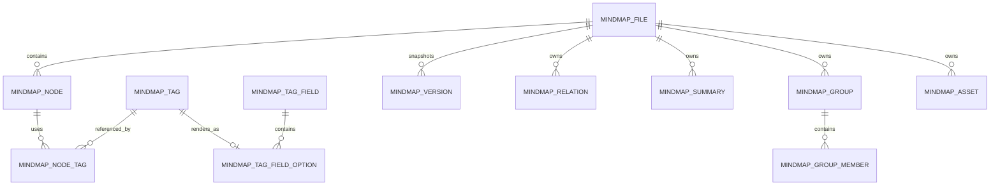
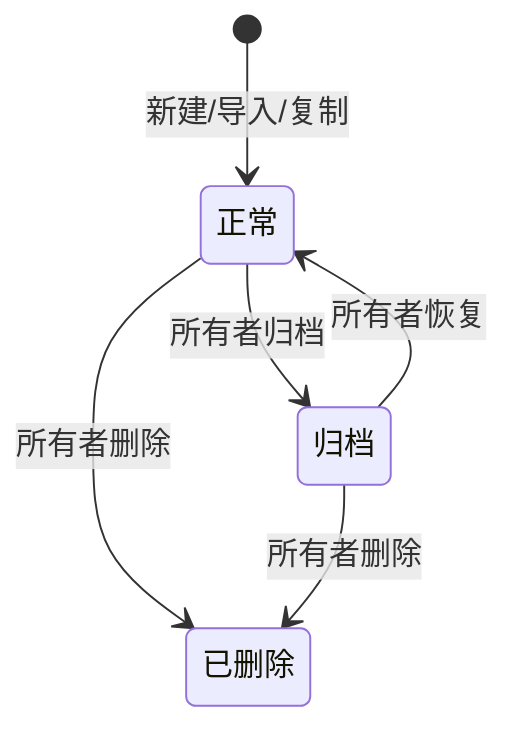

# 脑图文件、节点与全局标签管理产品设计文档

> 标签设计更新：本文中的“标签字段、字段选项、单选/多选约束”已被
> `docs/superpowers/specs/2026-08-24-mindmap-unified-tag-management-functional-design.md`
> 替代。脑图文件、节点、关系、资源、版本与编解码设计继续有效；标签相关冲突以新文档为准。

> 文档状态：产品方案（待评审）
> 版本：v1.0
> 日期：2026-08-17
> 适用模块：脑图管理、脑图编辑器、标签管理、实时协作、版本历史、模板与分享

## 1. 决策摘要

本方案将当前 `mindmap` 表中“文件元数据 + 完整节点树 JSON”的混合模型，拆分为：

1. `mindmap_file`：脑图文件及其布局、主题、视图、权限与版本元数据。
2. `mindmap_node`：脑图节点的稳定身份、父子关系、排序、文本及扩展属性。
3. `mindmap_node_tag`：节点和标签之间的引用关系。
4. `mindmap_tag`：所有可展示标签的唯一名称与样式来源。

除文件表和节点表外，关联线、概要、外框、资源等 `simple-mind-map` 跨节点或大对象数据使用配套关系表承载，不能为了“只拆两张表”继续塞回节点 JSON。普通节点内容、节点自定义样式和未来插件字段则通过有版本的扩展 JSON 保真保存。

标签使用位置不再保存标签名称、颜色等副本，只保存 `tag_id`。因此，修改标签名称或视觉样式后，所有脑图、所有节点、当前在线编辑器和后续打开的历史业务数据都能使用同一份最新定义，无需逐节点批量改写。

本次方案的关键产品原则是：

- 脑图文件负责“容器”，节点负责“内容和结构”。
- 标签定义负责“名称和视觉样式”，节点只负责“是否使用该标签”。
- 标签名称和视觉样式禁止节点级复制或覆盖，避免出现“标签管理已修改，但部分节点仍是旧样式”的问题。
- 标签在节点上的位置、对齐和排序属于布局信息，可保存在节点标签关系中，不影响标签名称与视觉样式的全局传播。
- 当前文件始终展示最新标签定义；历史版本预览保存标签快照，保证历史画面可复现，但恢复历史版本不会回滚全局标签。
- 数据库模型不直接等同于 `simple-mind-map` 的树 JSON；统一由文档编解码层完成“组件数据 ↔ 持久化模型”转换。
- 任何当前未知、以后新增的组件字段必须可往返保存，不能因后端未识别而被丢弃。

## 2. 背景与现状

### 2.1 当前实现

当前后端在 `mindmap.node_tree` 的 `LONGTEXT` 字段中保存完整节点树；前端每次自动保存会提交整棵树。实时协作又单独使用 Yjs 二进制状态，形成两套内容状态。

当前项目内置的是经过本地定制的 `simple-mind-map`，上游基线为 commit `fc4f93a38ee2a2eaa8e9e6c8d4c73f2bdac060b1`。组件 `getData(true)` 返回的不只是节点树，还包括 `layout`、`theme.template`、`theme.config`、`view`；每个树节点又包含 `{ data, children, ...额外包裹字段 }`。`data` 中既有内容、样式和运行状态，也存在关联其他节点的复杂插件数据。

当前编辑器中的字段标签写入节点时，会把以下内容直接复制进节点数据：

- `fieldId`、`optionId`
- 标签文本 `text`
- 背景色、字色、字号、圆角、内边距等 `style`
- 位置 `placement` 和对齐 `align`

节点标签样式面板还允许直接修改节点内的 `text` 和 `style`。因此，标签管理页修改字段、选项名称或样式后，既有节点仍保留旧副本，无法实现全局生效。

系统目前还同时存在两套标签概念：

- 独立标签：`mindmap_tag`
- 标签字段及选项：`mindmap_tag_field`、`mindmap_tag_field_option`

编辑器主要使用“字段选项标签”，独立标签管理与节点实际使用之间没有关系表，导致无法准确统计影响范围、阻止误删、跨脑图检索或完成全局替换。

### 2.2 核心问题

| 问题 | 用户影响 | 根因 |
|---|---|---|
| 标签改名不全局生效 | 同一标签在不同节点显示不同名称 | 节点保存名称副本 |
| 标签改样式不全局生效 | 视觉规范失控，需要逐节点修改 | 节点保存样式副本 |
| 删除标签无法评估影响 | 可能产生不可识别的孤儿标签 | 没有节点标签关系表 |
| 自动保存写入整棵树 | 大脑图保存成本高，冲突范围大 | 文件和节点未拆分 |
| 标签无法跨文件统计、筛选 | 标签管理缺少真实使用数据 | 标签只存在于 JSON 内 |
| Yjs 与 `node_tree` 双状态 | 协作状态和数据库快照可能不一致 | 缺少明确的主数据和物化规则 |
| 历史版本与全局标签冲突 | 要么历史画面变化，要么当前标签不全局生效 | 未区分实时引用与历史快照 |
| 只拆基础节点字段会丢插件能力 | 导入后关联线、概要、外框、图片等消失或错位 | 未设计 `simple-mind-map` 完整数据契约 |
| 未知字段无法升级兼容 | 组件升级后新属性被后端过滤 | 缺少 schemaVersion、透传区和编解码层 |
| 跨节点数据仍嵌在源节点 | 删除、复制、移动节点时产生悬空引用 | 关联线和分组没有结构化关系 |

## 3. 产品目标与非目标

### 3.1 产品目标

1. 将脑图文件和节点持久化拆分，支持节点级新增、编辑、移动和删除。
2. 建立标签唯一主数据，标签名称和视觉样式修改后在所有使用位置生效。
3. 标签保存前可看到受影响的文件数和节点数。
4. 标签删除时提供停用、替换、解除绑定等安全操作，不产生无效引用。
5. 保持现有编辑、自动保存、模板、版本、分享和协作能力可迁移。
6. 为按标签搜索脑图、筛选节点、使用统计和后续标签治理提供结构化数据。
7. 完整兼容当前 `simple-mind-map` 的文档、节点、插件和自定义字段，并支持后续组件升级。

### 3.2 非目标

本期不包含：

- 将每一种节点插件属性全部拆成独立列。
- 重做脑图编辑器整体视觉风格。
- 用节点操作日志彻底替代现有版本快照。
- 新增组织、团队或多租户权限模型。
- 让历史版本恢复操作回滚全局标签定义。

## 4. 用户与关键场景

### 4.1 用户角色

| 角色 | 能力 |
|---|---|
| 系统管理员 | 创建和维护全局标签、全局字段，查看全局影响范围 |
| 脑图所有者 | 创建私有标签，管理自己的文件和标签，邀请协作者 |
| 可编辑协作者 | 编辑授权脑图的节点和标签绑定；不能修改无权限的标签主数据 |
| 只读协作者/分享访问者 | 查看解析后的标签，不可修改节点或标签 |

### 4.2 关键用户故事

- 作为管理员，我修改“高优先级”的名称、背景色或字色后，所有使用它的节点立即呈现新效果。
- 作为标签维护者，我保存修改前能看到“将影响 18 个脑图中的 246 个节点”。
- 作为脑图编辑者，我给节点添加标签时选择的是标签实体，而不是复制一份文本和样式。
- 作为脑图编辑者，我可以调整标签在某个节点上的前后位置，但不会改变标签的全局名称和视觉样式。
- 作为标签维护者，我删除一个正在使用的标签时，系统要求我停用、替换或解除绑定，不能直接产生孤儿数据。
- 作为版本查看者，我预览旧版本时看到当时的标签外观；恢复后，当前文件仍遵循现行标签规范。

## 5. 领域模型

### 5.1 术语定义

| 术语 | 定义 |
|---|---|
| 脑图文件 | 脑图的业务容器，包含名称、目录、主题、布局、权限等，不直接保存完整节点树 |
| 节点 | 脑图中的一个可编辑元素，拥有稳定 UID、父节点、同级顺序和内容 |
| 标签 | 可被多个节点引用的主数据，名称和视觉样式具有唯一来源 |
| 标签字段 | 用于组织一组标签并规定单选/多选约束，例如“优先级” |
| 字段选项 | 字段下的可选项；每个选项关联一个可展示标签，而不是另存一套名称和样式 |
| 节点标签关系 | 表示某个节点使用某个标签，并记录节点内的标签顺序、位置和对齐 |
| 标签快照 | 版本创建时保存的标签名称和样式，仅供历史预览复现 |
| 文档编解码器 | 在 `simple-mind-map` 完整树结构和数据库分表结构之间进行无损转换的唯一入口 |
| 节点包裹字段 | 位于节点 `{ data, children }` 同级的额外字段；组件复制逻辑会保留它们 |
| 节点载荷 | 节点 `data` 中除稳定身份、树结构、标签和已结构化关系之外的可持久化属性 |

### 5.2 关系概览



### 5.3 主数据边界

| 数据 | 唯一来源 | 是否随标签修改全局变化 |
|---|---|---|
| 标签名称 | `mindmap_tag.name` | 是 |
| 背景色、字色、字号、圆角、内边距 | `mindmap_tag.style`，可继承字段默认样式 | 是 |
| 标签说明、分类、状态 | `mindmap_tag` | 是 |
| 节点是否使用标签 | `mindmap_node_tag` | 否，由用户绑定/解绑 |
| 标签在节点内的顺序 | `mindmap_node_tag.sort_order` | 否 |
| 标签相对节点的位置、对齐 | `mindmap_node_tag.placement/align` | 否，属于局部布局 |
| 历史版本中的旧名称与旧样式 | `mindmap_version` 的标签快照 | 否，仅用于历史预览 |

### 5.4 `simple-mind-map` 数据结构全景

当前组件的完整数据需要按以下层次设计，不能只读取 `data.text` 和 `children`。

| 数据层 | 当前数据示例 | 最新方案归属 |
|---|---|---|
| 文档配置 | `layout`、`theme.template/config`、`view.transform/state` | `mindmap_file` |
| 树结构 | `children`、节点顺序、父子关系 | `mindmap_node.parent_id/sort_order` |
| 节点身份与核心状态 | `uid`、`text`、`richText`、`expand`、`dir` | `mindmap_node` 核心列 |
| 自定义布局 | `customLeft`、`customTop`、`customTextWidth` | `mindmap_node` 布局列 |
| 节点内容 | `image/imageTitle/imageSize`、`icon`、`hyperlink`、`note`、`attachmentUrl/name`、`notation`、`checkbox`、`nodeLink` | `mindmap_node.content_data`，资源本体进入 `mindmap_asset` |
| 节点自定义样式 | 字色、字号、形状、边框、填充、连线等所有非保留字段 | `mindmap_node.style_data` |
| 标签 | `tag` 中的字符串或 `{fieldId, optionId, text, style}` | `mindmap_node_tag` + `mindmap_tag`，加载时适配为组件结构 |
| 关联线 | `associativeLineTargets`、控制点、端点、文字、按目标 UID 保存的样式 | `mindmap_relation` |
| 概要 | `generalization`，包含概要 UID、内容、样式和子节点区间 `range` | `mindmap_summary` |
| 外框 | 多个相邻子节点重复保存相同 `outerFrame.groupId` 和样式 | `mindmap_group` + `mindmap_group_member` |
| Base64 图片字典 | 根节点 `imgMap` | `mindmap_asset`；迁移兼容期允许文件级资源映射 |
| 节点包裹扩展 | `{data, children}` 同级、非 `_` 开头字段 | `mindmap_node.envelope_data` |
| 自定义/未知字段 | `_xxx` 或新插件加入的未识别属性 | `mindmap_node.extension_data` 原样透传 |
| 瞬时运行字段 | `isActive`、`inserting`、`needUpdate`、`resetRichText`、`activeStyle` | 不持久化，由组件运行时生成 |

持久化属性分类不能散落在多个页面中，应维护一份版本化字段注册表，例如 `SimpleMindSchemaRegistry`。注册表声明字段属于核心、内容、样式、关系、扩展还是瞬时状态，并与当前组件版本一起发布。

### 5.5 无损往返原则

统一编解码器必须满足：

```text
decode(encode(simpleMindDocument)) == normalize(simpleMindDocument)
```

其中 `normalize` 只允许：

- 移除明确列入黑名单的瞬时运行字段。
- 把标签副本转换为标签引用后，再按最新标签定义生成组件所需展示对象。
- 把关联线、概要、外框、资源转换为关系表后，再还原为组件要求的数据形态。
- 对对象 key 顺序、空数组和等价默认值做规范化，不改变用户可见语义。

后端不得使用严格白名单模型直接覆盖节点载荷；未知字段默认进入 `extension_data`，并设置大小、深度和危险 key 校验，保证升级兼容与安全性同时成立。

## 6. 功能设计

### 6.1 脑图文件管理

脑图列表、文件夹、重命名、复制、模板、分享、协作者权限仍以文件为操作对象。用户感知上仍称“脑图”，接口和数据库领域内明确称“脑图文件”。

文件详情加载时，后端返回文件元数据、节点集合、节点标签关系和本次使用到的标签定义。前端在内存中组装树，保持 `simple-mind-map` 的现有树形输入结构。

文件复制应一次性复制：

1. 文件元数据。
2. 全部节点并重建新旧节点 ID 映射。
3. 节点标签关系；标签定义仍引用原标签，不复制标签主数据。
4. 重建关联线的起止节点、概要范围、外框成员和文件资源引用。
5. 仅当关系两端都在复制范围内时复制跨节点关系，禁止产生指向原文件的隐式引用。
6. 不复制协作者、分享令牌和历史版本，除非后续另立产品规则。

#### 6.1.1 文件夹生命周期

- 文件夹是所有者私有的文件组织结构，不改变脑图本身的分享、协作者或标签语义；共享给我的脑图不进入接收者目录树。
- 同一所有者、同一父级下活动文件夹名称唯一。名称去除首尾空白，限制 1–100 个字符，并拒绝控制字符和 `/`、`\\` 路径分隔符。
- 目录树最多 20 层。创建、编辑和拖拽排序必须拒绝孤儿父级、循环引用、移入自身后代及越权父级；前端编辑父级选择器同步排除当前目录及其全部后代。
- 删除前展示目录名、子目录数量和受影响脑图数量。删除目录会连同子目录软删除，但脑图统一移至根目录，脑图内容、版本、分享和协作者关系均不删除。
- 删除目录、移动脑图和拖拽排序均为原子操作；部分 ID 无效、无所有权或执行期间数据变化时整体失败，不允许以“部分成功”静默返回。
- 目录列表具备加载、失败可重试和空状态；全部写操作互斥并显示后端业务错误。没有目录权限时保留“我的脑图/与我共享”和根目录创建能力，同时明确提示目录管理未启用。
- 数据库以活动目录生成列约束同级唯一性，避免并发创建绕过服务预检；文件列表与删除影响统计使用 `(owner_id, folder_id, del_flag, is_template)` 复合索引。

### 6.2 节点编辑与保存

节点拥有稳定的 `node_uid`，前端、Yjs 和数据库使用同一 UID 对齐数据。创建、修改、移动、删除以节点变更集保存，不再每次覆盖完整 `node_tree`。

建议的保存行为：

- 文本编辑结束：立即提交该节点变更。
- 连续样式或拖拽操作：2 秒防抖后批量提交。
- 创建、移动、删除：发送结构操作，携带父节点和同级排序。
- 单批次包含 `baseRevision` 和 `clientMutationId`，支持冲突检测与幂等重试。
- 文件维护单调递增的 `content_revision`；保存成功后返回最新版本号。

节点表只结构化高频查询和结构字段，插件扩展属性继续放在 JSON 中，避免为图片、图标、备注、超链接、公式等大量属性频繁改表。

### 6.3 标签管理

标签管理页应提供：

- 搜索：名称、标签 key、描述。
- 筛选：分类、全局/私有、启用/停用、字段。
- 列表信息：标签预览、名称、key、字段、作用域、使用文件数、使用节点数、更新时间。
- 编辑：名称、视觉样式、说明、分类和状态。
- 影响预览：保存前实时显示受影响的文件数与节点数。
- 审计信息：修改人、修改时间和变更摘要。

#### 保存标签修改

1. 用户修改名称或样式。
2. 系统展示影响提示，例如：“保存后将更新 18 个脑图中的 246 个节点，在线编辑器会立即刷新。”
3. 用户确认保存。
4. 后端只更新标签主数据并递增 `definition_revision`，不逐节点修改。
5. 提交事务后发布 `tag_definition_changed` 事件。
6. 当前在线且使用该标签的脑图收到事件，替换内存中的标签定义并局部重绘。
7. 未打开的文件下次加载时自然获取最新定义。

#### 节点内编辑标签

当前“点击标签后直接修改文本、背景、字色、字号”的交互需要调整：

- “编辑标签名称/样式”进入标签主数据编辑，并显示影响范围与权限提示。
- “调整位置/对齐/顺序”只作用于当前节点。
- 无标签编辑权限时，只显示标签详情和“从当前节点移除”。
- 手动输入新名称时，系统创建一个私有标签实体后再绑定；不再写入裸字符串。

### 6.4 标签字段与选项统一

保留现有“字段 + 单选/多选 + 选项”能力，但消除字段选项与独立标签之间的重复主数据：

- `mindmap_tag_field` 继续保存字段名称、选择模式、默认样式和排序。
- `mindmap_tag_field_option` 保存 `field_id`、`option_key`、`tag_id` 和排序。
- 选项显示名称和视觉样式来自其关联的 `mindmap_tag`。
- 独立标签可没有字段；字段选项标签必须关联一个字段。
- 同一字段在单个节点上的绑定数量由服务端校验：`single` 最多 1 个，`multi` 可多个。

样式计算顺序为：

```text
系统默认样式 <- 字段默认样式 <- 标签自身样式
```

最终计算结果不写入节点。字段或标签样式变化后重新计算即可。字段默认样式变更也应走影响预览和在线刷新流程。

### 6.5 删除、停用与替换

正在使用的标签禁止直接硬删除。删除入口先查询影响范围，再提供三种操作：

| 操作 | 行为 | 推荐场景 |
|---|---|---|
| 停用标签 | 已有节点继续显示并标记“已停用”，新增时不可选择 | 暂时退出使用但需保留历史语义 |
| 全部替换 | 将所有节点关系从旧标签改为新标签 | 标签合并、纠错 |
| 全部解除 | 删除所有节点标签关系，再删除/归档标签 | 确认标签无保留价值 |

全部替换必须在事务中执行，校验目标标签权限、字段约束和重复绑定，并写入操作审计。影响量较大时转为后台任务，前端展示进度和结果。

字段选项或字段被删除时同样遵守引用保护；不能再直接级联删除仍被节点使用的选项。

### 6.6 搜索与统计

节点标签关系结构化后，本期至少支持：

- 查看某标签使用了多少文件、多少节点。
- 从标签详情查看使用该标签的脑图文件列表。
- 脑图列表按标签筛选。
- 节点搜索结果显示所属文件及节点路径。

节点路径可在查询时由父子关系计算。本期不持久化 materialized path，避免移动子树时批量更新整棵子树。

### 6.7 组件能力保存与恢复

文件加载采用“平铺读取、统一组装、一次适配”的方式：

1. 查询文件和全部有效节点。
2. 批量查询标签、关联线、概要、外框成员和资源，禁止 N+1。
3. 根据 `parent_id + sort_order` 组装树。
4. 把关系表重新编码为组件要求的 `associativeLine*`、`generalization`、`outerFrame`、`tag`、`imgMap` 数据。
5. 合并核心字段、内容、样式、扩展和节点包裹字段。
6. 返回与 `setFullData()` 兼容的 `{root, layout, theme, view}`。

文件保存不能只监听节点文本变更。变更协议至少覆盖：

- `node.create/update/move/delete`
- `node.style.update`
- `node.asset.bind/unbind`
- `node.tag.bind/unbind/reorder`
- `relation.upsert/delete`
- `summary.upsert/delete`
- `group.upsert/delete/members.change`
- `file.layout/theme/view.update`

导入、导出、复制、模板、版本和 Yjs 初始化必须复用同一个编解码器，禁止各功能自行拼接一套不完整的节点 JSON。

## 7. 数据模型设计

### 7.1 `mindmap_file` 脑图文件表

建议由当前 `mindmap` 表改造或迁移而来，并保留原 ID，避免分享、版本、协作者等关联数据全面换号。

| 字段 | 类型建议 | 说明 |
|---|---|---|
| id | BIGINT | 文件 ID，沿用原脑图 ID |
| name / description | VARCHAR | 名称与描述 |
| owner_id / folder_id | BIGINT | 所有者、文件夹 |
| layout / theme / view_data | VARCHAR/JSON | 布局、主题、视图状态 |
| cover_image | VARCHAR | 封面 |
| root_node_id | BIGINT NULL | 根节点 ID，节点迁移完成后回填 |
| content_revision | BIGINT | 节点内容版本号，初始为 1 |
| node_count | INT | 节点数量缓存，用于列表和限额 |
| schema_version | INT | 内容模型版本，便于灰度迁移 |
| engine_name | VARCHAR | 固定为 `simple-mind-map`，为未来引擎迁移预留 |
| engine_version | VARCHAR | 当前组件基线 commit 或发布版本 |
| document_data | JSON | 未结构化的文档级扩展配置，不包含节点树 |
| is_template / template_category_id | BIGINT/SMALLINT | 模板信息 |
| last_version_id / version_count | BIGINT/INT | 版本信息 |
| status / del_flag | SMALLINT/CHAR | 归档、软删除状态 |
| 审计字段 | 现有字段 | 创建、更新、备注 |

迁移期可临时保留 `legacy_node_tree` 或原 `node_tree` 作为只读回退数据；稳定后再独立下线，不建议在第一次上线时直接删除原始 JSON。

### 7.2 `mindmap_node` 脑图节点表

| 字段 | 类型建议 | 说明 |
|---|---|---|
| id | BIGINT | 数据库主键 |
| file_id | BIGINT | 所属脑图文件 |
| node_uid | VARCHAR(64) | simple-mind-map/Yjs 稳定 UID，文件内唯一 |
| parent_id | BIGINT NULL | 父节点；根节点为空 |
| sort_order | INT | 同一父节点下的顺序 |
| text_content | LONGTEXT | 原始文本或富文本内容 |
| text_plain | TEXT | 去格式纯文本，用于搜索 |
| text_format | VARCHAR(16) | plain/rich |
| is_expanded | SMALLINT | 对应 `expand`，属于共享文档状态 |
| direction | VARCHAR(16) NULL | 对应 `dir` |
| custom_left / custom_top | DECIMAL NULL | 自定义布局坐标 |
| custom_text_width | DECIMAL NULL | 用户指定的文本宽度 |
| content_data | JSON | 图片引用、图标、链接、备注、附件、公式、checkbox 等内容属性 |
| style_data | JSON | 节点级自定义样式；未设置的样式继续继承主题 |
| extension_data | JSON | 当前未知或业务自定义的 `data` 字段，原样透传 |
| envelope_data | JSON | `{data, children}` 同级的额外节点字段 |
| payload_schema_version | INT | 节点载荷结构版本 |
| node_revision | BIGINT | 节点级乐观锁版本 |
| is_deleted / deleted_time | SMALLINT/DATETIME | 协作同步所需软删除标记 |
| 审计字段 | 通用字段 | 创建、更新人和时间 |

约束与索引：

- 唯一索引：`(file_id, node_uid)`。
- 加载索引：`(file_id, parent_id, sort_order)`。
- 搜索索引：根据数据库能力为 `text_plain` 建全文索引。
- 每个有效文件恰好一个根节点；由事务和服务层同时校验。
- 节点的 `parent_id` 必须属于同一 `file_id`，禁止环和跨文件移动。
- `uid`、`children`、`tag`、关联线、概要、外框和资源本体不得重复进入节点 JSON。
- 样式属性保持“稀疏保存”：只保存用户自定义值，主题默认值不复制到每个节点。
- 未知字段默认保留；命中瞬时字段黑名单时丢弃，命中关系字段时转交对应关系编解码器。

### 7.3 `mindmap_relation` 跨节点关系表

第一期至少承载关联线，后续也可承载业务节点链接。

| 字段 | 说明 |
|---|---|
| id / relation_uid | 主键和稳定关系 UID |
| file_id | 所属文件 |
| relation_type | `associative_line` 等 |
| source_node_id / target_node_id | 起点和终点节点 |
| text | 关联线文字 |
| control_data | 起终点方向、端点和贝塞尔控制偏移 JSON |
| style_data | 线条及文字样式 JSON |
| sort_order | 同一源节点关系顺序，用于还原组件数组 |
| revision / audit | 版本和审计字段 |

删除节点时，所有以该节点为起点或终点的关系必须在同一事务中删除。复制子树时，仅复制起点和终点都位于复制范围内的关系；跨出复制范围的关系默认不复制。

### 7.4 `mindmap_summary` 概要表

概要是带独立 UID、文本、富文本和样式的派生节点，不能当普通子节点，也不应继续内嵌在所有者节点 JSON 中。

| 字段 | 说明 |
|---|---|
| id / summary_uid | 主键和组件概要 UID |
| file_id / owner_node_id | 所属文件、概要所属节点 |
| start_child_id / end_child_id | 范围概要覆盖的首尾直接子节点；为空表示节点自身概要 |
| content_data / style_data | 概要内容与自定义样式 |
| sort_order | 同一节点多个概要的顺序 |

加载时根据当前子节点顺序把首尾节点转换为组件需要的 `[startIndex, endIndex]`。移动或删除成员节点时校验范围；范围失效时缩小到剩余成员，完全为空时提示并删除概要。

### 7.5 `mindmap_group` 与 `mindmap_group_member` 外框表

外框是多个相邻兄弟节点的分组。当前组件把相同 `groupId` 和样式重复写到每个成员节点，新模型应只存一次定义。

`mindmap_group` 保存 `group_uid`、`file_id`、`parent_node_id`、类型、文字、样式和 revision；`mindmap_group_member` 保存 `group_id`、`node_id` 和顺序。服务端必须保证同组节点拥有相同父节点且在产品规则要求下保持连续。

加载时，适配器把分组定义展开为各成员节点上的 `outerFrame` 对象；保存时再按 `groupId` 聚合，不能把展开副本作为主数据。

### 7.6 `mindmap_asset` 资源表

图片、附件和主题背景可能是 URL、Base64 或对象存储资源。当前 `NodeBase64ImageStorage` 会把 Base64 图片集中到根节点 `imgMap`，新模型应避免让根节点行承载大资源。

| 字段 | 说明 |
|---|---|
| id / asset_key | 主键和文件内稳定 key |
| file_id | 所属文件 |
| asset_type | image/attachment/background 等 |
| storage_type | url/object/base64（base64 仅迁移兼容） |
| uri / object_key | 资源地址或对象存储 key |
| mime_type / size / sha256 | 类型、大小和去重校验 |
| metadata | 图片宽高、原文件名等 |

节点 `content_data.image` 和附件只保存资源引用或外部 URL。迁移阶段解析根节点 `imgMap`，建立资源记录并替换引用；加载旧版组件时可重新生成 `imgMap`。

图片进入文档前必须执行统一输入策略：本地节点图片和主题背景只接受图片 MIME，单文件最多 5 MB；Data URL 使用同一体积上限。外部地址只允许 HTTP、HTTPS 或同源相对路径，禁止无法跨会话持久化的 Blob URL、带凭据 URL 和脚本/本地文件协议。客户端在写入节点前校验图片可加载性并设置 10 秒超时，失败时保持原数据不变并向用户说明原因；取消、重新打开或卸载组件会使旧异步结果失效。后续接入对象存储时仍保留这些前置规则，再由服务端校验 MIME、大小和哈希。

节点超链接必须在编辑入口和渲染入口执行同一安全契约：默认使用 HTTPS，允许 HTTP、`mailto:`、`tel:` 和以 `/`、`./`、`../`、`#`、`?` 开头的明确相对路径；拒绝脚本、Data、本地文件、Blob、协议相对、带凭据、控制字符及超长链接。导入和旧数据不能因为绕过编辑表单而获得可点击能力。新窗口链接必须隔离 `opener` 并禁用引用来源；链接标题、附件名和 SVG 导出标题必须通过 DOM `textContent` 写入，禁止拼接为 SVG/HTML 字符串。

附件在对象存储上传接口落地前提供 URL 型完整交互：编辑态可从工具栏新增或编辑，点击附件图标安全打开，右键进入编辑，只读态保留打开能力。新附件允许 HTTP、HTTPS 和同源相对路径；迁移兼容数据可读取 10 MB 内的 PDF、常用图片、纯文本、压缩包和 Office Data URL，但拒绝 HTML、SVG/XML 等可执行类型。导入或旧数据中的危险附件不渲染图标。附件名称为空时从 URL 路径推导，所有新窗口均使用 `noopener noreferrer` 和 `no-referrer`。未来本地文件上传必须先进入 `mindmap_asset`/对象存储，不能重新把大 Base64 当作常规节点内容写入。

节点备注采用“纯文本 Markdown 源 + 展示时安全解析”的模型，单条上限 20,000 字符。支持标题、段落、列表、引用、强调、行内代码/代码块、分隔线、链接和图片等基础 CommonMark 语义；不执行 Markdown 中的原始 HTML，也不允许插件扩展直接注入 HTML。链接和图片必须复用节点超链接、图片的统一安全协议校验，危险目标只保留可见文字或替代文本。外链统一隔离 `opener` 和引用来源，图片延迟加载。解析器只在首次展示备注时异步加载并跨入口复用；编辑对话框提供编辑/预览双视图和 Ctrl/Command + Enter 保存，预览使用短防抖及异步竞态令牌，批量编辑时明确提示作用节点数，并以打开对话框时的选区快照作为提交目标，避免选区漂移导致误写。悬浮卡片和备注侧栏使用同一白名单 AST 渲染器、同一视觉样式及暗色主题。悬浮卡片按画布坐标定位，移出图标后延迟关闭，进入卡片时取消关闭，使安全链接可操作且不会留下残余浮层。

### 7.7 `mindmap_node_tag` 节点标签关系表

| 字段 | 类型建议 | 说明 |
|---|---|---|
| id | BIGINT | 主键 |
| file_id | BIGINT | 冗余文件 ID，便于影响统计和分区查询 |
| node_id | BIGINT | 节点 ID |
| tag_id | BIGINT | 标签主数据 ID |
| sort_order | INT | 标签在节点中的展示顺序 |
| placement | VARCHAR(16) NULL | left/top/right/bottom |
| align | VARCHAR(16) NULL | top/center/bottom 或 left/center/right |
| created_by / created_time | 通用字段 | 绑定审计 |

约束与索引：

- 唯一索引：`(node_id, tag_id)`，同一节点不重复绑定同一标签。
- 使用统计索引：`(tag_id, file_id)`。
- 节点加载索引：`(node_id, sort_order)`。
- `file_id` 必须与节点所属文件一致，由服务层校验。
- 不保存 `name`、`text`、`fill`、`color`、`fontSize`、`radius` 等标签定义副本。

### 7.8 `mindmap_tag` 标签主表调整

保留现有 `uuid`、`tag_key`、`name`、`category_id`、`owner_id`、`style`，新增：

| 字段 | 说明 |
|---|---|
| status | active/disabled/archived |
| definition_revision | 每次名称、样式或状态变化递增 |
| usage_node_count / usage_file_count | 可选统计缓存，真实值仍以关系表为准 |
| update_by | 最后修改人 |
| updated_time | 最后修改时间 |

`uuid` 用于导入导出、跨环境和客户端引用，数据库关系使用 `id`。标签 key 在其作用域内保持不可变或仅管理员可改，避免外部集成失效。

### 7.9 `mindmap_tag_field_option` 调整

新增唯一的 `tag_id`，把选项的名称和视觉样式统一到 `mindmap_tag`。迁移期保留现有 `name/fill/color` 只读字段，完成切换后再删除。

### 7.10 版本表策略

`mindmap_version` 继续使用不可变 JSON 快照，而不是为每个版本复制一套节点行。快照结构建议为：

```json
{
  "schemaVersion": 2,
  "file": { "layout": "logicalStructure", "theme": {}, "viewData": {} },
  "nodes": [],
  "nodeTags": [],
  "relations": [],
  "summaries": [],
  "groups": [],
  "assets": [],
  "tagSnapshots": {
    "tag-id": { "name": "高优先级", "style": {}, "revision": 7 }
  }
}
```

规则：

- 历史预览读取 `tagSnapshots`，不受后续全局标签修改影响。
- 恢复版本只恢复文件、节点和节点标签关系，不修改 `mindmap_tag`。
- 恢复确认框提示：“历史预览使用当时标签样式；恢复后将按当前标签定义显示。”
- 如果版本中的标签已被彻底移除，恢复时将其恢复为“已停用引用”或创建私有迁移标签，禁止产生空引用。

## 8. 接口与事件契约

接口路径可在技术设计阶段按项目规范微调，产品能力至少需要以下契约。

### 8.1 文件与节点

| 方法 | 路径建议 | 用途 |
|---|---|---|
| GET | `/mindmap/file/{id}` | 获取文件元数据、平铺节点、关系和所需标签定义 |
| PATCH | `/mindmap/file/{id}/content/batch` | 批量提交节点、标签绑定、关系、概要、分组、资源和文件配置变更 |
| GET | `/mindmap/file/{id}/changes?afterRevision=` | 断线后增量补齐 |
| POST | `/mindmap/file/{id}/copy` | 复制文件及节点关系 |

批量变更请求必须包含：

- `baseRevision`
- `clientMutationId`
- `operations[]`
- 操作类型及目标 `nodeUid`
- 关系、概要、分组和资源操作的稳定 UID 与目标 revision

冲突时返回当前文件版本和冲突节点，前端优先通过 Yjs 合并；不能自动合并时提示刷新或保留副本，禁止静默覆盖。

### 8.2 标签

| 方法 | 路径建议 | 用途 |
|---|---|---|
| GET | `/mindmap/tag/{id}/impact` | 获取使用文件数、节点数和示例文件 |
| PUT | `/mindmap/tag/{id}` | 修改标签并返回新 revision 与影响统计 |
| POST | `/mindmap/tag/{id}/disable` | 停用标签 |
| POST | `/mindmap/tag/{id}/replace` | 全局替换为另一标签 |
| DELETE | `/mindmap/tag/{id}?unbind=true` | 明确解除全部绑定后删除/归档 |

### 8.3 实时事件

新增领域事件：

```json
{
  "type": "tag_definition_changed",
  "tagId": 12,
  "definitionRevision": 8,
  "changedFields": ["name", "style"],
  "definition": {}
}
```

事件在数据库事务成功后发布。单实例可由房间管理器广播；多实例部署必须通过 Redis Pub/Sub 或事务消息表转发，避免只刷新当前进程中的在线用户。

客户端收到事件后：

1. 比较 `definitionRevision`，忽略旧事件。
2. 更新本地标签定义缓存。
3. 只重绘引用该标签的节点。
4. 更新标签选择器和属性面板。
5. 不触发节点内容自动保存，防止无意义回写。

## 9. 实时协作与数据一致性

### 9.1 权威数据定义

- `mindmap_file`、`mindmap_node`、标签关系、跨节点关系、概要、外框分组和资源表共同构成可查询、可审计的持久化主数据。
- Yjs 是在线协作与冲突合并状态，不再与整树 JSON 形成两个永久主数据源。
- `mindmap_ws_state` 可保留为短期恢复缓存，但需要携带对应的 `content_revision`；状态过旧时从节点表重新初始化。

### 9.2 协作保存规则

- 同一文件内的节点操作按文件序列化分配 revision。
- 所有操作携带 `clientMutationId`，服务端重复接收时直接返回原结果。
- Yjs 节点 UID 与数据库 `node_uid` 一致。
- Yjs 文档除 `meta`、`nodes` 外，增加 `relations`、`summaries`、`groups` 和 `assets` 顶层集合；跨节点数据不再藏在某个节点的 `data` 中。
- 常规节点编辑通过 Yjs 增量包与受影响节点修复补丁广播；支持检查点协议时，完整状态改为最多每 5 秒上行一次，并在初始化、重连、正常退出和新协作者加入时立即刷新。服务端只把周期检查点转发给旧客户端，新客户端不再为每次编辑编码、上传或接收整图；能力协商失败时自动回退逐次完整状态，保证滚动升级兼容。
- 节点修复补丁必须限制版本、节点数、子节点引用数、UID 长度和编码体积，服务端只转发白名单字段，拒绝非法或超限载荷。
- 标签定义不写入 Yjs 节点数据，Yjs 只同步 `tagId` 绑定和局部位置。
- 标签主数据通过独立领域事件同步，避免每个协作者重新写整棵树。
- 最后一个用户离开房间时，确保未物化的节点变更已提交；Yjs 状态只作为断线恢复补充。

### 9.3 缓存规则

- 标签缓存以 `tag_id + definition_revision` 为键。
- 文件详情只返回当前文件实际使用到的标签定义，避免加载全部标签。
- 标签选择器可单独分页/搜索，不与文件详情绑定。
- 标签修改提交后先更新数据库，再失效缓存，再发布事件。

### 9.4 客户端加载规则

- 编辑、浏览和公开预览分别声明最小插件集合，禁止只读入口静态加载编辑器能力。
- PDF、XMind/XML 等重型导出插件在用户首次选择对应格式时动态加载并注册到当前脑图实例；加载 Promise 复用，失败后允许重试。
- Markdown、纯文本等格式转换器只在实际导出或复制该格式时加载，不能因基础 PNG/SVG 导出或小地图功能进入编辑器首屏包。
- 构建产物应持续检查编辑器首屏块、公开预览块及异步导出块，插件回流主包视为性能回归。

## 10. 权限与审计

### 10.1 权限规则

- 全局标签：仅管理员可创建、修改、停用、替换和删除。
- 私有标签：仅标签所有者可修改；文件协作者可在被授权文件中绑定可见标签。
- 协作者即使不是私有标签所有者，只要有权访问使用该标签的文件，也能读取渲染所需的名称和样式，但不能在标签库中管理它。
- 标签替换需要同时拥有源标签管理权限、目标标签可见权限和所有受影响文件的系统级操作权限；管理员批量治理应写审计日志。
- 只读分享接口只返回渲染字段，不返回内部说明、所有者隐私字段等管理信息。

### 10.2 审计范围

至少记录：

- 标签创建、改名、样式变更、停用、恢复、替换、解除绑定。
- 变更前后值、影响文件数、影响节点数、操作者和时间。
- 脑图文件迁移结果、失败原因和校验哈希。
- 版本恢复及恢复时遇到的已停用/缺失标签处理结果。

## 11. 迁移方案

### 11.1 迁移原则

- 原脑图 ID、节点 UID、标签 UUID 尽量保持不变。
- 先增表和双读校验，再切流；原 `node_tree` 在观察期内保留。
- 迁移必须可重复执行，依靠迁移批次号和唯一键保证幂等。
- 每个文件独立迁移和校验，一个文件失败不阻断全部任务。

### 11.2 数据迁移步骤

#### 阶段 A：建模与兼容

1. 创建 `mindmap_file`、`mindmap_node`、`mindmap_node_tag` 及必要索引。
2. 为字段选项增加 `tag_id`，为已有选项创建或匹配对应 `mindmap_tag`。
3. 保留旧接口，新增 v2 读取和节点批量保存能力。

#### 阶段 B：文件与节点回填

1. 复制 `mindmap` 元数据到 `mindmap_file`，保留 ID。
2. 递归解析 `node_tree`，把每个节点写入 `mindmap_node`。
3. 已有 `uid` 原样保留；缺失 UID 时生成，并记录迁移映射。
4. `children` 转换为 `parent_id + sort_order`。
5. 节点 `data` 中移除 `uid`、`tag` 和 `children`，其余扩展属性保留。
6. 按字段注册表拆分核心字段、内容、样式、扩展、节点包裹字段和瞬时字段。
7. 解析关联线、概要、外框和根节点 `imgMap`，写入对应支持表并校验 UID 引用。
8. 回填 `root_node_id`、`node_count`、`engine_version` 和 `schema_version=2`。

#### 阶段 C：标签回填

按旧数据形态处理：

| 旧标签形态 | 迁移策略 |
|---|---|
| `{fieldId, optionId, text, style}` | 优先通过 optionId 找到其 `tag_id`；节点内名称和视觉样式副本丢弃 |
| 已包含 tagId/uuid 的对象 | 校验权限和存在性后直接建立关系 |
| 裸字符串 | 按文件所有者 + 标准化名称匹配私有标签；无匹配则创建私有标签 |
| 无法识别或目标已删除 | 创建“迁移待整理”私有标签并记录告警，不丢数据 |

旧对象中的 `placement`、`align` 和顺序迁入 `mindmap_node_tag`。旧对象中的 fill、color、fontSize 等不作为节点覆盖保存，否则会继续阻断全局样式传播。

#### 阶段 D：一致性校验

每个文件至少校验：

- 节点总数一致。
- 根节点唯一。
- 所有父节点存在且同属一个文件。
- 无环、无孤立有效节点。
- 节点文本和扩展数据哈希一致。
- 标签数量、顺序、字段单选/多选约束一致。
- 关联线数量、目标 UID、文字、控制点与样式一致。
- 概要 UID、内容和覆盖范围一致。
- 外框分组、成员、文字和样式一致。
- 图片、附件、根节点 `imgMap` 引用完整且哈希一致。
- 未知字段和节点包裹字段往返后保持一致。
- 由新表重建的树与旧 `node_tree` 规范化后哈希一致。

#### 阶段 E：灰度切换

1. 先对测试账号和小脑图启用 v2 读取。
2. 新旧读取结果做影子比对，记录差异但不影响用户。
3. 开启新节点保存；旧 `node_tree` 只作为定期兼容快照，不再作为主写入目标。
4. 观察错误率、保存延迟和数据差异后逐步扩大。
5. 稳定观察期结束后停止双写，最后再下线旧字段。

### 11.3 回滚策略

- 灰度期间以文件级 `schema_version` 决定读取 v1 或 v2。
- v2 保存可异步生成兼容 `node_tree` 快照，便于短期回滚旧版本。
- 回滚只切换读取路径，不删除新表数据。
- 出现迁移错误时标记该文件 `migration_failed` 并回退旧数据，禁止在不完整节点表上继续编辑。

## 12. 分阶段交付计划

### Phase 1：数据底座与只读验证

- 新建文件、节点、节点标签关系模型。
- 新建关联线、概要、外框分组和资源模型。
- 字段选项关联统一标签。
- 完成字段注册表、统一编解码器、迁移器、树重建器和一致性校验工具。
- 文件详情支持从新表组装，前端仍接收兼容的 `nodeTree`。

### Phase 2：节点增量保存

- 前端从 `data_change_detail` 生成节点操作。
- 新增批量保存、幂等和 revision 冲突处理。
- 文件复制、删除、导入、模板创建适配新表。
- 节点以外的关系、概要、外框、资源和文档配置接入增量操作。
- 明确 Yjs 状态与节点表的初始化和物化关系。

### Phase 3：全局标签传播

- 编辑器标签数据改为 `tagId` 引用。
- 标签影响统计、保存确认、停用、替换和解除绑定上线。
- 在线房间接入标签变更事件并局部重绘。
- 移除节点级名称和视觉样式编辑。

### Phase 4：版本、搜索与旧模型下线

- 版本快照升级为 v2，支持标签快照预览。
- 标签筛选、节点搜索和使用明细上线。
- 完成存量迁移和观察，停止旧 `node_tree` 主写入。
- 在独立版本删除旧字段和兼容代码。

## 13. 验收标准

### 13.1 标签传播

- 修改标签名称后，所有引用节点在重新查询时 100% 显示新名称。
- 修改标签 fill、color、fontSize、radius、padding 后，所有引用节点显示新样式。
- 当前在线编辑器无需刷新页面，在事件到达后完成局部更新。
- 标签修改不会触发每个节点的内容保存，也不会改变文件 `content_revision`。
- 节点数据和节点标签关系中不存在标签名称和视觉样式副本。

### 13.2 文件与节点

- 由节点表重建的树在文本、结构、排序和扩展属性上与原始树一致。
- `getData(true)` 经持久化后重新加载，除明确瞬时字段和标签解析外，与规范化前数据等价。
- 图片、图标、链接、备注、附件、公式、checkbox、自定义位置和节点自定义样式均可完整恢复。
- 关联线、概要和外框在节点移动、复制、删除后不产生悬空 UID 或错误范围。
- 当前未知的自定义字段可无损保存并返回前端。
- 现代 XMind JSON 与 XMind 8 XML 均可导入；旧版 XML 使用浏览器原生解析能力，不把 Node.js `stream` 或服务端 XML 依赖打入编辑器产物。
- XMind XML 禁止 DTD 与实体声明，并限制 XML 大小、节点数、嵌套深度、压缩项数量、单项解压体积和总解压体积，异常文件明确失败且不能污染当前画布。
- SMM、JSON、XMind 和 Markdown 共用一个导入状态机：同一时刻只允许一个解析任务，成功且根节点校验通过后才替换画布，失败时保留文件与弹窗供用户修正或重试。
- 多画布 XMind 必须通过明确的“导入所选画布”或“取消导入”结束等待，不允许遮罩、Esc 或组件卸载留下未完成 Promise；导入期间应有可读的进度状态并阻止重复提交。
- URL 导入仅允许同源地址，支持请求取消，并在响应头及 Blob 两个阶段执行 20MB 限制；组件卸载后不能继续写入画布。
- 导出弹窗必须等待动态插件加载和文件生成完成后再显示成功并关闭；失败时保留当前格式、文件名和选项供重试，不能以“事件已发出”代替实际成功。
- 导出格式使用可聚焦的单选按钮语义；文件名去除重复扩展名并拒绝空值、路径字符、控制字符、跨平台保留名和异常尾字符，内边距统一限制为 0–200 整数。
- 每次导出都显式写入或清空页脚内容，避免上一次配置泄漏；PDF、XMind 等重型插件继续按格式懒加载，加载失败可以重试且不能留下永久 loading 状态。
- 创建、移动、删除节点不会覆盖其他未修改节点。
- 重复提交同一 `clientMutationId` 不产生重复节点或标签关系。
- 不能创建跨文件父子关系、环或多个根节点。
- 移入回收站只暂停访问并完整保留节点、标签关系、关系图元、版本、协作者、分享和协作缓存；永久删除才级联清理这些数据。
- 新建、导入和重命名共用同一名称契约：去除首尾空白，长度统一为 1–200 个 Unicode 字符，拒绝控制字符；前端校验只负责即时反馈，后端模型必须独立执行同样边界。
- 文件列表、范围切换、分页和标签远程搜索均采用最新请求获胜规则，旧响应、旧错误和旧 loading 不得覆盖当前条件；列表加载失败显示可重试错误态，不能伪装成业务空列表。
- 删除末页最后一项后自动回到有效页。新建、复制、移动和删除共享文件级操作锁，按钮暴露真实 loading/disabled，失败保留当前上下文并展示后端业务原因。
- 移入回收站确认使用脑图名称或批量数量，不暴露内部 ID，并明确关联数据保留、访问暂停和恢复后重新生效；永久删除使用独立的不可撤销文案，取消或关闭均不显示失败提示。
- 编辑页重命名与列表新建使用相同名称工具和提交锁；空白名称、超长名称、验证期间连击和接口期间重复提交都不能产生多次写入。

### 13.3 标签生命周期

- 使用中的标签不能被直接硬删除。
- 标签替换后不存在重复关系，字段单选约束仍成立。
- 停用标签在旧节点可识别，在新增选择器中不可选。
- 标签影响统计与关系表抽样/全量校验一致。

### 13.4 版本与协作

- 历史版本预览显示创建版本时的标签名称与样式。
- 恢复历史版本不会修改全局标签主数据。
- 多人同时编辑不同节点时不发生整树覆盖。
- Yjs 缓存 revision 落后时能够从节点表安全重建。
- 版本列表切换类型或分页时，旧请求不能覆盖最新结果；加载失败必须显示可重试错误态，创建、预览、恢复和删除共享互斥操作锁。
- 进入历史预览后暂停变更跟踪和 Yjs；点击退出、关闭侧栏或组件卸载都必须完整恢复预览前的树、布局、主题、视图与编辑模式，并等待画布异步渲染结束后再恢复协作。
- 恢复历史版本前先刷新当前未保存修改；保存失败则阻止不可逆恢复。后端恢复成功但详情刷新失败时依赖服务端 `document_reset`，绝不能使用恢复前的本地树重新初始化 Yjs。
- 删除最后一条分页数据后自动回到有效页；关闭确认框视为取消，不显示伪失败提示。正式版本名称限制 200 字符并在提交前去除首尾空白。
- 路由离开时必须重复检查脏状态；保存请求期间产生的新操作需要继续提交，直到文档真正无待保存变更，不能把单次请求成功等同于全部保存成功。
- 离开保存失败、持续编辑超过有界重试次数或活动请求等待超时时，先写入本地草稿再交由用户决定是否离开。
- 无法自动合并的版本冲突必须保留本地草稿和服务端冲突上下文；用户选择暂不处理后，页头持续提供明确的“处理冲突”入口，Ctrl/Command + S 也能重新进入同一流程，不能让保存永久阻塞且无恢复路径。
- 自动重试耗尽或不可重试错误必须提供“重试保存”；离线状态应继续显示离线语义并在联网后自动续传，不展示会必然失败的手动重试动作。恢复操作执行期间需要防止重复点击，并在成功后清除冲突、重试计数和错误状态。
- `beforeunload`、`pagehide` 和页面进入后台三类生命周期均能触发即时草稿保护，IndexedDB 不可用或页面即将冻结时保留同步回退副本。
- 脑图列表提供按当前用户隔离的本地草稿恢复中心，合并 IndexedDB 与 localStorage 的最新记录，展示来源文件、基础版本和保存时间，并支持下载 JSON、返回原文件继续处理和确认删除；云端保存成功后自动清理对应草稿。
- 删除、归档、撤权、会话失效和协作者恢复历史版本等强制终止场景，必须同时尝试持久草稿与 JSON 下载；浏览器阻止自动下载时不得删除唯一的本地副本，大文档不能只依赖 2 MB 的同步 localStorage 回退。
- 协作者管理入口只对文件所有者可见；“画布只读模式”与“没有协作者管理权”必须使用独立状态表达，不能让普通只读协作者进入必然失败的管理侧栏。
- 用户搜索必须携带脑图 ID 并由服务端再次校验所有权，只返回活跃、非所有者且尚未加入当前脑图的用户；`%`、`_` 等数据库通配符按普通文本搜索，禁止借搜索接口枚举无关用户。
- 协作者列表和远程用户搜索都使用最新请求获胜规则，侧栏关闭或文件切换立即废弃旧响应；加载失败展示可重试错误态，添加、改权和移除共享互斥操作锁。
- 编辑权限降为查看或移除协作者前必须明确说明会立即终止对方当前会话；弹窗取消不报错，接口失败保留原权限和列表。重复提交相同权限不得触发无意义写入或在线撤权。
- 新增协作者时后端校验目标用户仍存在且可用，并用唯一约束异常兜底并发重复添加，始终返回稳定业务错误而不是数据库异常。
- 长期打开的协作连接必须在心跳中重新验证 JWT 有效期、Redis 登录会话、用户状态和文件编辑权限，不能把建连时身份无限沿用；明确过期、注销、强制下线或停用应在一个心跳周期内终止连接。
- 登录会话失效的连接禁止在断开阶段回写 Yjs 检查点；前端先备份未同步内容再终止全部写入。认证服务短暂不可用可以有界重试，但持续无法确认身份时必须安全结束编辑，并与普通断网重连使用不同提示。

### 13.5 全屏、演示与鼠标交互

- 画布全屏只覆盖脑图画布；页面全屏只覆盖当前编辑页，不把应用之外的 DOM 作为业务容器。
- 全屏入口使用标准 `requestFullscreen/exitFullscreen`，兼容浏览器历史前缀；进入和退出是否成功以限定时间内实际 `fullscreenElement` 状态为准，不能只等待可能拒绝或不结束的浏览器 Promise。
- 全屏切换期间按钮不可重复触发，并通过 `aria-pressed` 暴露当前模式；浏览器不支持或用户拒绝授权时保留原界面并给出明确反馈。
- 演示控制栏只能在全屏确认成功后挂载；重复进入、提前退出、异步渲染结束晚到均不能造成二次绑定、空数据恢复或残留键盘监听。
- 退出演示时完整恢复树、视图变换、性能配置、命令状态和键盘状态；焦点先进入“退出演示”，退出后返回原演示入口。
- 演示页码输入受有效范围约束，上一页/下一页使用真实禁用状态并播报当前页；位于画布零坐标的高亮节点仍可正确定位。
- 鼠标操作模式使用原生按钮和 `aria-pressed` 表达切换状态，键盘用户能够执行与指针用户相同的模式切换。

### 13.6 分享链接生命周期

- 分享列表加载失败必须显示错误和重试入口，不能伪装成空列表；关闭或重新打开弹窗后，旧请求不得覆盖新结果或重新打开 loading。
- 同一时间只允许创建、复制或禁用一个分享操作；创建期间有效期控件锁定，禁用前明确说明链接立即失效且不可重新启用。
- 有效、过期、禁用和时间异常状态只计算一次并在文本、颜色和复制可用性上保持一致；只有有效链接允许复制。
- 分享 URL 使用规范化同源地址和编码后的令牌；复制优先使用 Clipboard API，降级复制必须检查浏览器返回值、恢复原焦点，失败时不得伪报成功。
- 复制按钮具有明确可访问名称，分享地址输入框具备标签；公开分享继续只支持只读，编辑协作必须使用协作者权限模型。

### 13.7 模板市场生命周期

- 模板列表、分类筛选、关键词搜索和分页使用同一驼峰请求契约，并遵循最新请求获胜规则；加载失败展示重试入口，筛选无结果与模板库为空使用不同文案。
- 模板卡片只渲染 HTTP、HTTPS 或同源相对封面，失败时降级为稳定占位图；卡片、分类和预览控制均可使用键盘，状态变化通过语义化区域表达。
- 使用模板前可查看真实只读脑图，预览按文档能力懒加载必要插件，支持缩放和适应画布；预览失败可原地重试，旧请求不能覆盖新模板或已关闭弹窗。
- 使用模板同一时间只允许一个请求，确认文案明确创建独立副本；后端必须返回有效的新脑图 ID，前端收到后直接进入编辑器，不能依赖猜测路由或静默退回列表。
- 模板发布从可搜索的源脑图列表选择，名称、描述、封面和分类均在前后端校验；发布服务在事务提交前固定新模板 ID，提交成功后响应不能触发 ORM 隐式查询。
- 下架模板前说明市场立即不可用但已有副本不受影响；发布、下架、分类新增和分类删除使用互斥操作锁，失败时保留当前上下文并展示后端业务原因。
- 模板分类名称去除首尾空白且全局唯一；服务层预检查之外必须有数据库唯一键兜底并发写入。发布与删除锁定同一分类行，数据库外键限制最终阻止悬空引用；仍被有效模板引用的分类不能删除，存量重复分类迁移时先重定向引用再合并定义。
- 运营页对发布、下架和分类权限分别判断；无写权限账号进入页面时显示明确只读说明，前端隐藏只负责体验，所有管理接口仍由后端独立鉴权。

## 14. 指标与告警

上线后建议监控：

- 文件详情 P50/P95 加载时间与节点数量分布。
- 节点批量保存 P50/P95、冲突率、幂等重试率。
- 树重建失败、孤儿节点、环、多个根节点数量。
- 标签定义事件发布失败率、在线客户端刷新延迟。
- 标签影响统计耗时和批量替换任务成功率。
- v1/v2 影子数据哈希差异率。
- Yjs revision 与 `content_revision` 不一致次数。

建议初始体验目标：

- 1,000 节点文件详情服务端组装 P95 小于 500ms（不含网络与前端渲染）。
- 单批 100 个节点操作服务端 P95 小于 300ms。
- 在线标签变更从提交成功到可见 P95 小于 2 秒。
- 迁移后规范化树差异率为 0，无法迁移文件必须自动回退且不丢数据。

## 15. 风险与产品决策

| 风险/分歧 | 推荐决策 |
|---|---|
| 用户希望某个节点上的同名标签有不同颜色 | 不允许托管标签做局部视觉覆盖；需要不同语义时创建新标签，保证全局一致性 |
| 标签位置是否算全局样式 | 位置、对齐和顺序视为节点布局例外；名称、颜色、字号、圆角、内边距必须全局生效 |
| 字段选项和独立标签是否继续两套实现 | 统一为 `mindmap_tag` 渲染实体，字段选项仅负责选择约束和排序 |
| 是否立即删除旧 `node_tree` | 不立即删除；先保留回退窗口，再独立下线 |
| 是否把版本节点也拆行 | 不拆；历史版本低频读取，完整不可变快照更适合复现和管理 |
| 标签修改是否批量更新节点 | 不更新节点；引用解析 + revision + 事件刷新，避免高成本和部分失败 |
| 恢复版本是否恢复旧标签样式 | 历史预览用旧快照；恢复后的当前文件用最新标签，不影响其他文件 |
| Yjs 和节点表谁是主数据 | 节点表是持久化主数据；Yjs 是协作合并与短期恢复状态 |
| `simple-mind-map` 全部字段是否拆列 | 不全部拆列；核心查询字段结构化，普通插件字段分区 JSON，跨节点语义独立成表 |
| 未知插件字段如何处理 | 默认保留到有版本的扩展区，只有明确瞬时或危险字段才过滤 |
| 关联线、概要、外框是否继续放节点 JSON | 不继续；使用关系、概要和分组模型，加载时由适配器恢复组件结构 |

## 16. 评审时需要确认的四项决策

在进入技术实施设计前，需要产品、前端、后端共同确认以下四点：

1. 是否接受“核心字段拆列、普通插件字段分区 JSON、跨节点数据独立成表、未知字段原样透传”的组件兼容策略。
2. 是否接受“标签名称和视觉样式不允许节点级覆盖”，位置/对齐/顺序作为唯一局部例外。
3. 是否接受“字段选项统一关联 `mindmap_tag`”，不再维护第二套名称和颜色字段。
4. 是否接受“历史预览冻结标签快照，恢复后的当前文件使用最新标签定义”。

四项确认后，可据此拆分数据库迁移、后端接口、前端编辑器、实时事件和测试任务，不需要再反复调整主数据边界。

## 17. 文件归档生命周期设计

### 17.1 产品目标与边界

归档用于把暂时不再维护、但仍需检索和查阅的脑图移出默认工作列表。它不是回收站，也不是软删除：文件内容、结构化节点、版本、现有分享链接、协作者关系、目录归属和标签绑定全部保留。

- 仅文件所有者可以归档和恢复；协作者始终只能查看归档状态。
- 归档文件默认从“正常”列表隐藏，可通过“全部”或“归档”筛选找到。
- 归档后文件整体只读，不允许重命名、内容保存、版本创建/恢复、标签绑定变更或其他编辑写入。
- 复制和模板发布读取归档文件时创建新的正常文件，不改变源文件。
- 移动目录、禁用现有分享、协作者降级/移除和删除文件属于治理操作，归档状态下继续允许。
- 归档后禁止新建分享、添加协作者或把只读协作者提升为编辑者，避免为不可写文件制造新的写权限预期。

### 17.2 状态机与并发规则



`status=0` 表示正常，`status=1` 表示归档。创建接口强制写入正常状态，状态只能通过专用流转接口改变。归档/恢复先锁定文件行并校验所有者，所有内容写入也在同一文件锁边界内检查状态，因此“正在保存”和“同时归档”按数据库锁顺序串行，不会在归档提交后继续写入。

归档事务提交后发布 `document_archived`：当前实例和 Redis 其他 worker 都向房间发送终止事件、清理在线成员并以 4005 关闭 WebSocket。客户端收到事件后停止 Yjs、自动保存、重试和本地写入状态，提示用户文件已归档并返回列表。实时通知失败只记录降级告警，不回滚已经提交的归档主数据；后端写门禁仍保证旧连接无法继续保存。

### 17.3 前后端契约

- `PUT /mindmap/status`：请求 `{ id, status }`，两者均为严格整数，ID 必须为正数，状态只能为 `0|1`；幂等重复请求返回 `changed=false`。
- 列表默认请求 `status=0`；清空筛选不传状态表示全部，选择归档传 `status=1`。
- 列表与详情统一返回 `status` 和服务端计算的 `canEdit`。只要文件归档，`canEdit` 必须为假，前端不得再用原始协作者权限反向覆盖该结果。
- 详情仍返回完整 `nodeTree` 供只读预览；归档不是内容状态错误，不与 `contentState=migration_failed` 混用。
- 新建/导入/复制结果一律为正常文件，客户端提交的创建状态被服务端忽略。

### 17.4 交互与验收标准

- 归档入口放在行级“更多”菜单，确认文案必须说明内容、版本、分享和协作者保留，在线编辑会立即结束，恢复前只能查看。
- 正常文件显示“归档”，归档文件显示“恢复”；写操作执行期间锁定文件级操作，避免重复确认和重复请求。
- 归档列表不得显示编辑按钮；进入详情显示“已归档 · 只读预览”和不可关闭的只读原因说明。
- 恢复成功后文件回到正常列表，重新进入详情才启动写入与协作链路，不在旧只读页面内隐式切回编辑。
- 多 worker 中任意实例归档后，所有在线编辑标签页都收到同一终止事件；终止连接不得在 `finally` 回写陈旧 Yjs 状态。
- 数据库为所有者常用筛选提供 `(owner_id, status, del_flag, is_template, update_time)` 复合索引，迁移只归一化非法历史状态，不修改合法的正常/归档记录。

## 18. 保存异常恢复设计

保存状态由正常流程中的“正在保存/已自动保存/离线”扩展为可操作的异常状态，但错误类型和恢复动作必须保持一一对应：内容版本冲突进入 `conflict`，自动重试耗尽或不可重试请求进入 `retry`，普通提示性错误不默认展示错误动作。状态文本继续通过 live region 播报，恢复按钮使用原生按钮、明确可访问名称和真实忙碌禁用状态；窄屏可以只保留图标，但不能丢失语义。

冲突对话框关闭或选择“暂不处理”只延后决策，不得清理冲突上下文或本地修改。用户通过页头入口或 Ctrl/Command + S 再次处理时，继续提供“先下载本地 JSON 备份，再加载云端版本”的安全路径。处理成功、文件切换、会话终止或编辑器卸载时统一清理缓存上下文，避免旧文件冲突污染新会话；离开页面前仍复用既有本地草稿和脏状态保护。

## 19. 长期协作会话安全设计

WebSocket 认证不是一次性动作。服务端每个心跳周期重新解码原始 JWT，并复核 Redis 中对应 session、启用用户和文件编辑权限。JWT 过期、Redis Token 不匹配、用户停用/删除属于确定失效，立即发送 `session_ended` 并关闭当前连接；Redis 暂时不可用属于可重试认证故障，最多连续重试三次，仍不能确认身份时按 fail-closed 结束编辑。文件权限撤销继续使用原有定向跨 worker 事件，不把某一登录 session 的失效错误扩大为同用户所有合法 session 全部下线。

一旦服务端判定连接身份不再可信，必须先设置“禁止断开持久化”再通知和关闭，endpoint 的 `finally` 不得回写该连接最后持有的完整 Yjs 状态。客户端收到 `session_ended` 后复用终止编辑状态机：有未同步修改则下载 JSON 备份，随后停止检查点、Yjs、自动保存、重试和草稿定时器，展示不可绕过的原因说明并返回列表。普通网络中断仍允许重连，不得与身份终止混为同一状态。

## 20. 本地草稿恢复中心设计

本地草稿是云端自动保存的安全补充，不是第二套主数据。每个草稿以 `userId + mindmapId` 为唯一键，记录文档、基础 `contentRevision`、更新时间和可读名称；IndexedDB 承载完整文档，localStorage 仅作为页面冻结时不超过 2 MB 的同步回退。恢复中心只读取当前登录用户记录，合并两种存储后按更新时间选择最新副本并倒序展示，不允许其他本机账号看到草稿标题或内容。

恢复中心位于脑图列表的常驻操作区，有草稿时显示数量徽标。每项提供三种明确动作：下载 JSON 生成经过路径字符清理的文件名；“继续处理”回到原脑图并复用已有同版本恢复/异版本冲突提示；删除必须说明只删除当前浏览器副本且不可恢复。原文件已删除或无权访问时，继续处理会进入既有稳定错误页，JSON 下载仍可独立完成。弹窗具备加载、失败重试、空状态、操作互斥、移动端纵向布局和语义化列表。

强制终止编辑时先同步写入 localStorage 回退，再排队写入 IndexedDB，最后尝试自动下载；终止事件只有在持久化结果已知后才向页面报告备份状态。自动下载只是“已发起”而不是唯一成功依据，不能据此清理草稿。协作者恢复历史版本时，只有 JSON 下载或持久草稿至少一条路径成功，才能用云端版本替换当前画布；云端保存真正成功后才自动删除对应本地草稿。

IndexedDB 打开和事务必须设置有界超时。浏览器隐私策略、损坏的数据库连接或被其他标签页阻塞时，保存、恢复中心加载和强制终止不能无限等待；超时后小于 2 MB 的文档继续使用 localStorage 回退，大文档保留下载路径和明确失败提示。两种本地存储都不可用时不得伪报已经备份。

## 21. 渐进升级与列表可访问性设计

脑图数据库迁移与应用发布允许短暂交错，但不能让只读列表因新约束列尚不存在而整体不可用。只承担索引约束、不参与接口输出的生成列应在 ORM 中延迟加载；业务查询不得主动读取它。这个兼容窗口只保证旧库可读写，不等价于迁移完成：上线流程仍必须执行 `20260818_mindmap_folder_lifecycle.sql` 并确认 `uq_mindmap_folder_active_sibling` 存在，才能依赖数据库阻止并发同级重名。部署检查发现迁移缺失时应告警，不能把兼容降级误认为最终状态。

发布流水线必须在应用切流前运行 `python -m scripts.verify_mindmap_schema`。预检只读取元数据，以稳定 JSON 列出缺失对象和对应迁移，不允许自动执行 DDL；只有结果为 `READY` 且退出码为 0 才能继续发布。这样既避免应用进程持有高权限自动改库，也避免遗漏手工 SQL 后带病上线。

迁移评审前先运行 `python -m scripts.plan_mindmap_schema_migrations`。计划器只读取与预检相同的结构元数据，把缺失对象按固定依赖顺序归并到 SQL 文件，并输出每份文件的 SHA-256、用途和影响对象；未知映射、文件缺失或空文件必须失败关闭。索引门禁不仅核对名称，还核对列顺序与唯一性；外键门禁同时核对约束列、目标表和目标列。受门禁检查的迁移必须能收敛同名错误定义，不能只因名称存在就跳过；MySQL 数据清理事务应在第一个非临时 DDL 前显式提交，不能宣称跨 DDL 原子。权限命名空间脚本修改的是业务权限数据，不能根据 Schema 自动推断，必须保持独立人工评审。计划器不得提供自动执行开关，实际 DDL/DML 继续由低峰期受控发布流程执行并保留发布记录。

列表中的固定范围入口属于导航控件，必须使用原生按钮而不是点击容器。当前范围用 `aria-current="page"` 表示，并保留键盘可见焦点；Enter、Space 和指针点击都应复用同一范围切换逻辑。样式需重置原生按钮的边框、背景和字体继承，使语义升级不改变既有目录栏尺寸和视觉层级。

列表右侧的纯图标工具栏同样必须有稳定名称和状态：搜索开关公开当前展开状态，刷新入口在请求期间显示忙碌并阻止重复触发，列设置入口公开弹出类型与展开状态。脑图页面应复用通用组件而非复制按钮，以保证语义、交互和后续维护只有一个实现边界。

节点标签选择弹窗是标签体系的核心写入入口，字段折叠和选项选择必须使用原生按钮，并分别暴露展开、控制目标和选中状态。字段远程加载要明确区分加载、错误重试和空数据；弹窗关闭或重开后，旧请求结果不得覆盖当前会话。自定义标签创建采用单请求互斥，Enter 与点击共享同一门禁，创建期间禁止确定或取消造成不确定提交；晚到响应只允许影响发起它的弹窗会话。取消弹窗不得保存临时选项，重新打开不得保留上次未提交的输入文本。

节点图片位置和节点图标属于画布上下文工具条，而不是无语义的悬浮装饰。容器使用带可读名称的 `toolbar`，每个操作使用原生按钮；位置或图标的当前状态通过 `aria-pressed` 表达，并提供键盘焦点、暗色主题和不小于 32px 的触摸目标。同一图标分类最多保留一个值，选择当前值表示取消；显式“移除图标”必须调用删除分类操作，不能复用会反向添加的切换函数。浮层绑定活动节点，节点切换或取消选择时必须立即关闭，避免把后续操作提交到旧节点。

图标侧栏与节点图标浮动工具条必须共享同一状态模块，不允许各自维护一套增删算法。多选节点采用“统一应用”语义：只要任一节点尚未选择目标图标，点击即为全部节点设置该图标；只有全部节点均已选择时，点击才统一移除。选中态表示所有活动节点的交集，混合状态不伪装为已选；替换已有分类图标时保留该分类在图标数组中的位置。取消全部节点选择时关闭上下文侧栏，避免空目标操作。

大纲树把“展开/收起”和“定位节点”拆为两个原生按钮，分别公开 `aria-expanded` 与包含节点名称的操作标签，不能用整行点击容器和不可聚焦的箭头。公式侧栏的常用公式使用语义列表和具名按钮，公式预览对读屏隐藏，LaTeX 文本作为操作名称与提示保留。两类控件都必须有可见键盘焦点，且不能因语义升级改变原侧栏的信息密度。

全屏大纲编辑采用无损快照加节点级即时命令，不允许在关闭时回放整棵旧树。打开时为每个节点同时保留“可编辑纯文本标题”和“原始节点数据”；重命名、新增同级、新增子级和拖拽分别映射为 `SET_NODE_TEXT`、`INSERT_NODE`、`INSERT_CHILD_NODE` 与节点移动命令，直接进入统一撤销、Yjs 操作、草稿和自动保存链路。未编辑节点不产生命令，因此富文本 HTML、`richText`、图标、标签和未知 simple-mind-map 扩展字段不会被重写；远端同时新增的节点也不会被旧快照删除。Enter/Tab 创建节点只生成一个 UID，树组件键与最终 `data.uid` 一致，并在创建前提交当前编辑文本。目标节点失效时停止该次操作并刷新大纲，关闭和卸载前主动提交焦点中的最后输入。根节点不能拖动或创建同级节点，其他节点可以安全拖入根节点。

主题切换包含“覆盖自定义样式”“保留自定义样式”“关闭确认”三种不同结果。确认完成前不得改变主题选中态、暗色模式或持久化数据；关闭表示完全不操作，确认期间所有主题卡片锁定以防并发弹窗。主题实例事件随 `mindMap` 实例变化解绑和重绑，避免文件切换后监听旧编辑器。主题、结构和快捷颜色均视为单选控件，使用带名称和 `aria-pressed` 的原生按钮；图片提供具体预览替代文本，颜色按钮至少 28px 并包含透明色与自定义颜色的可读名称。

基础样式中的颜色预览块和彩虹线色条同样属于操作控件。连线、概要、关联线、关联线激活态和关联线文字颜色使用具名按钮打开统一颜色面板；彩虹线当前方案按钮公开弹层展开状态，每个候选方案公开单选状态，关闭方案也必须可通过键盘选择。颜色本身可以作为视觉预览，但不能作为唯一操作名称或选中反馈。

所有画布样式颜色入口复用 `ColorTrigger`，业务面板不得自行复制无语义色块。组件以原生按钮为根节点，默认至少 32px，允许少数紧凑面板显式设置高度；操作名称同时包含字段用途和当前颜色，透明或空值读作“透明色”。透明色使用棋盘格提示，普通颜色不能叠加棋盘纹理；焦点、悬停和 disabled 由组件统一管理。弹层禁用时必须传递到真实按钮，避免视觉只读但键盘仍能打开颜色面板。

剪贴板操作以“确认写入成功”而不是“调用过 API”为成功标准。文本优先使用异步 Clipboard API，失败后可进入单一兼容降级实现；降级必须检查浏览器返回值、清理临时控件并恢复原焦点。PNG 复制没有文本降级路径，必须同时具备有效 PNG Blob、`ClipboardItem` 与图片写入能力，否则显示可理解的具体原因。转换器加载失败、导出结果为空和空文本均不得提示成功，分享与右键菜单必须复用同一文本复制工具。

大纲的粘贴只接受 `text/plain`，使用 Selection/Range 在当前 `contenteditable` 选区插入文本节点，不能把剪贴板 HTML 注入 DOM。插入前验证选区属于触发粘贴的编辑项，替换原选区后把光标移动到新文本末尾；无法确认安全插入位置时停止并提示，不使用已废弃的全局编辑命令。

## 22. 统一标签治理状态机与交互设计

标签治理页同时承担定义查询、影响分析、全局样式传播、标签替换和字段选项维护，所有远程读取必须以当前视图身份为边界。标签列表、分类、替换候选、字段列表和字段详情分别维护独立请求序号；只有最后一次请求可以更新数据、错误和 loading。关闭替换弹窗、切换字段或卸载页面时立即废弃对应请求，不能让旧筛选结果、旧字段详情或晚到错误覆盖当前视图。错误态不得清空已经成功加载的数据，并提供原位置重试；空结果与加载失败使用不同文案。

定义变更使用资源级互斥：查看影响、编辑、停用、替换和解绑归档共享标签操作锁；字段保存与删除互斥；字段选项按真实 ID 或临时 ID 独立加锁。确认框取消不是失败，服务端拒绝必须显示业务原因。选项删除采用提交后更新，后端因正在使用等约束拒绝时保留原行；新增字段时多个选项同时失焦只允许发起一次字段创建。创建字段与选项的接口必须返回 `fieldId`、`optionId` 及关联 `tagId`，客户端只接受正的安全整数，不得按名称或 Key 回查猜测主键。

替换操作必须同时在前后端执行作用域兼容检查。全局源标签只能替换为启用的全局标签；私有源标签只能替换为启用的全局标签或同一所有者的私有标签；源与目标不能相同。这个规则保护节点绑定的命名空间归属，不能仅依赖前端候选过滤。编辑分类时同样只允许全局分类，或在私有标签场景下使用当前所有者的私有分类。

字段区域在桌面使用列表/详情分栏，在窄屏变为上下堆叠，不维持会压缩表单的固定比例。字段项、颜色预设、创建和删除入口使用具名原生按钮，当前字段与当前颜色公开 `aria-pressed`，异步操作公开 loading/disabled 并保留可见焦点。颜色入口复用编辑器共享的 `ColorTrigger`，透明色、普通色、禁用态和触摸尺寸只有一个实现来源；这样标签定义页修改视觉能力时不会与节点标签样式面板分叉。

## 23. 编辑器设置归属与持久化设计

### 23.1 设置归属

编辑器设置必须先判断“跟人走”还是“跟文件走”，不能把两类状态混在同一个 localStorage 对象中：

| 归属 | 设置 | 持久化与传播 |
|---|---|---|
| 本机个人偏好 | 性能模式、自由拖拽、键盘直接编辑、始终显示展开按钮、画布边界限制、滚轮缩放/移动、新节点行为、左右键选择模式、富文本开关、暗色偏好 | 保存到当前浏览器；同一用户打开其他文件继续使用，不进入文件 revision，也不影响协作者 |
| 文件展示设置 | 水印、图片与文字间距、文字内容间距 | 保存到文件 `document_data`；参与自动保存与协作，复制、模板和公开预览保持一致 |

滚轮模式由自定义滚轮处理器与 simple-mind-map 的 `mousewheelAction` 共同遵守：普通滚轮按“缩放/移动”设置执行，`Ctrl/Command + 滚轮` 作为触控板或浏览器缩放手势始终缩放。文件设置缺失时必须恢复组件默认值，不能沿用上一个文件的运行时状态。

### 23.2 扩展数据契约

文件设置使用已有 JSON 扩展字段，避免为每个 simple-mind-map 插件选项持续增加数据库列：

```json
{
  "simpleMindMap": {
    "config": {
      "watermarkConfig": {
        "text": "内部资料",
        "onlyExport": false,
        "lineSpacing": 100,
        "textSpacing": 100,
        "angle": -30,
        "textStyle": {
          "color": "rgba(0,0,0,0.1)",
          "fontSize": 14
        }
      },
      "imgTextMargin": 5,
      "textContentMargin": 2
    }
  }
}
```

已知字段在客户端和服务端边界规范化，水印文字最多 200 字符，角度、字号和间距使用明确范围；整个对象必须可以严格 JSON 序列化，最大 128 KiB、20 层和 5,000 个成员。客户端复制对象时过滤 `__proto__`、`prototype` 和 `constructor`，但保留其他未知命名空间与插件字段，使 simple-mind-map 后续能力可以在不破坏旧客户端的前提下演进。

### 23.3 保存、协作与派生文件

文件设置变化生成独立 `file.document_data.update` 操作，与布局、主题、视图和节点内容分属不同冲突域。同一设置字段的并发修改明确冲突，设置与节点或主题的并发修改可以合并。保存成功后由服务端返回实际 `documentData` 和新 revision，客户端以服务端结果更新已保存快照；草稿、退出备份和 JSON 导入导出携带同一字段。

Yjs 顶层元数据同步 `documentData`。新房间由服务端详情播种；远端更新先规范化，再应用到 simple-mind-map 运行时。滚动升级期间，旧 Yjs 状态没有该字段时保持“缺失”语义，不生成空对象覆盖数据库；握手会独立补齐缺少的文件元数据键。只读公开分享和模板预览使用相同的应用函数，避免编辑器、预览器各自解释配置。

复制脑图、发布模板和使用模板都复制文件设置。复制后的设置是独立 JSON 值，后续修改互不影响。公开分享只读取当前文件设置，不给匿名访问者提供修改入口。

### 23.4 兼容与版本边界

- 旧客户端只提交 `document.update` 且没有 `documentData` 时，服务端保留原设置，不把缺失字段解释为空。
- 旧草稿没有 `documentData` 时，恢复只替换草稿实际拥有的内容，不清空云端文件设置。
- 旧 localStorage 可能遗留水印和间距，这三个键在构造编辑器前被过滤，避免个人缓存覆盖文件主数据。
- 切换到没有文件设置的脑图时，水印清空，间距恢复为 5 和 2，杜绝跨文件泄漏。
- 前端规范化不得为了匹配服务端新上限而静默截断存量未知插件数据；合法 JSON 使用非递归克隆完整保留，超出新上限时由保存接口明确拒绝并保持原文件不变。
- 文件展示设置在本阶段属于“当前文件策略”，不纳入历史版本快照；恢复历史内容继续使用当前水印和间距，不会回滚文件策略。若未来产品需要逐版本复现完整视觉外观，应为版本表增加独立 `document_data` 快照并执行迁移，而不是把设置塞回节点树。

### 23.5 交互与验收标准

设置侧栏的开关、单选、输入框、滑块和颜色入口都必须有可读名称、真实禁用状态和键盘焦点。水印关闭不删除其他 simple-mind-map 扩展数据；重新开启时使用稳定默认值。窄屏下说明文字允许换行，控件区域不被固定宽度挤出侧栏。

只读模式允许调整性能、滚轮、暗色和鼠标模式等个人浏览偏好，但水印与间距必须真实禁用并说明原因；整理布局等会改变文件内容的命令同样不可执行。搜索等临时输入态可以暂停“按键自动进入编辑”，但必须捕获原值并在失焦、关闭、文件切换和卸载时恢复，不能写死为开启。

验收至少覆盖：刷新后设置不丢失；两个协作者实时看到一致水印与间距；设置和节点并发修改均保留；复制、模板、公开分享显示一致；旧草稿和旧协作状态不清空新设置；在两个文件间切换不串值；滚轮“缩放/移动”与触控板缩放手势符合选项语义；超大、过深、不可序列化或非对象扩展数据被服务端拒绝且不推进 revision。

## 24. 只读命令边界与强制终止设计

只读不能只依靠按钮隐藏或组件 `disabled`。simple-mind-map 的命令总线是所有菜单、快捷键、插件和业务组件最终汇合的写入边界，必须采用默认拒绝：只显式允许定位节点、调整选中态、全选以及展开/收起等不改变文件内容的浏览命令；节点文本、结构、样式、资源、标签、撤销重做和布局重置等其余命令一律拒绝。拒绝动作发出不含业务内容的事件用于调试和监控，不创建历史记录、不触发自动保存，也不改变本地模型。

大纲在只读文件中继续承担树形浏览和节点定位，但不能进入全屏编辑。入口按钮使用真实禁用状态；即使组件已在编辑态打开后才收到权限变化，也必须关闭编辑层。标题元素移除 `contenteditable` 和拖拽能力，重命名、粘贴、快捷新增、拖拽落点等写函数在入口再次检查权限。组件防线用于清晰交互，命令总线防线用于数据完整性，两者不能互相替代。

长期会话可能在用户正编辑文本时收到权限撤销、登录失效、文件归档或删除事件。活动 DOM 编辑框中的最后输入此时可能还没有进入脑图模型，终止流程必须保持固定顺序：

1. 建立终止互斥，拒绝重复终止，并禁止 `hide_text_edit` 再触发云端保存。
2. 关闭大纲编辑以 blur 当前标题，然后依次提交节点普通/富文本、关联线和外框的活动文本编辑器。
3. 基于提交后的完整文档重新判断脏状态；有修改时同步写入小草稿回退、排队写入 IndexedDB，并尝试下载 JSON 恢复副本。
4. 设置终止状态，关闭活动侧栏，同时把应用 Store 和 simple-mind-map 核心实例立即切为只读。
5. 清理自动保存、草稿、防重试和 Yjs 元数据计时器，停止后续写入；本地持久化结束后再向页面层报告终止结果。

单个插件编辑器提交异常不能阻断其余编辑器提交、只读锁定和恢复副本流程。终止后的页面提示必须说明本地草稿或下载副本是否成功，不能把“已尝试下载”描述为“已经安全备份”。验收至少覆盖：大纲焦点未失焦、普通节点输入中、富文本输入中、关联线输入中、外框输入中、重复终止事件、自动下载被拦截以及 IndexedDB 延迟等场景；所有场景都不得向撤权后的服务端继续保存，也不得允许任何命令产生本地写入。

## 25. 编辑会话身份与路由事务设计

在线编辑会话不能只用文件 ID 标识。相同文件的编辑态和显式只读态拥有不同的 Yjs 连接、保存监听、快捷键和核心权限配置，因此稳定会话键采用 `fileId:edit` 或 `fileId:readonly`。文件或访问模式任一发生变化都必须销毁旧脑图实例、协作连接和事件监听，再从服务端重新取得权威权限与内容；目录来源、返回范围等不改变内容或权限的查询参数不属于会话身份，不能导致无意义重载。

Vue Router 在同一路由记录内只修改查询参数时不会触发离开守卫，因此文件 ID 或访问模式变化必须由路由更新守卫覆盖。离开路由和更新会话复用同一事务：只读会话直接放行；编辑会话先等待当前保存请求和后续脏变更全部刷新；失败时区分“已有本地草稿保护”和“可能丢失”，由用户明确选择继续或留在当前会话。只有守卫成功后才能更新路由和卸载实例，取消时原文件、画布、Yjs 和保存状态保持不变。

新会话开始加载时，页面权限状态先恢复为未知并按只读展示，服务端详情返回 `canEdit` 后才能开放命令栏、重命名、分享和协作入口。这样从只读切到编辑、从编辑切到只读以及浏览器前进后退都不会短暂继承上一个会话的写权限。验收至少覆盖：同文件 edit→readonly、readonly→edit、文件 A→文件 B、保存中切换、保存失败后取消、保存失败后确认继续，以及只改变 `from/scope` 等非身份参数。

## 26. 编辑器就绪协议与加载体验设计

“文件详情请求完成”不等于“编辑器可用”。就绪必须同时满足：权威访问权限已经返回、画布容器尺寸有效、simple-mind-map 构造成功、首次节点树完成渲染、按配置启用的插件安装完成、Yjs 与保存监听完成初始化、业务事件总线完成绑定。只有编辑器子组件发出一次 `ready` 后，页面才能移除加载遮罩并展示命令栏、底部导航和协作状态，避免空画布、无目标工具栏或用户在监听尚未绑定时产生修改。

加载过程分为两个可理解阶段：权限未知时显示“正在获取文件与访问权限”，权限已知但核心未就绪时显示“正在初始化画布与协作能力”。遮罩覆盖画布区域而不遮挡返回入口，使用高对比但克制的卡片、柔和品牌色背景和旋转进度图标；暗色主题使用独立背景与边框值，窄屏允许卡片收缩。状态容器提供 `role=status`、`aria-live=polite` 与 `aria-busy=true`，命令栏不能在 ready 前进入焦点顺序。

加载必须有确定终态。容器在有界重试后仍无有效尺寸、构造器抛错、实例在首次渲染前销毁或首次节点树 10 秒未完成，都要清理渲染/销毁监听并进入统一失败页，保留返回列表和实例级重新加载路径；不能无限显示动画。重新加载保留文件 ID 与访问模式，但清空标题、权限、所有者、归档和迁移保护等派生状态，通过新的挂载 nonce 创建全新 simple-mind-map/Yjs 实例，不能尝试修补已经失败的实例。会话键变化时立即重置 ready，防止新文件沿用旧文件已就绪状态。验收覆盖正常小图、大图性能模式、只读文件、草稿恢复弹窗、构造异常、零尺寸容器、渲染超时、失败后重试、路由快速切换以及明暗主题和 390px 窄屏。

## 27. 异步初始化取消与会话隔离设计

编辑器初始化中的详情请求、IndexedDB 草稿查询、草稿恢复确认和首次渲染等待，以及运行期的协作状态恢复、远端版本重置和保存冲突重载，都属于当前文件会话，不能跨挂载存活。每个编辑器实例在挂载时创建独立取消控制器，所有详情读取必须接收对应 `AbortSignal`；卸载、文件身份变化、访问模式变化或实例级重试时立即中止旧控制器。因为并非所有异步步骤都原生支持取消，所以每个 `await` 返回后仍须检查组件存活状态、核心实例和取消信号，迟到结果只能被丢弃，不能更新文件名、权限、所有者、文档内容、保存状态、加载错误、ready 或成功提示。

本地草稿和冲突处理确认框同样属于发起它的会话。弹窗打开期间记录归属状态，会话卸载时主动关闭；关闭后的确认或取消结果不得继续下载、清除或载入旧文件草稿，冲突副本也只能在再次确认当前会话有效后生成。全局请求层把主动取消识别为正常生命周期控制，不显示错误消息，但真正的超时、断网和服务端错误仍进入既有反馈与重试路径。由此保证任意时刻只有当前活动会话可以影响页面状态和用户决策。

验收至少覆盖：文件 A 请求未完成时切到文件 B、同文件 edit/readonly 快速互切、请求中触发实例级重试、IndexedDB 慢于路由切换、草稿确认框打开时离开、旧请求在取消后仍迟到返回，以及取消与真实网络失败的消息区分。所有场景中，文件 B 不得短暂显示文件 A 的标题、权限、内容或错误，旧会话不得发出 ready，也不得让用户误操作旧草稿。

## 28. 保存冲突单飞与会话终止设计

保存冲突恢复是一个完整事务，而不是可重复执行的按钮动作。自动保存发现冲突、网络恢复重试和用户手动点击“处理冲突”可能在同一事件循环内交叠，编辑器必须以共享 Promise 实现单飞：首个调用负责确认、安全副本和权威重载，其余调用等待同一结果；只有事务 settle 后才能接受下一次恢复。这样不会堆叠确认框、重复下载副本、并发重建 Yjs 或由较晚返回的旧请求覆盖新 revision。

权限撤销、登录失效、文件归档、删除和组件卸载都属于会话终止。终止流程在建立终止标记后立即中止详情与重载读取、关闭会话拥有的草稿和冲突确认框，再执行既有只读锁定和草稿保护；弹窗因终止关闭时不得显示用户主动取消提示。已经发出的保存写请求不能假设可以在服务端回滚，因此不以 AbortSignal 伪装事务撤销；响应返回后必须先检查会话和核心实例，失效时保留终止备份并忽略所有 revision、操作队列、草稿清理和成功提示更新，后续由 mutation ID 幂等语义与重新加载权威状态完成对账。

验收至少覆盖：自动冲突弹窗打开时连续点击恢复、两个调用在确认前后交叠、确认期间撤权、详情重载期间归档、保存 PATCH 返回前删除文件、组件卸载后迟到成功响应，以及用户正常取消后再次恢复。任一场景不得产生两个确认框、两次下载或两次重载；终止后的画布不得恢复为可写，本地安全副本不得被迟到响应清除。

## 29. 本地草稿版本化队列设计

草稿写入、云端保存后的草稿清理和页面卸载同步备份可能由不同存储通道完成，执行顺序不能作为版本顺序。每份草稿必须在捕获文档快照时同时冻结单调递增的更新时间和唯一写入 ID；IndexedDB 队列真正运行时不能重新生成时间。存储层采用新版本优先：在同一个读写事务中比较当前记录，只允许相同或更新的候选覆盖；localStorage 回退执行相同比较。IndexedDB 成功后只能移除不晚于本次写入的回退记录，更新的同步卸载副本必须继续保留。

云端保存事务在发出请求前记录草稿清理截止时间。响应成功且确认没有后续修改时，只删除截止时间及以前的草稿；请求等待期间捕获的新修改具有更高版本，即使旧删除任务最后执行也不得移除。用户在草稿恢复对话框或草稿中心明确选择丢弃时仍是无条件删除，因为这是显式产品决策，不受自动清理截止时间限制。

验收至少覆盖：IndexedDB 打开缓慢、旧写入排队后立即产生新修改、云端保存完成与页面卸载交叠、同步 fallback 先写而旧 IndexedDB 写后到、旧删除晚于新 fallback、存储超时降级，以及用户显式删除。自动任务只能影响其快照时间及以前的版本；任何更新版本都必须继续出现在恢复读取或草稿中心中。

## 30. 不可变草稿快照与深层比较设计

草稿的 `updatedAt`、`writeId` 和文档内容必须描述同一个原子快照。记录创建时先规范化并复制完整 JSON 文档，之后才允许等待 IndexedDB；调用方继续编辑原节点对象或插件配置时不得改变已入队记录。不能仅依赖当前 simple-mind-map 的 `getData(true)` 恰好返回副本，因为草稿工具也会被终止恢复、导入和未来插件直接调用，隔离职责应位于存储边界。

草稿等价、文件元数据和跨节点操作比较使用统一的规范序列化。实现必须保持对象键顺序无关、数组顺序敏感、JSON 空值语义一致，并明确拒绝循环引用；遍历使用显式栈而非递归调用，避免深层节点或扩展配置耗尽 JavaScript 调用栈。比较输出只用于内存差异判断，不作为长期持久化格式或安全哈希。

验收至少覆盖：调用保存后立即修改原对象、嵌套插件配置引用、不同对象键顺序、数组顺序变化、共享子对象、循环引用和 5,000 层输入。旧快照内容必须保持调用时值；等价 JSON 必须比较相同，真实顺序或数值变化必须比较不同，深层合法数据不得抛出栈溢出。

## 31. 多窗口草稿隔离与精确恢复设计

同一用户可能在多个浏览器标签页同时打开同一脑图，草稿不能只用 `userId:fileId` 标识。每次编辑器挂载生成稳定到该实例销毁为止的会话 ID，新记录键采用 `userId:fileId:sessionId`；同一文件的各窗口独立写入、条件清理和终止备份。旧版 `userId:fileId` 键继续读取并标记为兼容草稿，不能要求用户清空浏览器数据或执行 IndexedDB 结构迁移。

自动保存成功只清理当前会话、且不晚于保存开始截止时间的记录。恢复中心可以同时列出同一文件的多份草稿，并说明是独立编辑窗口还是旧版兼容记录；“继续处理”和“删除”必须携带精确记录键，不能退化为按文件批量操作。恢复路由中的草稿键属于编辑会话身份：目标变化时经过离开保存守卫并创建新编辑器实例，组件还需校验该键确实属于当前用户和文件。

从其他窗口记录恢复时，来源记录在云端保存前继续保留，当前编辑器同时建立自己的会话副本。只有恢复内容成功写入云端后，才能按来源键与来源时间条件删除；如果来源窗口已经生成更新记录，条件删除必须保留它。验收至少覆盖两个窗口离线编辑同一文件、窗口 A 保存时窗口 B 仍有修改、分别打开两份草稿、精确删除其中一份、恢复期间来源继续编辑、旧版键读取，以及伪造其他用户或文件的草稿键。

## 32. 多记录草稿中心视觉与可访问性设计

同一文件可能出现名称、云端版本和保存时间都非常接近的多份草稿，仅显示“独立编辑窗口”不足以支撑安全决策。每个会话使用内部 ID 的非敏感尾部生成稳定六位短标识，界面显示为“编辑窗口 XXXXXX”品牌色胶囊；旧版无会话记录显示中性“兼容草稿”。短标识只用于当前浏览器内辨识，不参与存储查找、权限判断或路由校验。

每个下载、继续和删除操作的可访问名称必须同时包含草稿名称与窗口来源，避免读屏器生成多个无法区分的“下载 JSON”或“继续处理”。卡片标题保持单行省略，文件、版本、来源和时间允许换行；悬停层级只使用轻边框与阴影，不依赖颜色表达状态。

720px 以下对话框保留 12px 双侧安全边距，卡片改为纵向布局；操作区使用两列等宽网格，下载与继续并列，删除独占下一行，保证 390px 视口的按钮目标宽度和文案完整性。验收覆盖同名多窗口草稿、兼容草稿、长标题、200% 文本缩放、键盘逐项操作、读屏名称及 390px 窄屏无横向滚动。

## 33. 本地草稿持久化结果与诚实反馈设计

“已保存到本地草稿”只能由持久化层的成功结果触发，不能由“已经调用保存函数”推断。草稿写入统一返回包含 `saved` 和存储类型的结果；只有 IndexedDB 事务完成，或 localStorage 回退写入成功，才可以显示安全保存文案。存储请求仍未完成时，标题栏显示“待保存”；浏览器禁用存储、配额耗尽、事务失败且回退内容超过容量等情况必须进入错误态，不得继续显示“离线”或“重试中”掩盖本地副本失败。

错误态提供明确主操作“保护修改”，并用可访问名称说明动作顺序：先重试本地草稿，失败时下载 JSON 备份。重试成功且在线时立即发起一次云端保存，成功后显示本地与云端均已保存；云端仍不可用则保留已有重试机制并明确本地副本已经安全。离线时不发出无效云端请求，只说明恢复联网后自动同步。若本地重试仍失败，系统自动生成 JSON 下载；只有下载动作真实启动后才声明已经下载，若浏览器也拦截下载，则要求用户保持页面开启并手工复制重要内容。

离线监听、云端重试和最大重试次数仍可并行使用同一草稿 Promise，但所有“本地已保存”通知必须等待该 Promise 返回 `saved: true`。连续存储故障只通知一次，避免每次编辑造成消息轰炸；任一次真实持久化成功后重置故障通知和恢复状态。页面离开与权限终止继续使用既有同步回退、IndexedDB 队列和 JSON 双保险，并根据各自真实结果向上层报告，不能因为尝试过某个通道就宣称数据安全。

验收至少覆盖：IndexedDB 正常写入、IndexedDB 不可用后 localStorage 成功、两个存储都不可用、localStorage 配额异常、草稿超过 2 MiB 回退上限、离线期间失败后恢复、在线恢复后云端同步、自动下载成功与失败、连续失败通知去重，以及持久化完成前的“待保存”状态。任何失败场景都不能出现未经证实的“已保存”文案。

## 34. 管理列表窄屏操作与权限边界设计

标签治理和脑图文件列表属于高频管理界面，窄屏不能把关键操作留在超宽表格最右端。保留横向滚动用于查看完整元数据，但名称列固定在左侧、操作列固定在右侧，使用户始终知道当前记录并能执行下一步。标签操作压缩为直接“影响”和“管理”菜单：编辑定义、停用、替换引用、解绑并归档保持清晰分组；脑图文件继续直接展示查看和编辑，把低频复制、移动、归档与删除放入更多菜单。固定列宽必须为中间信息保留最小可读空间，页面自身不得产生水平溢出。

重复记录的操作名称必须包含记录名称，不能让读屏器得到十个无法区分的“影响”或“管理”。文件夹树的图标操作必须使用原生按钮并具备名称、可见焦点和 `focus-within` 状态，不能只依靠鼠标悬停显示。菜单展开后使用标准 menu/menuitem 语义，Esc 可关闭，键盘焦点不应落入被权限过滤的动作。

权限控制使用与页面状态一致的响应式计算结果决定渲染，同时在命令分发入口再次校验权限、文件所有权和当前操作锁。权限指令不能直接挂在第三方 Fragment 根组件上，因为指令可能不会执行并产生运行时警告；服务端授权仍是最终安全边界。分页和其他第三方组件只使用当前受支持 API，开发环境控制台出现弃用或“指令无法作用”警告视为验收失败。

验收至少覆盖：1,280px 桌面、461px 常见窄屏和 390px 手机视口；标签与脑图表格横向溢出时操作列仍完整可见；每条记录的可访问名称唯一；菜单可展开和关闭；无文件夹权限、只读共享、仅编辑、仅删除和超级管理员权限组合；命令入口拒绝伪造动作；刷新页面后控制台不新增 Vue 运行时或 Element Plus 弃用警告。

## 35. Schema 发布门禁与滚动升级边界设计

脑图拆表涉及文件、节点、目录、归档、模板和权限命名空间，发布流程不能等到业务接口访问缺失对象后才发现数据库未升级。交付物必须提供独立的只读 Schema 检查入口：核对表、列、索引和外键，输出稳定的 `READY/NOT_READY`、缺失对象与对应迁移文件，并以进程退出码供 CI/CD 或容器编排阻断发布。检查过程不得读取业务内容、输出数据库凭据或自动执行 DDL/DML。

容器发布检查采用显式 profile，不进入普通开发启动路径，也不成为现有后端实例的启动依赖。这样新版本发布可以在切流前主动执行门禁，同时旧版本和迁移前数据库仍保留滚动升级窗口；是否执行迁移始终是独立、可审阅的运维动作。推荐顺序固定为：生成迁移计划并核对文件哈希和 `manualReview` 项，人工审核 SQL 与权限命名空间，受控执行迁移，再运行严格检查直到 `READY`，最后才部署或切流应用实例。

新环境与已有环境使用同一检查器，但“检查通过”不替代备份、灰度和回滚策略。权限菜单与角色映射等无法仅靠数据库结构证明正确的内容必须进入人工复核清单；迁移脚本保持幂等，应用在兼容期继续支持旧快照读取。验收至少覆盖：普通 `docker compose up` 不启动门禁、显式 `release-check` profile 等待 MySQL 健康后运行、缺失对象返回非零退出码、全部对象齐备返回零、日志不泄露 DSN，以及后端服务不依赖检查服务。

## 36. 快捷键作用域与自动草稿事务隔离设计

脑图快捷键默认只在鼠标位于画布内响应，文本编辑器为了让 Enter、Tab 等提交按键正常工作，可以在编辑期间临时暂停该范围检查，但关闭编辑器必须恢复原边界。节点普通文本、富文本、关联线和外框文本共用同一暂停/恢复协议；恢复函数必须清除绕过状态，不能继续让页面标题、搜索框、弹窗或其他业务区域的按键触发脑图新增、删除、粘贴和保存命令。组件销毁和异常关闭也必须调用恢复路径，验收覆盖四类编辑器打开/关闭及关闭后画布外按键不执行命令。

自动草稿是主内容保存的增强能力，不是主内容持久化的单点故障源。主内容、变更日志和常规草稿成功时仍由同一外层事务一次提交，但草稿写入必须位于数据库嵌套保存点：草稿唯一键、序列化或 `flush` 失败时只回滚保存点，外层内容修改仍可提交；主内容自身失败则继续回滚整个事务。不能只用 `try/except` 吞掉数据库异常，因为失败的 SQLAlchemy 事务在显式回滚前不可继续提交。

版本、变更日志和节点审计统一保存可读的登录用户名，避免新增版本继续展示数字用户 ID；服务脚本或历史调用未提供用户名时才允许回退 ID。存量数字作者在读取版本列表时按用户 ID 解析当前昵称，查询使用“用户 ID 转字符串”而不是把任意作者文本强制转数字，兼容 MySQL/PostgreSQL 且不会因历史用户名触发转换异常；用户已删除或无法匹配时保留原审计值。验收至少覆盖：草稿成功与失败两条路径、失败后外层提交、用户名贯穿结构化写入/变更日志/草稿、旧调用回退、存量数字作者解析，以及草稿异常日志不包含脑图业务内容或数据库凭据。

## 37. 搜索字面量语义与标签筛选状态机设计

节点搜索与替换默认提供普通用户可预期的字面量语义，不把输入隐式升级为正则表达式。`.*+?[]()`、反斜杠等字符只匹配自身，替换内容中的 `$&`、`$1` 等文本按原样写入；纯文本节点和富文本中的文本节点必须共用同一替换函数，避免两种节点产生不同结果。空搜索词不能执行替换，也不能在字符之间批量插入内容。若未来提供正则模式，必须作为显式、可关闭的独立高级能力，并单独说明语法和错误反馈。

搜索条件由关键词和统一标签组成完整状态机。任一条件变化都使旧服务端结果失效；两个条件均为空时立即清除结果、高亮和当前索引，不发送无意义请求。标签建议加载公开加载、失败和可重试状态，每次请求携带递增身份，只有当前搜索会话的最新响应可以更新列表；关闭面板、卸载组件或开启新会话会使旧请求失效。为改善短暂网络故障后的体验，失败时可以保留上一次成功缓存，但必须明确标记其状态，不能把缓存伪装成本次请求成功。

标签筛选值始终使用稳定标签 ID。建议列表先按 ID 去重；不同 ID 可以同名，同名时必须追加用户可理解的作用域与稳定 Key，例如“P0 · 全局 · testcase_priority_p0”，避免用户选中错误定义。名称唯一时保持简洁标签，不为所有选项制造冗余信息。显示消歧不改变标签自身名称，也不复制样式定义，实际节点展示仍由统一标签解析链路决定。

标签筛选控件必须有独立可访问名称，加载错误通过状态或警报语义公开，重试入口支持键盘操作。打开搜索后焦点进入关键词输入框，Esc 关闭并回到原触发按钮；结果使用 listbox/option 语义并公开当前项。验收至少覆盖正则元字符、替换模板字符、空搜索、纯文本与富文本一致性、快速连续请求乱序、关闭后迟到响应、加载失败重试、清空单个及全部条件、重复 ID、同名不同作用域、Esc 回焦和 390px 无横向溢出。

## 38. 版本操作会话隔离与并发一致性设计

版本列表、正式版本保存、历史预览、恢复和删除都属于发起动作时的编辑会话。任何跨越确认框、当前修改刷新或网络请求的操作，必须捕获固定的文件 ID、脑图实例、Yjs 实例和保存函数；每个异步边界返回后重新确认组件仍存活且身份完全一致。用户关闭侧栏、切换文件或编辑器重建后，迟到响应只能自然结束，不能更新新文件列表、改写画布、重建新会话 Yjs 或显示与当前页面无关的成功和失败消息。不可逆请求如果已经由服务端接收则不伪装成已取消，但本地后续效果仍必须被会话门禁隔离。

历史预览使用完整文档快照而不是只保存节点树，并记录快照所属的运行实例。进入预览前暂停 Yjs 和变更跟踪、切换只读模式；退出或预览应用失败时，先把节点、布局、主题和视图恢复到原实例，并等待一次渲染完成或有界超时，之后才能恢复 Yjs、编辑模式和变更跟踪。组件卸载仍要对旧实例完成这条清理链路，但不显示全局成功反馈。这样即使 `setFullData` 在中途异常，也不会让部分历史数据重新进入实时协作。

服务端所有正式版本写操作以脑图文件行锁作为串行化边界。统一编辑权限检查取得文件 `FOR UPDATE` 后，创建分配版本号、恢复推进内容 revision、删除维护版本计数均复用同一锁，不重复查询同一文件。涉及单个版本记录时固定采用“文件锁 → 版本锁”的顺序；删除必须在版本锁内重新确认记录存在且仍为正式版本，再执行删除和一次计数扣减。第二个并发删除看到记录已经消失时返回稳定业务错误，不能重复修改 `version_count`。

恢复成功响应必须携带服务端提交后的 `contentRevision`。前端仍以重新读取当前文件详情作为权威画布来源，revision 用于详情成功后的 Yjs 重建和网络异常诊断；若详情读取失败，不得用恢复前的本地树重新播种协作，服务端已提交的 `document_reset` 广播负责通知其他在线客户端。验收至少覆盖确认框期间导航、刷新保存期间换文件、预览详情迟到、预览应用异常、恢复成功后详情失败、操作完成后组件卸载、两个并发删除同一版本、删除与创建交叠、锁顺序以及响应 revision 契约。

## 39. 公式能力内容感知加载与首屏预算设计

公式是完整脑图能力，但 KaTeX 不应成为每一张普通脑图的固定首屏成本。编辑器在取得服务端文件或恢复本地草稿后、构造 MindMap 前，以非递归扫描识别整个 simple-mind-map 文档中的公式标记；扫描范围包含节点数据、概要和未来嵌套扩展对象，使用已访问集合防止循环引用。检测到公式时必须先完成 Formula 插件加载和全局注册，再创建画布，确保已有公式第一帧即正确显示，不能先展示原始占位 HTML 再闪烁修复。

不含公式的文档不下载 Formula 与 KaTeX。用户首次打开公式侧栏时，通过共享 Promise 动态加载插件并初始化当前 MindMap 实例；并发打开或预览复用同一个模块请求，失败会清除缓存以允许真实重试。侧栏加载期间显示可感知状态并禁用确认，失败时提供键盘可操作的重新加载入口，只展示稳定用户文案；面板关闭或实例切换使旧请求失效，迟到结果不能更新新侧栏。插件就绪后仍遵守“仅富文本模式支持公式”的现有产品边界。

文档能力检测属于编辑、公开预览和模板预览的共享基础设施，不能各自维护不同的公式识别规则。原有预览函数名可保留兼容别名，但新调用统一使用通用文档能力接口；未来关联线、外框和专业布局转为编辑器按需加载时沿用同一检测结果。扫描必须对 5,000 节点保持毫秒级，不能递归耗尽调用栈。

包体验收以真实构建依赖图为准：普通脑图路由静态依赖不得出现 Formula 和 KaTeX，构建仍应生成可被公式文档和公式侧栏访问的独立异步块。性能收益按路由实际需要下载的原始与 gzip 体积记录，不能通过提高告警阈值或无差别 `manualChunks` 宣称优化。全局其他业务的 Monaco、图表等异步块与脑图首屏分别核算。验收至少覆盖无公式文件、节点公式、概要公式、本地草稿公式、公开预览、首次打开侧栏、并发加载、失败重试、侧栏关闭后迟到响应、关闭富文本模式以及 5,000 节点扫描。

## 40. 运行期整文档替换与渲染能力事务设计

文档能力不能只在编辑器首次构造时检测。导入、历史版本预览与恢复、保存冲突重载、协作者恢复和服务端并发合并都会在同一个实例中替换完整文档；目标文档可能含有当前画布从未加载过的公式、关联线、外框或专业布局。所有 `setFullData` 型入口在改变画布前必须经过同一能力扫描与插件准备接口，并固定捕获目标 MindMap 实例；异步加载返回后如果实例、访问模式或编辑会话已经变化，只能丢弃结果，不能把旧文档应用到新会话。

插件加载器按能力维护共享 Promise，成功后复用全局注册类并为当前实例补初始化，失败时删除 Promise 允许用户真实重试。编辑器常驻能力和预览按需能力使用同一加载器，但允许根据运行模型选择不同策略：关联线、外框和专业布局会被 Yjs 节点或元数据增量同步，编辑器继续常驻以保证远端更新同步可见；只读分享与模板预览没有增量写链路，仍按文档内容加载。公式和 KaTeX 体积较大且可以在整文档边界可靠准备，继续保持按需策略。

导入成功的事实来源是“解析成功且当前画布完成应用”，不是事件总线已经投递。导入组件向编辑器传递一次性 resolve/reject 回执并等待结果；插件加载失败、编辑器未就绪、只读状态或会话切换都保持弹窗并显示准确错误，不得提前提示成功。文档扩展设置同样先暂存，只有目标树成功应用后才替换当前 `documentData`，避免画布旧内容与新设置短暂分裂。

自动保存的服务端提交与本地合并渲染属于两个事实阶段。服务端已经返回新 revision 后，即使动态插件或 `setFullData` 失败，也不能把本批操作当成网络失败重新发送。客户端必须确认已提交操作、保留当前画布草稿、阻止在旧基线上继续保存，并提供“下载当前副本后加载云端权威结果”的恢复入口；错误文案要明确云端提交已经成功、失败发生在本地刷新。验收至少覆盖：普通文档导入公式、无公式当前版本预览公式历史、恢复后详情公式、冲突重载、并发合并插件加载失败、加载期间切换文件、导入应用失败不报成功、设置原子切换，以及已提交操作不重复重试。

## 41. Yjs 增量公式能力门禁与异步重放设计

整文档替换门禁不能覆盖协作者通过 Yjs 增量首次写入公式的场景。远端状态应用到画布前必须从最新 Yjs 文档重建候选 simple-mind-map 文档并检测能力；只有候选包含公式且当前实例尚未初始化 Formula 时才返回异步准备任务。普通节点、已具备公式能力的实例以及编辑器常驻的关联线、外框和专业布局继续走同步增量更新，不能让所有协作消息都承担 Promise 调度或动态加载等待。

能力准备期间仍允许本地编辑正常写入 Yjs，不能把“等待插件”伪装成“正在应用远端画布”而抑制本地变更。等待前记录 Yjs 状态向量；加载完成后只要状态向量变化或存在合并中的应用请求，就必须从最新 Yjs 状态重新构建文档并再次检查能力，直到候选稳定后才更新画布。这样等待前的旧快照不会覆盖用户在加载期间输入的内容，连续远端更新也会合并为一次最新状态应用。

暂停、销毁和实例切换属于独立生命周期边界。历史版本预览暂停期间到达的远端更新只记录待应用状态和完整元数据标志，退出预览并恢复实时协作后立即重放；组件销毁或 MindMap 实例变化后，迟到的插件结果不得更新旧画布。真正进入画布渲染后才启用远端应用保护，并继续等待 `node_tree_render_end` 或有界超时，防止渲染过程产生的异步 `data_change` 被回传为本地修改。

动态能力加载失败采用有界退避重试，默认间隔为 1、3、10、30 秒；同一时间只允许一个重试定时器并合并后续远端状态。重试中明确说明修改仍保存在协作文档，恢复后清除错误并只提示一次；达到上限后停止宣称“正在重试”，改为要求检查网络并刷新。验收至少覆盖首次远端公式、本地编辑与加载并发、连续远端更新、加载失败后恢复、重试耗尽、准备期间销毁、版本预览暂停与恢复、普通节点同步路径、远端渲染事件回流保护，以及错误通知去重。

## 42. 标签定义协作刷新与画布事件隔离设计

托管标签的名称和样式由标签定义表与 Yjs 顶层定义缓存统一决定，节点只保存稳定标签身份和局部布局。服务端广播定义变化后，客户端先按 `definitionRevision` 拒绝乱序旧事件，再更新本地定义缓存；画布刷新必须从 Yjs 权威节点树重新解析标签，不能直接修改当前画布快照形成第二套更新路径。这样同一标签在所有节点、所有在线协作者和版本预览恢复后使用同一名称与样式。

标签定义刷新与普通远端节点更新共用远端应用状态机。`updateData` 后直到 `node_tree_render_end` 或有界兜底超时之前，simple-mind-map 派发的 `data_change` 都属于远端渲染副作用，不能被重新编码为本地节点操作或回传服务器。历史版本预览暂停期间只更新 Yjs 定义并记录待应用状态，退出预览后再对实时文档统一重放，避免全局标签变化污染正在查看的历史快照；组件销毁、权限终止和实例切换继续使待处理刷新失效。

业务广播用于低延迟通知，但不能成为标签定义收敛的唯一事实来源。客户端断线、切后台或跨 worker 漏掉 `tag_definition_changed/tag_replaced/tag_unbound` 后，重连取得的 Yjs `tagDefinitions` 更新仍必须收敛新增、修改和删除；删除只根据当前 Yjs 事务明确报告的键清理本地缓存。不能简单用当前 Map 全量覆盖，因为滚动升级期间旧 Yjs 状态可能尚无整个定义 Map，此时应保留从服务端详情取得的标签名称和样式，直到收到明确的新定义或删除事件。

验收至少覆盖：名称与多项样式同时变化、异步 `data_change` 晚于调用栈发生、渲染结束后保护释放、多个定义事件合并、旧 revision 乱序到达、无引用标签更新、版本预览暂停与恢复、销毁后不更新画布、漏掉业务广播后通过 WebSocket Yjs 新增/修改/删除收敛、旧状态缺少定义 Map 的兼容，以及刷新过程不产生本地保存操作。

## 43. 超深脑图非递归遍历与损坏数据防护设计

前端结构化协作协议允许最多 20,000 个节点，核心树转换不能假设脑图深度低于 JavaScript 调用栈上限。simple-mind-map 树扁平化、Yjs 扁平节点重建、托管标签定义捕获与应用、跨节点关联/概要/外框/资源拆分及恢复统一使用显式栈遍历；不得在这些主链中按节点深度递归调用，也不能为每个深度复制完整祖先集合形成平方级内存消耗。

显式 DFS 必须保持原有父子顺序和深度优先语义。Yjs 重建使用当前活动路径集合检测循环，分支退出时释放节点，因此损坏数据中的环会在当前边被截断，而同一节点被不同父级引用的异常 DAG 仍保持旧实现的分支视图语义。直接树对象使用对象身份集合确保循环和共享引用确定终止；循环防护不等于接受损坏内容，保存与服务端校验仍应拒绝非法结构。

压力验收应覆盖协议上限规模的树扁平化、超过常见调用栈深度的 Yjs 重建、跨节点状态拆分与恢复、最深节点托管标签解析，以及末端回指根节点的循环对象。除“不抛出栈溢出”外，还必须核对根节点、最深父节点、子节点顺序、关联目标、外框成员、标签名称和样式，避免用仅完成遍历掩盖语义丢失。

## 44. 并发移动的确定性单根拓扑收敛设计

Yjs 可以无损合并两个协作者对不同 `children` 数组的操作，但“同一节点被同时移动到两个父级”在 CRDT 层可能合并为多父图，而 simple-mind-map 需要严格单根树。每次本地节点事务、远端结构化补丁、完整 Yjs 更新和同步初始化完成后，客户端必须执行同一套确定性拓扑归一化，不能依赖 Map 插入顺序或某个客户端恰好先渲染。

当前画布根 UID 是最高优先级的根身份；若该 UID 不存在，才依次使用已有无父节点、未被引用节点和稳定排序首项。任何把根挂到其他节点的边、自引用、重复子项和不存在节点的悬空边都删除。同一子节点有多个候选父级时，优先采用 Yjs `parentUid` 已经 CRDT 收敛的候选值；该值失效时按父 UID 稳定排序选取一个，其他父级移除引用，保证所有客户端得到相同结果。

单父关系仍可能形成不包含根的环。归一化沿 `child → parent` 函数图检测环，并确定性移除环中 UID 最大节点的父边；并发创建、断链或断环形成的孤立分支不能静默丢弃，而应按 UID 顺序追加到根节点。最终同时回写每个父节点的子列表与每个子节点的 `parentUid`，使渲染树和协作状态一致。该修复用于保全可编辑内容；服务端持久化与输入校验仍应拒绝调用方主动提交的非法拓扑。

验收至少覆盖：两个父级同时引用同一节点、CRDT `parentUid` 指向其中一个候选、候选父级失效、根被子节点反向引用、节点自引用、同一父级重复子项、悬空 UID、非根二节点及多节点环、孤立新节点、不同 Y.Map 插入顺序，以及远端 `_handleUpdate` 后画布中每个 UID 只出现一次且所有节点仍可达。

## 45. 服务端树拓扑持久化门禁设计

客户端对并发 CRDT 图进行自愈不代表服务端可以接受非法树。导入、兼容整文档保存、模板复制、版本恢复、影子校验和并发合并进入结构化持久化前，必须经过同一树校验边界：节点数量不超过 20,000、持久化层级不超过 256，`children` 只能包含节点对象，并拒绝对象环、同一节点对象被多个父级复用以及重复的非空 UID。服务端不能把多父图或环写入数据库后依赖每个客户端重复修复。

缺失 UID 属于旧文档兼容场景，可以在服务端副本中补齐，但已有重复 UID 必须返回稳定业务错误，不能随机改写其中一个。关联线目标、概要范围、外框成员、标签绑定和后续节点操作都以 UID 为身份；静默改名会让原引用产生歧义或指向错误节点。数字 UID 在持久化边界统一转换为字符串，空值补齐不得修改调用方传入的原始对象，生成值还必须避开文档内全部保留 UID。

校验、整树副本和编码主遍历都使用显式栈并保持父子顺序、深度优先节点顺序和 `sort_order`。校验必须发生在复制之前，使循环对象不会先卡在复制阶段；整树复制按节点执行，不能让 256 层合法 children 链在 `deepcopy` 中耗尽 Python 调用栈。补 UID 后还要再次保证最终身份唯一，并拒绝多个节点共享同一个无 UID `data` 对象的纯内存异常。结构化 DAO 继续验证单根、父级存在、循环和不可达节点，形成“输入对象图 → 编码 UID 树 → 数据库父子行”的分层门禁。

验收至少覆盖：重复字符串 UID、数值 UID 字符串化、缺失 UID 补齐且不修改原对象、节点回指祖先、同一节点对象出现在两个父级、两个节点共享无 UID 数据对象、非法 children、节点数和深度上限、恰好 256 层合法树，以及合法文档的关联线、概要、外框、标签和资源往返不变。并发合并和数据库拓扑排序原有用例必须继续通过。

## 46. 结构化读取完整性与损坏数据诊断设计

写入门禁不能证明历史库、人工修复或滚动升级期间的结构化记录始终正确。服务端从节点表重建 simple-mind-map 文档前必须先校验完整行集，不能一边连接对象一边容错：每行必须是节点对象并包含非空稳定 UID，规范化后的 UID 唯一，排序值可转换为整数，节点数和深度仍受协议上限约束。重复 UID 不能以后出现的行覆盖先出现的行，否则节点内容、标签和关联关系会随机绑定到数据库返回顺序。

结构化记录必须且只能包含一个 `parent_uid IS NULL` 的拓扑根。文档元数据声明了 `root_uid` 时，该值必须存在且与拓扑根一致；旧记录完全缺省 `root_uid` 时，允许从唯一拓扑根兼容推断。所有非根节点的父 UID 必须存在，完成父子索引后从根执行非递归可达性遍历，节点重复到达、深度超过 256、断开的环或其他不可达分支都应返回稳定可诊断错误，不能静默忽略后返回一棵看似可用但已经丢内容的半树。

只有完整性校验通过后才创建节点对象和挂接 children。兄弟节点继续按 `sort_order`、UID 双键稳定排序，使数据库返回顺序不会改变画布；标签、关联线、概要、外框和资源随后应用到这棵已证明完整的树。读取失败应沿现有服务异常边界形成文件加载错误并保留数据库原状，不在 GET 请求中自动改写或删除损坏记录；修复必须通过独立、可审计的运维流程完成。

验收至少覆盖：节点行不是数组或对象、空 UID、重复 UID、非法排序值、零根和多根、声明根不存在、声明根不是拓扑根、缺失父级、自引用、与根断开的双节点环、不可达分支、超过 20,000 个节点、超过 256 层、恰好上限的合法树、缺省根兼容推断，以及乱序数据库行仍按稳定兄弟顺序还原。合法完整文档的往返哈希和大图并发合并不得回归。

## 47. 内容完整性保护状态与只读降级设计

结构化读取失败不能只作为服务端日志，也不能在回退兼容 `node_tree` 后继续宣称文件可编辑。详情响应统一提供 `ready`、`migration_failed`、`integrity_failed` 和 `load_failed` 四种内容状态：迁移失败表示既有影子一致性门禁未通过，完整性失败表示结构化主数据已确定损坏，读取失败表示数据库或依赖暂时不可用。后三种状态均强制 `canEdit=false`；兼容快照只用于让用户查看和导出已有内容，不是新的保存基线。

schema v2 声明结构化节点表是主数据，因此节点记录缺失与拓扑校验失败同样属于完整性错误。详情、公开分享、复制脑图、发布模板、创建正式版本和 WebSocket 协作初始化读取 schema v2 时必须使用 required 模式，不能再静默退回可能过期的旧快照。只有数据库明确记录 `migration_failed` 时，详情和公开分享才按迁移兼容策略展示旧快照；修复数据或恢复正式版本属于独立、可审计的运维/版本流程。

兼容整文档保存和增量树保存写入前必须验证当前 schema v2 基线可完整读取。幂等重放仍优先返回历史结果，但新的替换或树操作不能用客户端快照覆盖已经损坏或缺失的服务端主数据。文件名等不改写节点表的独立元数据操作可以继续，但画布、Yjs、导入、版本创建、模板复制和分享派生都遵守内容保护状态。WebSocket 在加入房间前执行同一 required 校验，避免绕过详情页直接进入损坏文件的协作会话。

前端使用单一内容状态工具规范化状态、判断可写性并提供展示文案。缺省状态为兼容旧服务的 `ready`；任何未知非空状态按 `load_failed` 失败关闭，避免后端以后增加保护状态时旧前端误开放编辑。编辑器内层、页面命令栏和列表编辑入口都要同时满足服务端 `canEdit` 与状态可写，告警按迁移警告、完整性错误、暂时不可用分级显示；服务端安全说明优先，缺省时使用稳定且不暴露内部异常的本地文案。

验收至少覆盖：结构化记录缺失、确定性拓扑损坏、临时数据库读取错误、迁移失败、未知未来状态、详情兼容快照只读、命令栏和编辑器同时锁定、列表入口失败关闭、兼容整文档替换拒绝、增量批次拒绝、幂等重放、公开分享、复制、模板、正式版本和 WebSocket required 读取，以及加载失败后刷新恢复为 ready。保护路径不得自动修改数据库，也不得把节点正文写入错误日志。

## 48. 附属结构完整性与无损读取设计

结构化主数据不仅包含节点父子树，还包含节点标签绑定、关联线、概要、外框分组和图片资源。任一附属记录损坏都可能改变用户看到的语义，因此读取时不得通过跳过悬空记录来伪装成功。解码器统一要求各集合为数组、各记录为对象、稳定标识非空且唯一、排序值可解析；标签必须引用有效节点，关联线的起止节点必须存在且不能自指，概要范围必须同时存在、顺序有效并引用所属节点的直接子节点，外框成员必须非空、唯一、连续且属于同一父节点，资源键必须非空且唯一。

DAO 组装结构化文档时同样不能提前过滤损坏引用。活动节点引用已删除或不存在的父级、概要范围引用失效节点等确定性异常直接抛出完整性错误；关联线、标签、外框成员等引用原样交给统一解码器验证。读取服务将 DAO 和解码器产生的 `ValueError` 都转换为 `integrity_failed`，而数据库连接、超时等非确定性异常仍归类为 `load_failed`，保证用户提示和恢复方式准确。

写入边界对编码后的附属记录执行同一套校验，避免生成数据库无法无损表示的状态。跨节点 `group.upsert` 在操作归一化后显式写入成员的共同父节点，根节点不能作为外框成员；概要显式提供范围时，起止位置必须同时有效。版本恢复仍可作为有权限、带修订日志的审计修复路径，但普通自动保存、协作入房、分享和派生流程不得覆盖或忽略损坏附属记录。

所有持久化身份还必须匹配数据库列宽：节点、关联线、概要和外框 UID 最多 64 个字符，资源键最多 128 个字符，首尾空白身份视为非法。关联线默认身份不能直接无界拼接两个节点 UID；短身份继续使用可读的 `assoc:{source}:{target}`，超过 64 个字符时改为带 `assoc:` 前缀的 SHA-256 截断摘要。同一源节点和目标节点始终生成相同身份，既避免 MySQL 严格模式写入失败，也不引入随机键导致的重复关系。

## 49. 开发热重载与日志运行时资源设计

在线脑图开发环境需要频繁热重载前后端，日志系统不能因为每次父子进程启动都创建多组跨进程队列而耗尽操作系统信号量。日志队列模式由 `LOGURU_ENQUEUE` 显式控制：开发环境在单 worker 热重载下关闭 Loguru `enqueue`，父进程和重载子进程各自同步写入 stdout/文件；生产与容器环境默认开启队列，继续获得多 worker 下的异步日志隔离能力。该开关不改变日志脱敏、格式、滚动、保留或压缩策略。

配置必须在日志初始化前加载，并向 stdout、info 文件和 error 文件三个 sink 一致传递，禁止出现部分 sink 仍隐式创建队列的状态。验收包括配置传播单元测试、完整脑图回归、原始 `app.py --env dev` 热重载启动，以及后端 `/docs` 和前端首页的主机网络 HTTP 200 检查；开发服务连续重启时不得再出现 `multiprocessing.SemLock` 资源错误。

## 50. 节点标签编辑器可访问性与统一定义保存一致性设计

节点标签样式面板属于画布上的非模态编辑对话框，打开后应优先聚焦可编辑的标签名称输入框；没有统一标签定义权限时聚焦对话框容器并保留只读说明。面板必须公开对话框名称，名称、位置、对齐和字号控件分别提供可访问名称，Esc 可关闭；关闭、删除、画布缩放或组件卸载都结束当前面板生命周期，正常关闭后焦点返回原触发控件。连续从一个节点标签切换到另一个标签时，不能把面板内部即将隐藏的输入框覆盖为回焦目标。

统一标签的名称、背景、文字颜色和字号会影响多个脑图，连续调色或输入不能产生并行写请求。客户端采用“最新待处理值合并 + 已开始请求严格串行”的保存队列：250ms 内只保留最后一个快照，已有影响查询、确认或更新请求完成后才执行下一快照；每个任务携带面板代次，关闭面板、切换标签或组件卸载后，尚未开始的任务被丢弃，已经跨过异步边界的旧任务在继续确认或写入前重新检查身份。`flush` 只等待调用时已经进入队列的快照，后续任务不能反向延长旧调用的生命周期。

统一标签详情与权限请求同样绑定每次标签点击产生的独立序号，包括从统一标签切换到普通标签的场景。只有请求序号仍是最新且面板仍属于该标签时才允许回填定义和权限；用户已经开始编辑会使初始详情请求失效，避免服务端旧定义覆盖刚输入的新值。影响范围确认在同一标签的连续编辑会话中只展示一次，后续快照仍由服务端权限和 revision 契约校验。验收至少覆盖待处理值合并、在途任务串行、取消使上下文失效、统一标签快速切换到普通标签、权限响应迟到、关闭后不继续确认、Esc、禁用态聚焦、回焦和全部表单控件可访问名称。

## 51. 节点属性批量编辑与选区快照设计

节点图片、超链接、附件、备注和标签等属性弹窗都属于一次明确的编辑事务，提交目标在弹窗打开时冻结。活动节点列表可能因键盘操作、协作刷新、画布重建或其他事件变化，弹窗不能在点击“确定”时重新读取实时选区，否则用户看到的是节点 A 的属性，实际可能写入节点 B。统一快照工具只接受有效脑图节点、按对象身份去重、右键指定节点优先，并冻结目标数组；保存、移除和异步图片加载完成后的提交全部使用该快照，关闭后立即清理。

多节点编辑采用明确的统一覆盖语义。弹窗标题展示目标节点数量，正文说明设置会应用到打开弹窗时选中的节点；标签集合可能包含每个节点不同的业务信息，因此额外使用警告层级说明“各节点原有差异标签会被替换”。弹窗初始值仍取第一个目标节点作为编辑基线，但“移除图片/链接/附件”的入口根据全部目标中是否任一存在对应属性决定，不能因第一个节点为空而隐藏批量清理能力。窄屏宽度使用视口安全边界，不产生水平溢出。

包含文本输入的属性弹窗在打开时暂停画布 Enter/Delete 等节点快捷键，关闭时成对恢复，并把焦点放入首个主要输入控件；组件在弹窗仍打开时卸载也必须恢复快捷键。该协议与节点文字、富文本、备注和标签编辑保持一致，避免鼠标仍停留在画布时输入 URL 或标题却意外新增、删除节点。验收至少覆盖选区打开后漂移、重复节点去重、右键指定节点、多节点混合属性、批量移除、标签差异覆盖提示、异步图片完成前切换选区、取消不写入、窄屏宽度，以及图片和超链接弹窗的快捷键暂停/恢复与输入聚焦。

## 52. 分享弹窗资源会话与迟到响应隔离设计

分享链接列表、创建、禁用和复制都属于打开弹窗时的脑图文件会话。弹窗激活时绑定规范化的正整数文件 ID 和独立代次，每个异步任务捕获不可变会话快照；接口、确认框和剪贴板调用返回后，只有弹窗仍打开、代次仍有效且当前路由文件 ID 完全一致时，才允许更新列表、表单、操作锁或展示成功失败消息。关闭、组件卸载或文件切换立即使整个作用域失效并清空列表与忙碌状态，旧任务的 `finally` 也不能解除新会话的操作锁。

不可逆请求已经被服务端接收后，即使用户关闭弹窗或切换文件，也不把服务器事实伪装成取消或失败；客户端只停止对已离开的界面反馈，用户再次打开原文件时通过权威列表看到结果。禁用链接从确认框出现前就进入互斥状态，防止双击产生多个确认；确认返回后再次检查会话再发送删除请求。创建请求始终使用快照中的文件 ID 而不是响应时的 prop，成功后只在同一会话刷新；重试按钮使用无参包装，避免 UI 点击事件被误当作内部会话参数。

分享弹窗宽度受视口边界限制。桌面端保留双列表单和横向链接元数据，600px 以下改为单列表单、可换行状态信息和纵向链接操作，复制和禁用入口仍保持可见且不产生横向页面溢出。验收至少覆盖加载乱序、创建期间关闭、禁用确认期间切换文件、删除请求发出后导航、旧 `finally` 遇到新会话、复制完成后关闭、同一文件重新打开、重试点击事件、无效文件 ID、双击禁用，以及 390px 下表单和长链接布局。

## 53. 协作者管理资源会话与窄侧栏交互设计

协作者列表、远程用户搜索、添加、权限调整和移除必须共享侧栏打开时的脑图资源会话。侧栏激活且当前用户仍有管理权限时，以脑图 ID 激活新代次；关闭侧栏、组件卸载、切换脑图或管理权限丢失时，统一失效会话、列表和搜索请求、搜索防抖定时器及操作锁，并清理旧协作者和候选用户。所有请求使用会话快照中的文件 ID，响应、确认框和 `finally` 返回后同时校验组件存活、侧栏仍激活、管理权限仍存在、脑图 ID 和代次一致。

权限降级和移除会立即终止对方在线会话，确认框出现前就进入以协作者 ID 区分的互斥状态，阻止重复确认或与添加、搜索结果操作交叠。确认后再次验证目标仍存在于当前列表，再发送写请求；服务器已接收的写入保留真实结果，但离开侧栏后不再更新新会话或弹反馈。权限成功后以不可变列表映射替换对应行，不直接修改可能属于旧响应的对象引用；协作者 ID、权限枚举和添加表单值都在执行边界重新验证。

协作者侧栏宽度有限，添加表单采用标签置顶的单列布局，用户搜索、权限和提交按钮占满可用宽度，不能依赖 200px/90px 固定控件拼成桌面内联表单。协作者列表保留头像、名称、权限和移除入口的清晰层级，长名称收缩而操作入口不被挤出。验收至少覆盖搜索防抖后切换文件、添加返回前关闭、降级确认期间权限丢失、移除请求后卸载、旧 `finally` 遇到重新打开、双击降级/移除、非法协作者 ID 和权限值、不可变行更新，以及 320px 侧栏中表单无横向溢出。

## 54. 版本历史确认互斥与操作令牌设计

保存正式版本、恢复和删除在确认框出现前就进入全局版本操作互斥状态，确认期间禁用版本类型切换、分页和其他版本动作，避免双击或不同按钮交叠产生多个确认与不可逆请求。操作状态由单调递增令牌持有；确认取消、接口完成和异常路径只能释放自己的令牌，组件卸载或后续操作推进令牌后，旧请求迟到的 `finally` 不得解除新操作锁。保存名称继续限制在服务端字段上限内，并在发送正式版本请求前刷新当前编辑内容。

版本行在执行边界重新解析为正的安全整数，并要求目标仍属于当前版本列表；删除还必须确认列表中的目标是正式版本。确认返回后再次验证文件会话、脑图实例和目标身份，导航、刷新列表或目标消失都会终止尚未发送的请求。已经被服务端接收的恢复或删除保留真实结果，客户端仅在原会话仍有效时刷新画布、列表和提示；恢复前的保存失败必须阻断不可逆恢复。

分页使用当前组件 API，并在预览或写操作期间禁用，防止请求参数和当前操作上下文漂移。验收至少覆盖保存、恢复和删除的确认前互斥，确认取消/关闭，旧 `finally` 遇到新令牌，确认期间切换文件，目标从列表消失，字符串版本类型兼容，非法或超大 ID，恢复前保存失败，删除末页后回退上一页，以及预览/操作期间分页禁用。

## 55. 节点备注只读门禁与批量覆盖语义设计

节点备注属于正文写操作，不能只依赖工具栏按钮的可见禁用态。工具栏备注按钮、节点备注图标双击、弹窗打开、保存和移除都必须在执行边界重新检查编辑器模式与全局只读状态；权限撤销、内容完整性保护或版本预览在弹窗打开期间使文件转为只读时，弹窗立即关闭，未提交内容不再写入旧节点对象。组件卸载时成对结束文本编辑状态，避免画布快捷键长期保持暂停。

备注编辑复用节点属性统一目标快照：弹窗打开时过滤非法节点、按对象身份去重并冻结目标数组，节点备注图标指定的单节点优先于当时多选集合。后续选区变化、协作刷新或鼠标落点变化不改变本次保存目标；保存值在执行边界再次限制到备注协议最大长度。没有有效目标或已进入只读状态时，保存和移除均无副作用。

批量编辑必须公开覆盖语义。若目标备注完全一致，使用信息提示说明同一内容会应用到全部节点；若任一节点内容不同，提升为警告提示，明确当前编辑内容会覆盖所有目标的原备注。标题、影响数量和提示均指向打开弹窗时的冻结集合，避免用户误以为保存会跟随实时选区。验收至少覆盖只读双击入口、打开后撤权、保存/移除二次门禁、重复和非法节点、指定节点优先、选区漂移、不同备注警告、相同备注信息提示、最大长度以及卸载时快捷键恢复。

## 56. 节点属性弹窗在线撤权一致性设计

图片、超链接、附件和标签与备注一样都是正文写操作，必须共享同一只读事实来源：编辑器传入的当前模式与全局内容保护状态任一为只读即禁止操作。工具栏把当前模式显式传给各弹窗，组件自身仍读取全局状态作为第二事实边界；打开事件、表单控件、保存、移除和标签选项修改分别复核，不能只依赖按钮禁用或 simple-mind-map 最终命令忽略写入。

在线撤权、文件归档、内容完整性降级或版本预览可能发生在弹窗打开之后。只读状态变更时立即关闭对应弹窗并成对恢复画布文本编辑/快捷键状态，清空冻结目标。图片文件读取和尺寸探测使用递增令牌失效，撤权后迟到结果不能再调用 `setImage`；标签字段查询、自定义标签建议和创建绑定到弹窗代次，关闭、撤权和卸载都会推进代次。已经发送给服务端的标签创建保留真实服务器结果，但离开的弹窗不再绑定该标签、更新旧 UI 或显示误导反馈。

执行边界仍需防御程序化事件和极短竞态。图片、链接、附件和标签保存均要求当前可写且冻结目标非空，移除操作遵循同一规则；标签自定义创建还要求当前弹窗代次有效且没有重复提交。组件卸载时取消异步上下文并在弹窗仍打开时结束文本编辑状态。验收至少覆盖只读状态下程序化打开、打开后撤权、撤权与图片加载并发、撤权与标签建议/创建并发、保存和移除二次门禁、旧结果不更新 UI、快捷键恢复，以及重新取得权限后新弹窗不受旧任务影响。

## 57. 常驻上下文编辑器在线撤权设计

节点图标、图片位置、富文本、标签样式、关联线和外框编辑器为了持续接收 simple-mind-map 的选区与画布事件，需要与编辑器实例共同常驻，不能用按需卸载代替权限控制。它们统一以全局内容保护状态作为只读事实来源：只读时不响应画布打开事件，已经显示的工具条、弹层或样式面板立即关闭或反激活，全部可写控件进入禁用态。视觉隐藏用于避免误导，控件禁用用于键盘和辅助技术语义，二者不能替代执行边界校验。

每个实际写入口在调用 simple-mind-map 命令、节点方法、插件方法或后端标签接口前再次检查只读状态。图标切换与删除、图片位置修改、富文本格式和颜色、普通标签名称与样式、关联线样式、外框样式与删除都必须无副作用返回。这样即使程序化事件、已经排队的点击或撤权与提交发生在同一事件循环，也不会依赖底层命令恰好拒绝写入。

统一标签样式属于跨文件服务端写入，还要把只读状态纳入异步身份门禁。详情与权限请求只有在面板仍显示、请求序号最新且当前可写时才能回填；影响查询、确认框和更新请求的每个异步边界都重新验证面板代次。撤权会关闭面板并取消最新值串行队列，尚未发送的更新不得继续；已经被服务端接收的更新保留真实结果，但迟到响应不能更新已关闭界面、污染新会话或显示与当前文件无关的提示。

验收至少覆盖六类常驻编辑器的只读程序化打开、打开后在线撤权、全部控件禁用、每个直接写入口二次门禁、统一标签详情与影响请求迟到、确认期间撤权、待处理队列取消、已发送请求不污染新会话，以及重新取得权限后只允许新上下文重新打开。

## 58. 可写侧栏权限白名单与异步确认隔离设计

侧栏能否在只读模式使用属于全局状态不变量，不能依赖右侧触发栏恰好处于挂载状态。只读安全侧栏使用单一白名单：大纲浏览、快捷键说明、版本历史和协作者管理；节点样式、基础样式、主题、结构、公式、图标和设置等可改变正文或编辑行为的侧栏在状态切换为只读时由 store 同步清除。入口列表、程序化打开和点击执行都复用同一判断，避免禅模式隐藏触发栏后失去关闭监听，也不得保留没有实际组件的幽灵白名单项。

关闭侧栏仍不是写权限的唯一保证。节点样式和基础样式的所有节点/主题/插件写入、结构切换、节点图标设置和公式插入必须在调用 simple-mind-map API 前重新检查只读状态；短暂保留在 DOM 中的控件同步禁用。底层命令总线继续作为最后一道完整性边界，但直接调用节点与插件方法的侧栏不能依赖命令总线代为拦截。

主题覆盖确认跨越不可控的用户等待时间，必须捕获固定脑图实例和单调操作编号。确认返回后同时校验组件仍存活、操作编号最新、主题侧栏仍是当前侧栏、脑图实例未替换且仍可写，才允许应用主题和自定义配置；关闭侧栏、组件卸载、切换文件或在线撤权都会使旧确认失效。用户仅关闭确认时不提前改变选中主题或暗色状态，已失效操作的 `finally` 也不能解除后续操作状态。

验收至少覆盖正常模式与禅模式下切换只读、只读安全侧栏继续可访问、可写侧栏同步关闭、程序化打开拒绝、六类直接写入口二次门禁、主题确认期间关闭侧栏/切换实例/撤权/卸载、旧 `finally` 隔离，以及重新进入编辑模式后由新侧栏会话正常修改。

## 59. 导入可取消事务与导出资源会话设计

导入会替换整张脑图，必须绑定弹窗发起时的可写会话。工具栏把当前只读状态显式传入导入组件；只读时程序化打开、拖入文件、路由 URL 导入、确认和 XMind 画布选择都拒绝执行。每次解析使用单调请求编号，文件文本读取、动态解析器加载、多画布选择和编辑器应用返回后均校验组件仍存活、请求仍最新且文件仍可写。在线撤权或组件卸载会推进编号、终止 URL 下载、拒绝待处理画布选择、关闭弹窗并清理文件，迟到解析结果不得再发送整文档替换事件或显示成功消息。

导出允许只读用户使用，但请求必须固定捕获发起时的 MindMap 实例和编辑会话信号。PDF/XMind 等插件加载返回后先确认实例未替换、会话未终止，再在该实例生成文件；不能读取当时的全局 `mindMap.value` 而意外导出导航后的另一张脑图。生成结束后的迟到结果同样只向原组件请求结算，组件卸载使用自己的请求编号隔离界面反馈。

导出内边距和底部文字是一次性运行配置，不属于脑图正文或持久化文档设置。导出请求携带规范化后的临时配置，编辑器在生成前保存原值并应用，生成结束后仅在原实例仍有效时恢复；底部文字函数不得残留到右键节点导出或下一次文件导出。内边距统一限制为 0–200 的整数，非函数页脚降级为空；只读导出仍能应用这些临时选项，而不会触发自动保存或绕过内容只读边界。

侧栏状态动作本身也必须执行只读白名单，而不只在切换为只读时做一次清理；任何后续程序化 `setActiveSidebar` 都不能重新打开不可写面板。验收至少覆盖插件加载期间切换文件、导出期间卸载、只读导出自定义内边距、页脚配置恢复、连续导出、只读程序化导入、解析期间撤权、URL 下载中撤权、XMind 选择期间撤权、卸载后迟到解析，以及只读后程序化重开侧栏。

## 60. 节点图片统一信任边界与预览实例隔离设计

节点图片可能来自当前编辑弹窗、旧版 `node_tree`、XMind/JSON 导入、模板、版本快照、Yjs 远端更新或根节点 `imgMap` 资源映射，不能把“当前 UI 写入时已经校验”当作渲染安全保证。图片 URL 策略必须下沉到 simple-mind-map 渲染层：只允许 HTTP、HTTPS、浏览器可解析的相对路径和受体积限制的图片 Data URL，拒绝脚本、本地文件、临时 Blob、带账号密码和超长地址。编辑入口使用抛错型规范化接口给用户准确反馈；历史和导入数据使用容错型接口，把单个危险图片降级为不渲染，不能让坏数据阻断整张脑图加载。

节点图片真实地址需要先通过根节点 `imgMap` 解引用，再执行同一安全校验。渲染器的 `getImageUrl` 是节点图片、双击预览及其他插件读取图片的统一事实入口，解引用和校验只能发生一次，后续 SVG Image 不得再次读取原始字段或绕过安全结果。应用层的文件大小、远程地址和 Data URL 校验复用组件库策略，避免编辑器与渲染器维护两份逐渐漂移的协议白名单。

图片查看器属于当前 MindMap 实例的临时资源会话。双击事件返回的地址仍需执行容错校验；脑图实例切换时先解绑旧实例、关闭查看器并清空 URL 列表，再绑定新实例。组件卸载执行同样清理，确保旧文件图片不会覆盖在新文件画布上，也不会让不可见组件继续持有大 Data URL。验收至少覆盖合法远程/相对/Data URL、脚本/本地/Blob/凭据地址、`imgMap` 中的危险值、超大 Data URL、双击预览二次门禁、实例切换关闭、卸载清理，以及含危险图片的旧文档其余节点仍可正常渲染和导出。

## 61. 节点搜索资源会话与只读替换边界设计

节点搜索同时包含当前画布本地搜索和按统一标签调用服务端的分页搜索，两条路径都必须绑定打开时的脑图资源。服务端请求固定捕获 MindMap 实例、正整数文件 ID、搜索词、标签 ID 和请求序号；响应、异常和 `finally` 只有在面板仍打开、实例与文件未变化、查询条件仍一致且组件存活时才能更新结果。用户在请求期间修改关键词会立即废弃旧任务和加载态；切换文件、替换整文档、关闭面板或卸载组件统一结束搜索、清除高亮和结果，不把旧文件节点定位到新画布，也不让旧 `finally` 覆盖新查询状态。

搜索结果高亮属于文本展示，不需要 HTML 渲染能力。客户端把原始节点文本拆为“普通/匹配”纯文本片段，模板只使用文本插值和样式类，不通过 `v-html` 拼接高亮标签；正则元字符按字面量搜索，服务端结果保持大小写不敏感高亮，本地结果保持 simple-mind-map 的大小写语义。富文本结果只从惰性 `template` 内容提取文本，缺失、空值和异常旧节点统一规范为空字符串，避免搜索一张旧文档时因 `text.includes` 抛错或把 `undefined` 当作真实正文。

替换是正文写操作，不能只依赖按钮禁用。只读状态下不提供展开替换区，已打开的替换区在撤权、归档、版本预览或内容保护降级时立即关闭；单项替换和全部替换在组件执行入口再次检查面板、查询模式、关键词和只读状态。simple-mind-map Search 插件自身也必须拒绝只读替换并发出统一拒绝事件，因为其 `replace`/`replaceAll` 会直接修改节点或渲染树，不能依赖命令总线兜底。搜索词限制为服务端契约的 200 字符，替换内容限制为节点可控上限，避免超大输入造成无界正则、网络或批量内存开销。

验收至少覆盖请求期间修改关键词、标签切换、分页迟到、切换 MindMap 实例、仅文件 ID 变化、整文档导入、关闭和卸载、旧 `finally` 遇到新请求、富文本与缺失文本节点、包含 HTML/脚本样式文本、正则元字符、大小写语义、只读时程序化单项/全部替换、打开替换区后撤权，以及重新取得编辑权限后的新搜索会话。

## 62. 演示模式全屏事务与迟到渲染隔离设计

进入演示模式不是同步开关，而是一笔跨越浏览器 Fullscreen 授权、全屏事件、节点树重渲染和首步定位的资源事务。simple-mind-map Demonstrate 插件为每次进入分配单调请求编号；Fullscreen Promise、`fullscreenchange` 和组件等待结果只在请求仍是最新、插件未销毁且进入状态仍有效时继续。退出、插件移除、实例销毁或用户在授权期间取消都会推进编号，使旧 Promise 返回取消而不是在已销毁画布执行 `_enter`、展示错误提示或重新挂载演示控件。

全屏资源按所有权释放：取消进入或销毁时，如果当前 Fullscreen Element 仍是本次脑图容器，则请求退出；其他页面或组件取得的全屏不能被旧演示任务关闭。Fullscreen 事件可能早于请求 Promise 完成，首次 `_enter` 成功后 Promise 只读取既有演示事实，不重复暂停历史、创建遮罩或注册键盘事件。失败反馈同样绑定组件请求、当前 MindMap 与组件存活状态，离开页面后迟到拒绝不再显示与新页面无关的消息。

演示开始后的节点展开、子树渲染、画布适配和高亮更新也属于同一生命周期。`jump`、`expandToNodeUid` 回调、`node_tree_render_end` 和 `render` 回调在修改展开状态、视图或 DOM 前重新确认仍处于演示模式；退出后只允许恢复演示前数据、变换、性能模式、历史和快捷键，不继续执行旧页定位。高亮元素不存在或演示已结束时更新无副作用，避免回调访问已移除 DOM。

验收至少覆盖授权等待期间退出、授权后组件卸载、插件移除和 MindMap 销毁、Fullscreen 事件早于 Promise、拒绝后重试、旧请求遇到新请求、其他元素全屏不被关闭、首屏渲染前退出、展开回调迟到、子树渲染回调迟到、退出后不再跳页，以及正常进入/翻页/填空/退出仍完整恢复画布和焦点。

## 63. 小地图截图资源会话与实例切换设计

小地图截图是由当前 MindMap 实例异步导出的临时 SVG Data URL，不是可以脱离文件生命周期长期保存的界面状态。每次绘制必须捕获固定 MindMap 实例并激活新的作用域会话；导出回调只有在组件仍存活、小地图仍打开、实例未替换且会话代次仍为最新时才能回写图片。连续数据变化只保留最新绘制，旧实例或旧帧的迟到结果不得覆盖新文件缩略图；导出异常在会话内降级为空图，不能形成未处理的 Promise 拒绝或清除后续会话结果。

关闭小地图、切换 MindMap 和组件卸载统一使截图会话失效、取消待执行的防抖绘制并清空图片字符串，避免不可见界面继续持有较大的 Data URL。关闭、换图或卸载还要调用对应 MiniMap 插件的鼠标释放入口，防止拖拽中关闭后插件保留按下状态。实例监听必须在首次传入时立即绑定，并在替换时成对解绑旧实例、绑定新实例；如果面板保持打开，换图后的下一帧重新测量容器并只为新实例绘制。

小地图容器作为具名区域暴露给辅助技术，内部缩略图为重复画布内容的装饰图像并禁用浏览器原生拖图。响应宽度不得变成负数，零尺寸时不启动导出，避免极端窄视口向 MiniMap 计算传递无效几何。验收至少覆盖快速连续绘制、绘制期间切换文件、关闭后迟到回调、卸载后迟到异常、同一文件关闭再打开、拖拽期间关闭/换图、初始实例事件订阅、打开状态换图重绘、导出失败、零宽容器，以及区域名称和装饰图片语义。

## 64. 顶部工具栏容器响应式与最新布局事务设计

顶部命令栏的可用宽度由它在编辑页 Flex 布局中的真实容器决定，而不是只由浏览器窗口宽度决定。快捷键提示、宿主面板、嵌入式布局或未来外壳即使不触发 `window.resize`，也可能改变工具栏空间，因此优先使用 `ResizeObserver` 监听工具栏容器；不支持该能力时才回退到窗口事件。尺寸通知使用短防抖合并，但每次真正计算都分配最新请求编号，候选渲染跨越 `nextTick` 后必须复核请求、组件和 DOM 实例，后发计算会使旧计算退出，卸载则统一失效请求、断开观察器并清理定时器。

响应式计算必须测量候选布局的真实 DOM，而不是用上一次界面状态推断。“更多”按钮仅在仍有溢出项时显示，因此每个候选都同时设置横向项、溢出项和按钮显示状态后再测量；候选从零个横向节点操作到全部节点操作完整遍历。宽度并不保证严格单调——最后一个节点按钮替换“更多”按钮后可能更窄——所以使用独立纯函数从全部测量值选择可容纳的最大候选，不能在首次超宽时提前终止。容器再窄也至少保留文件操作和“更多”入口，全部节点操作可以进入溢出层；非法或负数测量值不得参与布局选择。

布局重算会关闭已打开的溢出浮层，避免参考按钮在重排中被替换后留下脱节弹层。顶层公开具名 `toolbar`，节点操作、文件操作和溢出操作分别公开具名分组；“更多”按钮通过 `aria-controls` 和 `aria-expanded` 同步目标与当前展开状态。验收至少覆盖窗口不变但容器变宽/变窄、连续尺寸通知、旧 `nextTick` 迟到、卸载期间计算、零个节点项可见、全部节点项可见、最终候选宽度回落、上次隐藏“更多”后重新收窄、非法 CSS 边距、浮层打开时重排、ResizeObserver 缺失回退，以及工具栏分组和展开语义。

## 65. 搜索结果统一键盘导航与短视口布局设计

本地画布搜索与统一标签服务端搜索必须共享同一套结果选择状态，不能让点击、键盘和 simple-mind-map 插件各自维护不同索引。组件使用一基显示索引和纯函数零基导航边界：回车移动下一项，Shift+回车移动上一项并在首尾循环；搜索输入的上下键进入结果，结果项内上下键继续循环，Home/End 直达首尾。激活任何结果时先同步组件索引，再分别调用本地 Search `jump` 或服务端节点定位，并在下一帧把对应结果滚入可视区；由键盘进入结果时使用漫游焦点，鼠标和回车操作保持原输入焦点。标签搜索首次返回有效结果与本地搜索一致，自动定位第一项，后续相同条件回车只移动结果而不重复请求。

搜索输入作为组合框关联固定结果 listbox，公开展开状态和当前活动项；结果项使用稳定 ID、`aria-selected`、集合位置/总数及单一 `tabindex=0`，其余项从 Tab 序列移除。选中项在浅色和暗色主题均有持续背景及定位点颜色，不能只依赖悬浮或焦点环。修改本地关键词会立即终止旧插件搜索并清空旧结果；本地插件的指定索引跳转即使不发布新的信息事件，组件选择状态也保持准确。服务端分页的集合总数保留权威总数，但不得小于已经加载的结果数量。

结果高度根据搜索面板真实底边和视口剩余空间计算，由纯函数限制在 96–480px；面板内容因标签错误或替换区变化时使用 `ResizeObserver` 重算，窗口变化保留同步监听，卸载断开观察器。窄屏宽度限制在视口左右安全边界，短视口把面板移到顶部安全间距，避免旧固定减法产生负高度或结果完全离屏。验收至少覆盖首次本地/标签命中、回车与 Shift+回车循环、输入上下键、结果上下/Home/End、鼠标后继续键盘、插件不发索引事件、关键词编辑清理旧结果、分页总数、加载/错误期间导航、滚动揭示、组合框活动项、漫游 Tab、亮暗选中态、替换区开合、标签错误高度、320px 高度和 300px 宽度，以及卸载后的观察器清理。

## 66. 节点备注展示会话、失败恢复与只读查看设计

悬浮卡片、查看侧栏和编辑器预览虽然共用安全 Markdown 渲染器，但每次解析仍必须属于明确的界面会话。悬浮卡片捕获发起时的 MindMap、节点和请求编号；隐藏、切换实例或卸载会推进编号、清空内容和结束加载，解析结果只有在组件存活、卡片仍显示、节点与实例均未变化时才能回写。卡片 DOM 随 MindMap 实例切换到新的画布容器，定位只读取捕获实例的边界并规范化无效坐标，旧文件的迟到结果不能写入或定位到新画布。

备注侧栏使用相同的实例、节点、活动侧栏和组件存活四重门禁。关闭侧栏、激活其他节点、切换文件或卸载都统一使当前解析失效并清空展示状态；事件只接受属于当前 MindMap 的有效节点。Markdown 解析失败由当前会话收口为稳定、无内部细节的错误态，旧会话的异常不能覆盖新备注或形成未处理 Promise 拒绝。编辑器预览固定捕获防抖触发时的源文本，并在弹窗关闭、页签切换或新输入出现后拒绝迟到成功与失败，任何解析异常都结束加载态。

备注侧栏只展示经过受控渲染器处理的内容，不执行节点写入，因此属于只读安全侧栏；归档、版本预览、共享只读和内容保护降级用户仍可点击备注图标查看说明。备注编辑弹窗继续受只读门禁约束，查看权限不能借此修改或移除备注。三种界面均公开加载忙碌状态和可感知错误提示，亮暗主题保持一致。验收至少覆盖连续悬浮不同节点、隐藏后迟到结果、切换 MindMap、容器迁移、卸载期间成功/异常、侧栏关闭和切换到其他侧栏、节点不属于当前实例、空备注、解析失败后重试、预览输入防抖与关闭弹窗、只读打开备注侧栏，以及只读仍拒绝备注编辑。

## 67. 实例绑定上下文控件的所有权与切图清理设计

关联线样式、外框样式、节点图标和图片位置控件都持有 simple-mind-map 运行时对象，状态所有权属于产生这些对象的 MindMap 实例，不能只依赖当前响应式 `props.mindMap`。组件首次以非空实例挂载时必须立即订阅事件；实例替换时按“解绑旧实例、关闭并清空旧目标、绑定新实例”的顺序执行。节点事件还要验证来源节点属于当前实例，写入入口再次要求捕获实例、当前实例和目标节点实例一致，避免旧文件浮层留在 `body` 或旧侧栏状态对新文件执行命令。

关联线和外框侧栏在切图时同步清除激活状态并关闭全局侧栏，不能让旧线条/外框的配置继续显示。关联线样式更新必须构造新的外层映射和目标线样式对象后再写入，禁止先原地修改 `getData` 返回的嵌套对象，否则历史快照、差异检测或协作同步可能看不到真实变更边界。图标和图片位置工具条在只读切换、实例切换和卸载时执行同一关闭函数，清空节点、SVG 元素、图标列表和实例引用。

验收至少覆盖组件挂载时 MindMap 已存在、空实例后再传入、A→B 实例切换、旧实例事件迟到、工具条打开时切图、侧栏打开时切图、切图后点击旧 DOM、只读切换、卸载，以及关联线嵌套样式更新不修改原映射对象。新实例必须能正常重新打开所有控件，旧实例监听数量回到零。

## 68. 富文本、节点标签与公式编辑会话的实例所有权设计

富文本选区事件和节点激活事件通过共享总线转发时必须携带产生事件的 MindMap 实例。富文本工具条只接受当前实例的选区，显示时固定来源实例，格式、字体、字号、颜色和清除格式全部经同一写入门禁复核只读状态、工具条可见性和实例身份；撤权、切图、失去选区或组件卸载统一关闭并清空格式快照。工具条公开水平工具栏语义、支持 Esc 关闭，并限制在视口安全边界内，窄屏允许工具条自身横向滚动而不扩张页面。

节点标签编辑器在点击时冻结 MindMap、节点和标签索引。统一标签详情、影响查询、确认与更新请求在每个异步边界同时复核面板代次和冻结目标；普通标签写入从节点数据构造新的标签数组、标签对象和嵌套样式对象，不能原地修改 `getData` 返回值。实例替换先解绑旧监听并取消保存队列，再无回焦地清空旧会话，避免焦点跳回已经离开的文件；正常关闭仍把焦点还给原触发控件。

公式侧栏把插件加载、渲染列表、输入文本和活动节点视为同一实例会话。插件请求只有在组件存活、请求编号最新、侧栏仍激活且 MindMap 未替换时才能回写；切图、关闭或卸载会推进请求编号并清空公式、列表、错误和选区。确认插入要求当前实例插件就绪、无加载错误、文件可写、侧栏激活且至少一个活动节点属于当前实例；旧实例的节点事件被忽略，成功插入后清空输入。验收至少覆盖旧选区和旧节点事件迟到、插件加载期间切图/关闭/卸载、只读切换、无活动节点、公式渲染失败后重试、标签详情迟到、标签编辑期间切图、普通标签数据不可变，以及富文本工具条的 Esc、语义和窄屏边界。

## 69. 共享画布事件来源与活动选区所有权设计

编辑器通过共享事件总线发布会改变临时界面状态或携带运行时节点的事件时，必须在参数末尾附加产生事件的固定 MindMap 实例。适用范围包括节点激活、点击、右键、按下、备注双击、附件点击与右键、画布点击、展开按钮、SVG 按下、鼠标释放、格式刷、富文本选区、缩放和平移。事件消费者统一使用来源校验器：明确来自旧实例的事件一律拒绝；兼容未携带来源的内部调用时，仍要过滤具有外来 `node.mindMap` 的节点，节点列表还需按对象身份去重。

活动节点订阅由可复用组合式能力集中管理，而不是由每个属性弹窗重复监听总线。组合式能力首次挂载和实例切换后从当前渲染器同步真实选区，切换时先清空旧节点并执行组件自己的会话清理，卸载时解除监听且阻止迟到的下一帧同步。图片、超链接、附件、备注和标签弹窗在切图时关闭并清空冻结目标，图片读取、备注预览、标签字段和保存队列等异步任务同时失效；节点样式、图标侧栏和顶部工具栏从新实例重新建立状态，旧实例不能改变撤销/重做、格式刷或弹层状态。

未经过活动选区组合式能力的直接动作同样执行双重所有权校验。右键菜单、附件点击、备注双击和悬浮备注先验证事件来源，再确认目标节点属于当前实例；缩放、平移和画布事件只能关闭当前实例的临时界面。备注悬浮的 `show` 与 `hide` 回调固定捕获创建编辑器时的实例，旧文件鼠标移出不得安排关闭新文件已打开的备注卡片。实例切换后残留在队列中的旧事件允许安全到达总线，但必须没有任何可见或写入副作用。

验收至少覆盖 A 文件打开弹窗后切换 B、旧 A 的节点激活/右键/附件/备注事件迟到、旧 A 的缩放和平移、旧备注鼠标移出晚于 B 的悬浮展示、重复与混合归属选区、未携带来源但节点明确属于外部实例、挂载时已有选区、切图后新实例选区同步、卸载前排队的下一帧回调，以及 B 文件中的新事件仍能正常驱动所有工具和弹层。

## 70. 全量运行时事件来源与派生界面一致性设计

MindMap 实例向应用共享总线转发的事件必须遵循单一协议：无论事件当前是否已有消费者，产生事件的固定 MindMap 实例都作为最后一个参数传递。不能维护一份容易遗漏的“需要来源事件”白名单；节点、正文、视图、渲染、模式、导出过程、滚动条、演示和文本编辑生命周期事件使用相同规则。应用自己的命令事件不冒充运行时事件，继续由调用方显式绑定当前资源会话。

正文和视图事件是持久化触发器，来源校验必须位于保存逻辑的第一条执行边界。旧实例的 `data_change`、`view_data_change` 或 `hide_text_edit` 不得记录操作、同步 Yjs 元数据、更新本地草稿、重置重试状态或调用后端保存。派生界面同样只接受当前实例：大纲只读取当前树，小地图只为当前画布安排截图，节点统计只更新当前文件；渲染结束不能让旧实例刷新新文件的派生状态。

演示进入、跳页和退出属于画布资源事件，消费者先验证来源，再读取插件状态和更新控制条。控制条挂载到捕获 MindMap 自身的 `el` 容器，不能通过全局 ID 查询可能属于其他编辑器的 DOM；下一帧挂载还要复核组件存活和实例身份。节点统计遍历使用显式栈和对象去重，旧版循环数据或极深树不能造成递归溢出，缺失文本按空字符串处理而不是计入 `undefined`。

验收至少覆盖旧实例正文事件不触发当前文件保存、旧视图事件不写草稿、旧文本退出不立即保存、旧渲染结束不刷新大纲或小地图、旧演示进入/跳页/退出不改变当前控制条、同页存在多个画布时控制条挂载到所属容器、无来源的应用内部兼容调用，以及循环节点和深层节点统计能够确定终止。

## 71. 大图大纲窗口化、线性模型与树键盘交互设计

大纲侧栏必须支持与正文协议相同的 20,000 节点规模，不能把完整可见树同时挂载为 DOM。数据层先用显式栈生成先序扁平模型，记录稳定键、UID、层级、父键、同级位置和折叠状态；使用 `WeakSet` 跳过循环或共享对象，重复 UID 通过先序出现次数生成唯一界面键，无 UID 旧节点使用单调遍历序号，避免逐层拼接路径产生平方级字符串内存。正文变更事件直接复用事件携带的数据，只有渲染结束等无正文载荷场景才重新读取当前画布。

展示层使用固定 40px 行高和上下缓冲，只渲染滚动视口附近的条目。总高度由可见模型长度计算，滚动位置映射到窗口起止索引；400px 视口即使面对 20,000 个节点也只保留约二十余条行记录。侧栏通过 `ResizeObserver` 读取真实可用高度，不支持时回退窗口尺寸事件，卸载必须释放观察器、事件和元素引用。层级缩进设置可用上限，极深合法或兼容数据不会把节点文字推出整个侧栏；顶部持续显示当前可见节点数，亮暗主题均有清晰的悬浮、焦点和活动背景。

窗口化树保留完整键盘模型。每个条目公开 `treeitem`、层级、同级位置、同级总数和可展开状态；节点目标使用漫游 `tabindex`，上/下移动相邻可见项，Home/End 到达首尾，左键折叠或转到父级，右键展开或进入第一个子级。移动到窗口外时先滚动再在下一帧聚焦；鼠标滚动使原焦点条目离开窗口后，当前窗口仍保留一个可进入 Tab 顺序的目标。折叠按钮保持原生按钮语义，指针折叠后焦点回到对应节点，不落到被卸载的虚拟行。

验收至少覆盖 20,000 层无 UID 数据、20,000 个宽树节点、循环与共享对象、重复/空 UID、折叠后先序结果、任意滚动位置的窗口上下缓冲、零高和非法尺寸、容器动态变高/变矮、观察器缺失与卸载、滚动后 Tab 重新进入、上下/Home/End、父子左右键、指针折叠焦点恢复、只读定位与编辑入口禁用，以及亮暗主题中的文字截断和焦点可见性。

## 72. simple-mind-map 公共遍历器迭代化与兼容语义设计

simple-mind-map 的公共 `walk` 同时服务布局、节点渲染、Markdown/TXT 导出、演示、关联线、外框、富文本和图片资源处理，是 20,000 节点能力的基础执行链。它不能继续依赖 JavaScript 调用栈处理深树，也不能要求每个消费者自行实现不同的遍历保护。公共遍历器使用显式进入/退出帧：进入帧执行先序回调并安排子节点，退出帧执行后序回调，从而保持原有先序、后序、父节点、根节点标识、层级、同级索引和祖先列表语义。先序回调返回真值时只跳过该节点子树，当前节点的后序回调仍必须执行。

异常旧数据使用“当前活动路径”对象集合识别祖先循环。遇到指向祖先的子节点时跳过该边，保证遍历确定终止；同一对象在一条分支退出后又被另一条分支引用时仍按树兼容语义再次访问，避免把合法的共享引用静默删除。遍历器不修改输入节点或子数组；回调抛出的异常继续向调用方传播，不能被循环保护吞掉。

祖先数组会在极深链上形成不可避免的平方级复制，因此只有回调显式声明消费第六个参数，或调用方传入非空初始祖先链时才构造它；不使用祖先参数的常见渲染、导出和资源扫描保持线性时间与线性显式栈空间。确实依赖祖先信息的布局继续获得与旧实现一致的新数组，服务端持久化深度上限 256 约束其最坏规模。该优化属于内部执行策略，不改变公开数据结构、回调顺序或停止协议。

验收至少覆盖精确先序/后序顺序、根节点与父节点参数、层级和同级索引、完整祖先数组、停止子树后仍执行后序、祖先循环、跨分支共享对象、空子节点、回调异常、遍历期间只读输入，以及 20,000 层且不消费祖先参数的深链能够完成而不依赖调用栈。

## 73. 广度交互遍历与协作树转换线性化设计

搜索、框选、拖拽、键盘导航、关联线目标查找和渲染定位共用的广度遍历属于高频交互热路径。队列不得使用会在每次出队时搬移剩余元素的头部删除；实现使用数组游标顺序读取，使 20,000 个同级节点保持线性时间。回调顺序继续为逐层从左到右，根节点父级为空，其余节点携带直接父级；回调返回 `stop` 时立即结束，不再访问已入队的后续节点。

运行时节点以对象身份去重，并在入队时登记而不是出队后登记。合法树的顺序不变；循环边、共享对象和密集重复边只保留首次遇到的位置，避免异常旧数据无限遍历或在真正处理前制造大量重复队列帧。广度遍历不修改节点或子数组，空子节点按叶节点处理。

协作插件使用的嵌套树与 UID 扁平对象转换也必须线性且独立于调用栈。树转对象复用公共迭代深度遍历，保留节点数据、根标识和子 UID 顺序；对象转树从唯一声明的根开始按子 UID 顺序迭代重建，只处理根可达记录。缺失 UID、孤立记录、重复链接、共享子节点和指向祖先的循环边安全忽略，首次从根可达的链接拥有节点，输出始终是可序列化的单根树。该规则与 Yjs 层对并发多父和循环拓扑的确定化方向一致，不再使用“为每个节点扫描全部父候选”的平方级反向查找。

验收至少覆盖广度层序与父级参数、根节点停止、中途停止、20,000 个宽树节点、循环和共享对象去重；协作转换覆盖正常双向无损顺序、20,000 层树转对象、20,000 个宽节点对象转树、缺失引用、孤立记录、多父共享、祖先循环、数据克隆隔离和无根输入。

## 74. 历史快照迭代复制、明细只读物化与内存预算设计

撤销/重做历史在每次有效命令后复制完整渲染树，是大图编辑的持续热路径。渲染树快照与节点复制粘贴必须复用单一迭代复制内核，通过节点解析器适配普通树、运行时节点和 `nodeData` 回退子树。复制保持子节点顺序，节点 `data` 逐节点深拷贝，保留 `data`、`children` 之外的公开协议字段并过滤下划线运行时字段；历史快照清除节点和概要活动态，复制粘贴继续按调用参数移除、保留或生成 UID。异常循环和共享对象仅保留首次位置，使快照始终是可序列化树。

`data_change_detail` 的新建、更新和删除明细仍提供兼容的嵌套子树，但物化过程不得递归或原地把扁平对象中的子 UID 替换为对象。每份明细从目标 UID 使用显式栈创建独立的子树容器，按原子序展开并跳过缺失、重复和循环链接；扁平的前后文档保持只读，因此明细计算不再需要为了防止自身改写而对两份完整对象额外执行 JSON 深拷贝。节点数据引用来源于已经相互隔离的前后历史解析结果，消费者不得改写事件载荷。

历史数量上限不能单独承担浏览器内存保护。默认继续允许最多 500 个撤销快照，同时增加 64MiB 的可配置估算内存预算；字符串按每个 UTF-16 代码单元 2 字节保守估算，新增历史后同时执行数量和字节限制，始终从最旧快照开始回收。即使单份最新文档超过预算也至少保留这一份，使当前状态、后续编辑和保存事件不因预算配置失效；非正数字节预算表示不启用字节限制，非正数量配置至少保留最新一步。

验收至少覆盖渲染树字段过滤与数据隔离、`nodeData` 子树回退、活动态和 UID 变换、循环与共享对象、20,000 层历史快照；明细物化覆盖顺序、输入不变、缺失链接、循环共享和 20,000 层子树；历史预算覆盖数量优先、字节优先、二者组合、超大最新快照、分支编辑后旧前进历史清理，以及撤销/重做索引始终指向现存快照。

## 75. 协作文档线性迭代深比较设计

协作插件在远端 Yjs Map 变化后需要判断完整扁平文档是否真正改变，本地历史明细也需要逐节点判断前后记录。深比较不能对左侧每个键都在线性数组中查找右侧同名键，否则 20,000 个 UID 会退化为平方级扫描；也不能递归进入节点数据，否则深层扩展配置或异常循环对象会耗尽调用栈。

公共比较器使用显式对象对栈。普通对象先比较可枚举自有字符串键数量，再用 `hasOwnProperty` 常数时间确认右侧存在同名键，随后压入对应值；数组保持长度和索引顺序。对象键顺序不参与等值判断，数组顺序参与；稀疏数组与显式 `undefined` 延续旧行为，普通对象中“缺失键”和“值为 `undefined` 的键”仍不相等。对象、数组之外的类型保留严格相等语义，因此相同引用的 Date/函数可相等，不同实例不因内容相同而相等，`NaN` 继续不等于自身。

循环图使用左对象到右对象集合的弱引用“对象对”记忆。只有同一对容器再次出现时才跳过后续展开，既能结束等价自循环，也会继续检查不同配对的键和内容；比较过程不修改任一输入。合法 JSON 型协作文档的时间复杂度与访问的键、数组元素总数线性相关，辅助空间与待比较对象对数量线性相关。

验收至少覆盖对象键重排、数组顺序变化、缺失键与 `undefined`、基本类型和不同容器类型、Date/函数严格引用语义、等价循环与结构不同循环、危险原型名称、共享引用，以及 20,000 UID 扁平协作文档和 20,000 层对象均能确定完成。

## 76. 布局子树位移与区域指标迭代化设计

节点结构切换、拖拽、概要变更和重新排版都会在浏览器主线程同步触发布局计算。基础布局的子树位移、节点区域宽度与边界，以及时间轴和鱼骨图的区域高度不得依赖 JavaScript 调用栈；20,000 层异常旧文档或导入数据也必须确定完成，不能因为布局递归溢出而让整个编辑器失去响应。

子树位移使用显式栈保持从左到右的稳定先序。普通节点先应用位置或指定属性更新，再继续处理子节点；自定义位置节点本身仍按既有契约接受当前更新，但其后代不再跟随祖先位移。循环边和共享对象以对象身份只处理首次可达位置，避免损坏数据重复移动或无限展开。单属性更新与批量属性更新共用同一遍历内核，批量模式只预计算属性键，不改变公开调用方式。

区域宽度以栈帧携带当前路径累计值：非叶节点累计自身宽度的一半，叶节点累计完整宽度，展开概要时再加入概要节点宽度；全局最大值使用标量归并，不构造叶路径数组，也不把大数组展开给 `Math.max`。区域边界使用进入/退出双阶段帧实现后序计算，父节点合并已经完成的子树边界，并严格在父级合并子节点时按该子节点自身展开概要的宽高和间距扩展边界；横向与纵向方向继续保持原有坐标语义。

时间轴与鱼骨图的区域高度复用纯迭代计算器，通过回调注入各布局既有的活动子节点数量和纵向间距规则。每个节点继续累计自身高度、展开按钮高度和布局间距；循环或共享运行时节点只计算首次出现位置。公共工具不读取 MindMap 全局状态，布局类只负责注入策略，使计算语义可以独立测试并便于后续布局复用。

验收至少覆盖稳定更新顺序、自定义位置的后代截断、单属性与多属性更新、循环和共享对象；多分支路径宽度、展开概要宽度、横向与纵向概要边界、展开按钮与自定义间距高度，以及 20,000 层宽度、高度和边界计算均不依赖调用栈且保持既有数值结果。

## 77. 运行时节点渲染、移除与富文本导入迭代化设计

布局计算完成并不代表深树已经安全：画布仍需遍历运行时 `MindMapNode` 创建或更新 SVG，节点折叠、性能模式回收和概要更新还会移除已有子树，富文本插件在导入、替换整图和初始化时需要转换全部节点及概要。三条同步主线程路径都不得再次引入递归，否则一张能够成功解析和布局的深层文档仍会在最终渲染、清理或启用富文本时耗尽调用栈。

同步运行时渲染抽取“当前节点渲染”和“插入态收尾”两个明确阶段。纯遍历器使用进入/退出帧保持可见节点从左到右的稳定先序渲染，并按稳定后序记录收尾；节点 `expand=false` 时只渲染自身，不进入隐藏后代。全部 SVG 节点完成当前轮更新后先发布根调用的完成回调，再处理插入节点的激活和文本编辑，使常见的末尾新增节点继续在渲染器解除忙碌状态后进入编辑。异步性能模式继续按节点通过定时任务让出事件循环，不改变其分帧机制。

运行时树可能因损坏导入或插件错误形成祖先循环、重复边或共享节点。同步渲染和移除都按对象身份只处理首次可达位置，避免同一个 SVG 组重复更新/删除或无限展开；合法树的顺序不变。移除使用稳定先序，并保留旧契约：某个节点已经没有 SVG 组时立即截断该节点子树，不触碰可能属于其他渲染阶段的后代容器；存在组的节点仍依次删除组、概要和连线。

富文本初始化与整图替换复用公共迭代深度遍历。每个普通节点及其概要继续按文档版本决定是否转换为安全 HTML，保留 `richText`、`resetRichText` 和文本转义语义；循环旧数据确定终止，20,000 层导入不再建立 JavaScript 调用链。运行时遍历工具保持纯函数，不依赖 SVG、Quill 或 MindMap 全局单例，使顺序、折叠、去重、完成边界和深树行为可以独立测试。

验收至少覆盖多分支先序渲染、稳定后序收尾、完成回调先于插入态、折叠节点隐藏后代、循环和共享节点首次可达规则、缺失 SVG 组的移除截断、富文本普通节点与概要转换，以及 20,000 层同步渲染、移除和富文本遍历均不依赖调用栈；异步性能模式、概要节点和正常新增后立即编辑仍需通过完整回归与生产构建。

## 78. 鼠标滚轮与触控板缩放一致性设计

画布缩放必须同时适配传统鼠标滚轮、横向滚轮、触控板双指滚动和浏览器产生的 `Ctrl/Command + wheel` 缩放手势。输入优先使用非零纵向位移，仅当纵向为零时使用横向位移；默认 simple-mind-map 视图把上/左视为同一方向、下/右视为另一方向，斜向输入按事件生成顺序保持纵向优先。方向判断使用独立纯函数，不能以 `UP || LEFT` 之类只会返回首个常量的逻辑表达式代替多值判断。

不同浏览器的 `WheelEvent.deltaMode` 可能按像素、行或页报告位移。编辑器先把行和页转换为统一像素尺度，再把单次绝对值限制在 100px，避免一个常见 `deltaY=100` 的鼠标刻度直接把当前比例乘为零并跳到最小值。缩放采用指数因子：大位移约等于一次工具栏缩放步长，小位移保留触控板细粒度，连续相反输入近似对称；任何结果继续经过文档个人设置中的最小/最大缩放边界。

“滚轮方向反转”必须对鼠标和触控板统一生效。默认反转开启时向上或向左放大、向下或向右缩小，关闭时交换；滚轮模式为移动时普通输入只平移，`Ctrl/Command` 手势仍缩放。缩放中心继续由“以鼠标位置为中心”配置决定。无位移、非法当前比例和计算后比例未变化时不得调用视图更新；实际变化只通过 `View.setScale` 发布一次 `scale` 事件，不能由编辑器再次手工广播造成小地图、工具栏和协作界面重复刷新。

验收至少覆盖像素/行/页三种位移、纵向优先与横向回退、超大值钳制、鼠标刻度和触控板微位移、上下左右方向、斜向输入、反向开关、有限和无限上限、最小值、非法比例、零位移、移动模式与 Ctrl/Command 手势，以及一次输入只产生一次缩放事件；默认视图、编辑器自定义处理器和生产构建必须同时通过。

## 79. WheelEvent 设备判定与横向输入可达性设计

缩放方向计算只有在事件层没有提前丢弃输入时才真正生效。默认设备判定不能只检查 `Math.abs(deltaY) <= 10`：横向鼠标的 `deltaY` 通常为零，这会被误判为触控板，随后默认视图为过滤触控板横向噪声而移除左右方向，造成横向滚轮仍无法缩放。判定必须同时读取两个轴的有限绝对值，以最大非零位移为粒度依据；两个轴均为零时不是有效触控板手势。

触控板默认只接受像素模式且最大轴位移不超过 10px。按行或按页报告的事件属于离散滚轮，即使原始数值很小也不能进入触控板分支；大幅纯横向或纯纵向事件同样按鼠标处理。细粒度横向、纵向或斜向像素输入继续视为触控板，默认视图可以过滤其横向分量并用较小缩放步长处理纵向分量。该启发式只作为默认值，宿主提供 `customCheckIsTouchPad` 时仍拥有最终决定权，返回值规范为布尔值。

设备判定与方向解析均为无 DOM 的纯函数。验收至少覆盖零位移、非法数值、细粒度横/纵/斜向像素、大幅横/纵像素、行模式、页模式、自定义阈值回退和宿主覆盖钩子；还必须组合证明大幅横向鼠标得到 `isTouchPad=false`，其左右方向能够继续到达默认缩放解析，而不是仅测试两段孤立函数。

## 80. 视图状态白名单恢复与有限变换设计

视图状态会经过服务端文件、浏览器草稿、版本快照、模板、公开分享和 Yjs 元数据多条路径长期保存，必须被视为不可信兼容数据。恢复入口不能遍历 `viewData.state` 并把任意键写到 `View` 实例，否则存量或恶意字段可以覆盖 `mindMap` 引用、方法和内部锁；缺失 `state` 的旧 `transform-only` 数据也不能因 `Object.keys(undefined)` 阻断整张脑图初始化。

规范化边界只允许 `scale/x/y/sx/sy` 五个状态字段。现代格式优先读取 `state`，缺失时兼容 `transform.scaleX/scaleY/translateX/translateY` 和数组式 `translate`；比例必须为有限正数，坐标必须有限，非法值依次回退到兼容变换、当前安全状态和 `1/0/0` 默认值。恢复后重新生成 `{ origin:[0,0], scale, translate:[x,y] }` 规范 SVG 变换，不透传旋转、倾斜、未知键或来源对象引用，并同步记录已应用位置供画布边界限制使用。

公共 `setScale` 和围绕中心缩放同样使用该有限数值边界。非正、NaN 或 Infinity 比例无副作用并返回失败；现有坐标即使被外部插件污染也先恢复为有限值。指定中心缺失或非法时使用有限画布中心，计算必须保持中心点对应的画布坐标在缩放前后不漂移。比例、位置均未变化时不执行 SVG 变换或发布事件；成功时仍只发布一次缩放事件。最小/最大偏好继续由工具栏和滚轮调用方控制，公共 API 只拒绝数学上无效的比例，以保留“适应画布”可缩放到任意有限正值的能力。

验收至少覆盖现代完整状态、旧 transform-only 状态、数组平移、缺失 state/transform、未知实例键、旋转与倾斜字段、数字字符串、零/负数/NaN/Infinity、当前状态回退、空输入、围绕鼠标中心放大和缩小、非法中心、重复比例，以及模板预览、版本恢复、小地图、演示模式和生产构建继续兼容。

## 81. 适应画布单次测量与退化安全设计

“适应画布”会在编辑器初始化、工具栏、右键菜单、模板预览、公开分享和演示跳页中调用，必须能面对 SVG 尚未渲染、容器暂时隐藏、零尺寸内容、过大安全边距和损坏变换。旧实现先缩放再进行第二次 `rbox()` 查询；第二次查询失败时会留下已经改变的比例，同时零 scale、零宽高或负可用区域会通过除法产生 NaN/Infinity 并污染持久化视图。

适配计算使用一次 DOM 测量：从当前内容屏幕矩形、容器矩形和有限正 `scaleX/scaleY` 反推出脑图固有位置与尺寸，再根据可用宽高计算统一目标比例。未允许放大且内容在 100% 下已经完整容纳时目标为 1；否则使用宽高比例中的较小值，保持长宽比。容器左上角偏移、当前 translate 和 View 的 x/y 都必须计入目标屏幕矩形，居中位移由同一公式计算，不再按“无需缩放、宽受限、高受限”维护三套分支。

边距规范为有限非负数，并限制到容器短边的一半减 0.5px，确保极窄视口仍至少保留 1px 可用区域。内容或容器宽高非正、当前比例非法、反推尺寸非有限、目标比例非正，或 `transform/rbox` 查询抛错时，`fit` 返回失败且不修改比例和位置。成功计算后才依次应用目标比例和有限位移；相同值沿用视图层已有的无副作用规则。

验收至少覆盖小内容不放大并恢复 100%、显式允许放大、超大内容按宽或高缩小、长宽比、非零容器页面偏移、既有 scale/translate、负数/字符串/超大边距、1px 可用区域、零内容、零容器、零或非法 scale、测量异常，以及初始化、模板预览、公开分享、右键入口和演示模式的完整回归。

## 82. 性能模式异步渲染会话与销毁隔离设计

性能模式会在缩放和平移后把可视节点拆成零延迟定时任务，避免一次性占满主线程。一次视图渲染尚未结束时可能再次发生视图变化、整图渲染、数据切换、关闭性能模式或实例销毁；旧任务不能继续更新已经失效或被移除的 SVG，也不能在新一轮渲染之后迟到发布完成事件。每轮性能渲染因此必须拥有独立会话，统一登记本轮全部定时任务，并能从渲染器入口一次取消。

新视图渲染开始前先取消旧会话，并闭合旧会话已经发布的 `node_tree_render_start`；随后才为新会话发布开始事件。只有仍是当前会话且处于活动状态的完成回调可以发布 `node_tree_render_end`，从而保证被取代的回调没有写权限，也不会重复结束新会话。整图渲染、数据替换、强制加载、运行期关闭性能模式和 `beforeDestroy` 都属于取消边界；销毁同时取消视图节流、文本编辑防抖、动画帧和节点激活延迟任务，并解绑本渲染器持有的配置与延迟事件监听。销毁操作必须幂等，销毁后所有渲染入口无副作用。

异步节点遍历通过会话调度子节点，不直接持有裸 `setTimeout`。会话以对象身份认领运行时节点，合法树保持原有子序和分帧行为；异常循环、共享节点或重复边只渲染首次可达位置，重复边仍要完成其父级计数，使整轮回调确定收敛。取消后未开始的任务全部清除，正在执行的当前 JavaScript 帧结束后不得再安排后代、处理插入态或向上传播完成。同步渲染继续使用既有显式栈，不改变正常编辑、插入后聚焦和强制渲染语义。

公共节流与防抖函数增加兼容的 `cancel()`，取消后允许再次调用重新计时，现有调用方式和首次参数语义不变。验收至少覆盖任务登记与释放、批量取消和幂等、取消后拒绝新任务、节点首次可达认领、节流/防抖取消后可重用、连续性能渲染的事件配对、关闭性能模式、数据切换、整图渲染和实例销毁后无迟到回调，以及生产构建和完整脑图回归。

## 83. XMind 导入导出迭代转换与持久化边界设计

现代 XMind JSON 导入、XMind 8 XML 主题转换和当前文档导出必须共用同一棵树映射内核，不能分别维护递归 `walk`。映射器使用显式栈保持父节点先于子节点、同级从左到右的稳定顺序；单节点转换器只负责标题、备注、链接、标签、图片和概要协议，子节点创建、图结构检查和规模限制由公共边界负责。目标树始终创建新容器，不能把来源节点或子数组引用带入编辑器或导出文档。

XMind 进入编辑器前必须满足与服务端结构化持久化相同的 20,000 节点、256 层限制。节点在发现时计数，超限后不得继续为同层剩余输入创建目标对象；子节点不是数组、节点不是对象、循环边或同一对象的重复引用都明确失败，不能生成只在后续保存时才被拒绝的临时脑图。XMind 8 的根主题查找改用迭代数组栈，同时保持旧实现“当前层优先、同层从左到右”的选择规则；缺失的标题、备注、标签、children、summary 或 attributes 以空值兼容，格式损坏不得因辅助查询的空解引用崩溃。

导出根节点时，映射目标容器是 sheet，但图片、概要和业务字段属于 `rootTopic`。图片异步转换必须接收实际 topic 数据对象，使根节点与普通节点都把 `image` 写到相同协议位置；所有图片任务完成后才序列化 `content.json` 和生成压缩包。异常循环、共享引用和超限本地树必须在压缩前失败，不得无限递归或输出 XMind 无法表达的多父结构。

验收至少覆盖稳定子序、层级和目标隔离，恰好 20,000 节点成功及第 20,001 个节点失败，256 层成功及 257 层失败，循环、共享、空节点和非数组 children，旧 XML 当前层优先根查找及循环数组，现代导入/旧版导入/导出三条路径共用迭代内核，以及根节点图片写入 `rootTopic`；完整导入状态机、懒加载导出插件和生产构建必须继续通过。

## 84. 布局父链传播迭代化与损坏关系隔离设计

节点插入、概要尺寸变化和子树重新排版会把高度或宽度差逐级传播到祖先的后续兄弟节点。逻辑结构、目录组织、思维导图、组织结构、时间轴、鱼骨图和竖向时间轴中的九条传播路径必须复用同一个父链遍历边界，按“当前节点到祖先”顺序逐层处理；每一层仍保持原有兄弟数组顺序、位置过滤和既有子树位移规则，不能改变合法文档的布局结果。

父链遍历使用显式循环和对象身份集合，不依赖 JavaScript 调用栈。默认只处理存在父节点的当前项；目录组织、时间轴、鱼骨图和竖向时间轴的顶部传播继续在根节点之前停止。鱼骨图底部第三级节点仍处理当前层，但向更高祖先传播时把新增高度切换为零，确保分叉骨架语义不变。调用方可以用边界谓词或回调返回值明确终止，公共工具不读取具体布局实例状态。

运行时树可能因旧版导入、插件或协作异常形成父指针循环，或出现 `current.parent` 存在但父节点 `children` 不再包含当前节点的断裂关系。循环只处理每个对象首次可达位置；断裂关系必须立即停止本次传播，不能把“未找到”误作最后一个索引而移动无关兄弟。正常子树移动继续复用既有的循环安全迭代遍历，因此父链和向下子树两个方向都不建立递归调用链。

验收至少覆盖当前到祖先的稳定顺序、默认和自定义边界、回调主动停止、父指针循环、断裂父子关系、20,000 层父链，以及七种布局九个入口全部接入公共遍历且不再自递归；完整脑图测试与生产构建必须继续通过。

## 85. 全格式导入结构与持久化一致性门禁设计

SMM、JSON、XMind 和 Markdown 虽然使用不同解析器，但进入编辑器后都受同一套结构化持久化契约约束。所有格式必须在替换当前画布之前经过公共只读校验：接受完整文档 `{ root, layout, theme, view, documentData }` 和裸根节点两种协议，显式存在的 `root` 必须是真实节点，根节点必须包含对象型 `data`；任意节点的 `children` 只能缺省、为空或为数组，数组成员必须是节点对象，存在的节点 `data` 也必须是对象。解析组件负责尽早给出可读错误，编辑器 `setData` 边界再次校验，防止其他事件调用方绕过导入界面直接替换损坏文档。

前端与服务端结构化编码器共用 20,000 节点、256 层和 64 字符稳定 UID 上限。遍历在发现节点时计数并使用显式栈，不为超限输入继续建立递归调用链；恰好达到上限允许导入，下一节点或下一层立即拒绝。已有 UID 允许字符串和有限数字，按字符串规范身份比较，首尾空白、超长、非有限数字、对象身份和重复值均明确失败；缺失或假值 UID 继续交给 simple-mind-map 兼容补齐，不破坏 Markdown、XMind 和旧文档导入。

浏览器从 JSON 解析得到的树通常不会包含对象环，但插件和程序化导入仍可能传入循环或共享引用。公共门禁以对象身份拒绝循环、共享节点和共享 `data`，保证即将进入渲染、历史、协作与自动保存链路的数据仍是一棵可无损持久化的单根树。校验只读取输入并返回根节点、节点总数和最大深度，不修改导入对象，也不替代 XMind 对压缩包、XML 和图片的格式专属安全检查。

验收至少覆盖裸根和完整文档、显式损坏 `root`、损坏 `data/children/child`、恰好 20,000 节点及第 20,001 个节点、恰好 256 层及第 257 层、循环、共享节点、共享数据、重复/空白/超长/非有限/非标量 UID，并证明四种格式的解析入口和编辑器替换入口共用同一校验器；完整脑图测试和生产构建必须继续通过。

## 86. Markdown 迭代导入、单根归一化与备注保真设计

Markdown 解析器在公共导入门禁之前就必须安全。标题内的强调、链接和内联代码可能形成多层 mdast 容器，嵌套列表也可能形成深链；文本提取和列表到节点的转换都使用显式栈，按原文从左到右稳定处理，跳过嵌套列表对当前列表项标题的污染。目标节点在创建时立即执行公共 20,000 节点与 256 层限制，不等待完整目标树生成后才拒绝，从而避免超大 Markdown 先占用不受控内存或耗尽调用栈。

脑图持久化只能接受单根树，但任意 Markdown 可以包含多个同级一级标题或多个顶层列表项。转换器不得再只返回第一个根而静默丢弃其余内容；单一顶层节点保持原结构，多个顶层节点统一放入名称为“Markdown 导入”的显式根下，并把所有原根整体下移一级。合成根也计入节点总量和层级上限，若归一化后超过持久化契约则明确拒绝，不通过隐藏节点规避限制。

simple-mind-map 的 Markdown 导出会在节点标题之后输出备注段落，因此对应导入必须支持基本往返。标题或列表之后的普通段落、代码块等非结构块归属最近创建的节点，优先通过 mdast 的源码偏移截取原 Markdown，保留强调、内联代码等备注语法；列表项内部除首个标题块和嵌套列表外的延续块同样合并为备注。没有标题或列表的纯段落文档以第一段创建根节点，后续段落作为该节点备注，不能再报“没有有效根节点”。多个备注块以空行连接，输入对象保持只读。

验收至少覆盖标题层级、跨级标题、内联文本顺序、嵌套列表顺序、多一级标题、多顶层列表、导出格式备注、列表延续备注、纯段落文档、构建期恰好 20,000 节点与第 20,001 个节点、256/257 层列表以及 20,000 层内联容器均不依赖调用栈；转换结果还必须继续通过全格式公共门禁、完整脑图回归和生产构建。

## 87. 指定节点森林变更与运行时包围框统一设计

插入同级、插入子级、批量粘贴和程序化指定节点都会先为一组数据子树合并默认属性并补齐 UID。两条操作必须共用稳定先序的节点森林遍历器，根列表和每级子节点都按原数组从左到右处理，回调可以只截断当前子树；正常树中每个节点恰好执行一次数据合并、UID 决策、概要 UID 补齐和调用方回调。遍历使用显式栈，因此 20,000 层指定子树不依赖 JavaScript 调用栈。

指定节点最终会进入可持久化正文，不能仅为了避免死循环而静默跳过损坏边。根或子项不是对象、`children` 不是数组、节点 `data` 或概要不是对象、祖先循环、重复边和多父共享节点都必须在修改/插入阶段明确失败，不能让共享对象被重复生成 UID，也不能返回仍然包含循环的“处理成功”图。通用森林遍历器保留可配置的无效与重复节点钩子：写入边界使用严格失败，测量等只读容错场景可以继续采用首次可达或跳过规则，避免维护两套遍历实现。

节点子树包围框由导出裁剪、演示聚焦和外框定位共同使用。测量遍历按“概要节点在前、普通子节点在后”的既有顺序合并所有有限 `rbox`，支持排除根或概要；SVG 组缺失、选择器缺失、测量抛错、NaN/Infinity 或负尺寸全部跳过，循环和共享运行时节点只测量首次可达位置。至少一个有效矩形时返回有限并集；没有可测节点时公开 API 返回 `{left:0, top:0, width:0, height:0}`，多节点并集跳过空测量项，不能把 Infinity 传入 `View.fit`、高亮层或导出尺寸。

验收至少覆盖多根稳定先序、父级/层级/同级索引、子树截断、循环和共享首次可达、严格重复/无效回调、20,000 层森林；包围框覆盖根排除、负坐标、多个矩形、非法/异常测量、空测量和有限退化值，并证明指定数据合并、UID 补齐及包围框三个入口不再维护局部递归；完整脑图回归和生产构建必须继续通过。

## 88. JSON 文档值迭代深拷贝设计

指定子树在批量插入多个目标前需要各自复制，协作插件、渲染树复制和若干兼容接口也会复用 `simpleDeepClone`。即使后续树遍历已经迭代化，只要该入口仍通过 `JSON.stringify/parse` 复制整棵文档，20,000 层数据仍会在进入安全遍历前耗尽序列化器调用栈。公共深拷贝因此使用显式值帧与对象退出帧，沿活动路径检测循环，保持源对象只读并为每个容器创建独立目标。

复制契约以可持久化 JSON 文档值为准：字符串、布尔、null 和有限数字原样复制，NaN/Infinity 转为 null，负零规范为零；对象中的 undefined、函数和 Symbol 属性省略，数组对应位置转为 null，根级不可序列化值返回 null。BigInt、属性读取/`toJSON` 异常或祖先循环使整次复制返回 null，保持原 `simpleDeepClone` 容错契约；Date 和自定义 `toJSON` 在序列化键上下文执行。普通共享引用不是循环，按 JSON 语义复制为两个相互独立的值，不能把共享身份带入目标文档。

普通对象只读取可枚举自有字符串键；`__proto__`、`constructor` 等名称通过自有数据属性写入，不能触发原型 setter 或污染全局对象。数组长度和空洞语义保持，源对象、嵌套对象和数组均不与结果共享引用。活动路径对象在其全部子值完成后释放，使宽树和深树的内存边界分别由待处理帧与当前深度决定；循环失败不能返回已经部分构建的结果。

验收至少覆盖基本文档值与引用隔离、对象属性省略、数组 null 占位、非有限数字与负零、根级不可序列化值、BigInt、Date/`toJSON`、危险原型键、祖先循环、普通共享值复制，以及 20,000 层对象复制不依赖调用栈；`simpleDeepClone` 不得继续出现 JSON stringify/parse，指定节点、协作和渲染树既有消费者需通过完整回归和生产构建。

## 89. 可变富文本 DOM 快照迭代遍历设计

富文本导入、搜索替换、公式清理和导出样式处理面对的是浏览器解析后的不可信 DOM 深度，不能假定服务端节点树的 256 层限制会约束 HTML 标签嵌套。公共 DOM 遍历从根容器的后代开始，使用节点森林显式栈保持稳定先序；每次准备进入元素时把该层实时 `childNodes` 转为数组快照，文本、注释等非元素节点不继续下降。循环或异常共享对象在测试替身和扩展宿主中只处理首次可达位置，真实 DOM 的正常父子顺序不变。

为目标标签增加导出内联样式时，标签名称先规范为小写集合；命中节点只更新自身 `style.cssText` 并截断该节点子树，保持旧实现不会重复处理嵌套同名标签的契约。未命中元素继续下降，空标签配置无副作用。搜索替换只访问文本节点，复用字面量替换器而不创建正则表达式；优先使用所属 document 创建新文本节点并由父级替换，缺少完整 DOM API 的兼容宿主退化为更新 `nodeValue`。

公式清理对命中 `ql-formula` 的元素先从父级移除并截断其子树。由于根级和每级子节点已经快照，两个相邻公式元素不会在第一个删除导致实时 NodeList 索引左移后跳过第二个；普通元素中的嵌套公式仍会被发现。三种操作保持同步、只修改传入的临时 DOM 容器，不保存全局节点引用，20,000 层 HTML 后代不依赖 JavaScript 调用栈。

验收至少覆盖样式命中与嵌套同名截断、多个分支顺序、相邻和深层文本替换、字面量语义、相邻公式删除、普通容器内嵌公式、缺失 DOM API 退化和 20,000 层元素链；三个公开富文本工具不得继续维护局部递归，并须通过搜索替换既有契约、完整脑图回归和生产构建。

## 90. 撤销历史、JSON 导出与剪贴板迭代序列化设计

深层脑图完成迭代复制后仍会在三个整树边界序列化：每次命令历史把渲染树写为字符串以比较和保存快照，JSON/SMM 导出把完整文档写入 Blob，节点剪贴板把结构化数据写入系统剪贴板。这些入口不能继续直接使用容器递归的原生 `JSON.stringify`，否则能够正常编辑和复制的 20,000 层兼容文档仍会在添加历史、下载或复制时栈溢出。

公共无缩进序列化器使用值帧、容器关闭帧和活动路径集合，普通对象按 `Object.keys` 的原生可枚举自有键顺序输出，数组按创建时固定长度和索引顺序输出。键名和字符串值的转义继续委托原生 JSON 基元序列化，容器展开不建立调用链。对象子值在确定可序列化之后才写入逗号、键和冒号，因此 getter 或 `toJSON` 返回 undefined 时不会产生多余逗号；数组中的不可序列化值仍写为 null，空洞也保持索引占位。

数值、负零、包装 Boolean/Number/String、Date、自定义 `toJSON`、普通共享对象和危险键语义与公共迭代复制及原生 JSON 一致。根级 undefined/函数/Symbol 返回 undefined；BigInt、属性读取异常和祖先循环继续抛错，调用方不能把失败伪装成空对象或下载半截 JSON。共享但非循环的对象在前一分支退出活动路径后可以再次完整输出。历史相等判断继续使用相同属性顺序，旧历史字符串仍可由 `JSON.parse` 恢复。

命令层删除没有任何调用方的递归 `removeDataUid`，避免保留第二套 UID 清理语义；现有节点复制使用已验证的迭代复制内核。验收至少覆盖与原生 JSON 的字符串/转义/省略/null/数值/包装值/Date 等价、`toJSON` 省略后的逗号正确性、数组空洞、循环和 BigInt 抛错、共享值重复输出、20,000 层序列化，以及历史、JSON/SMM 导出和剪贴板三个入口全部接入；完整回归和生产构建必须继续通过。

## 91. 整文档导出、草稿与恢复边界统一设计

工具栏导出不是唯一会处理完整脑图的入口：右键菜单可直接复制 JSON/SMM，XMind 插件在迭代映射完成后还要生成 `content.json`，本地草稿需要冻结调用时文档并在 IndexedDB 失败时写入 localStorage，保存冲突和撤权终止流程还会生成可下载 JSON 备份。任一入口继续维护自己的原生 stringify/parse 深拷贝或序列化，都可能让同一文档在主导出成功、右键复制或恢复保护失败，形成用户最难理解的数据安全差异。

公共迭代序列化器增加与原生 `JSON.stringify(value, null, space)` 一致的可选缩进：数字缩进截断并限制为十个空格，字符串缩进限制为十个字符，包装 Number/String 正确解包；只有包含有效子值的容器输出换行，空对象、空数组及被省略对象属性不产生多余空行。缩进只影响展示，不改变键序、数组占位、`toJSON`、数值规范化、循环和异常语义。冲突备份使用两空格格式保持人工可读，历史、剪贴板、localStorage 和 XMind 压缩包继续使用紧凑格式控制体积。

草稿冻结复用公共迭代复制器，并把无法安全复制明确作为保存失败，不得把循环或 BigInt 等异常文档静默替换为 null。localStorage 回退在序列化完成后再检查 Blob 字节数，仍遵守 2MB 上限；IndexedDB 主路径的数据结构和版本不变。跨节点 Yjs 数据只在浏览器缺少 `structuredClone` 时使用同一复制器，异常对象必须失败而不是形成部分协作状态。XMind 的 `content.json`/manifest、右键 JSON/SMM、草稿与备份均建立源码边界测试，防止未来重新引入整文档原生递归入口。

验收至少覆盖缩进与原生 JSON 的数字、字符串、包装值、嵌套、空容器和省略属性等价；20,000 层草稿可复制、写入回退存储并读回；256 层发布契约内的两空格备份可重新解析；XMind、右键复制、草稿、备份及跨节点降级复制全部接入公共内核。完整脑图回归和生产构建必须继续通过。

## 92. 节点渲染快照与协作判等统一设计

完整文档边界安全后，单节点热路径仍可能读取任意扩展数据：节点完成渲染时保存 `nodeDataSnapshot`，布局复用时比较新旧节点数据，概要节点判断是否重新测量，属性差异工具检查嵌套对象，Yjs 写入前判断现有值是否真正变化。simple-mind-map 允许未知扩展透传，这些值不受节点树 256 层限制；在其中继续调用原生递归 JSON 序列化，会让普通渲染和实时协作成为深层插件配置的新故障点。

需要冻结后续可变数据的渲染快照继续使用字符串，但统一由公共迭代 JSON 序列化器生成。布局比较解析旧快照后只覆盖本就忽略的 `isActive/expand`，再用同一序列化器比较当前数据，保持旧键序和 JSON 退化语义。节点缓存复用、概要尺寸判断和渲染完成后的延迟快照不得再各自调用 `JSON.stringify`；循环或 BigInt 等非文档值仍应暴露错误，不生成与真实节点不一致的残缺快照。

只需要语义相等而不需要冻结值的边界复用迭代结构比较器。对象属性插入顺序不是节点业务状态，Yjs 写入前也不应因键序不同而覆盖等价值；数组顺序、键集合、值类型和叶子严格相等语义保持。判等使用对象对访问集合终止循环图，并以显式栈处理深层扩展配置。它不替代快照序列化：调用方若会在比较前继续修改原对象，必须保存不可变字符串或副本。

验收至少证明布局基类、节点渲染快照和概要比较不再包含原生整对象 stringify；属性差异工具与 Yjs 值写入共用迭代结构比较；键顺序不同的等价对象不触发 Yjs 写入；20,000 层相等对象不写入，最深层改变只写入一次。完整布局、渲染、协作回归和生产构建必须继续通过。

## 93. 大正文防重、传输加密与幂等职责设计

脑图批量保存虽然只提交增量操作，但为了并发合并与异常自愈仍携带完整 `nodeTree`。正文离开编辑器后会依次经过公共重复提交保护、传输密钥重试快照和加密序列化；这些边界必须共享栈安全 JSON 语义，不能让已经通过编辑器、历史和草稿边界的深层文档在 HTTP 层重新因原生 `JSON.stringify` 或 `structuredClone` 溢出。请求正文的空值规范化、紧凑序列化和重试克隆收敛到独立工具，传输查询与正文均复用该入口；原生结构化克隆失败时，用迭代序列化加原生解析生成隔离快照，密钥刷新后恢复的 URL、参数和正文不得引用或污染首次请求对象。

通用重复提交保护覆盖 POST、PUT 和 PATCH，但不再把完整正文字符串写入 sessionStorage。JSON 正文先以公共迭代序列化器生成与传输一致的文本，再按 UTF-8 字节执行 SHA-256，仅缓存 URL、规范化方法、摘要、字节数和时间；中文、emoji 和代理对不能按 UTF-16 字符数误算。二进制、FormData、流式正文或缺少 Web Crypto 时明确跳过客户端防重。摘要计算、JSON 访问或浏览器存储失败只能降低防重能力，不能提前返回并绕过后续传输加密；方法、URL、字节数、摘要和正向时间窗全部相同才拒绝本次重复提交，旧版整正文缓存记录自然失配并被紧凑记录替换。

脑图批量保存已经携带唯一 `clientMutationId`，服务端在 revision 事务内承担真正的幂等与安全重试，因此该 API 明确关闭通用客户端防重。这样不会为每次自动保存额外序列化和哈希整棵树，也不会因为首个请求已发出但结果未知而阻断同一 mutation 的重试；传输加密仍必须执行，后端幂等键也不得被客户端重新生成。其他没有业务幂等键的 JSON 写请求继续使用通用紧凑防重。

验收至少覆盖 PATCH 方法、中文与 emoji 的 UTF-8 字节数和固定长度 SHA-256、不同正文摘要、二进制/表单跳过、方法/URL/字节数/摘要/时间窗判定、20,000 层正文指纹与重试快照，以及“防重降级后仍进入传输加密”的源码边界。脑图批量保存必须显式关闭客户端防重并保留 `clientMutationId` 服务端协议；完整前端回归和生产构建必须继续通过。

## 94. 弱网保存批次、幂等重试与协作覆盖保护设计

一次自动保存从读取画布、生成 operations 到服务端响应处理期间，用户仍可继续编辑。发送批次不能继续引用实时画布、实时 operations 数组或每次重试重新生成 mutation ID；否则超时但服务端已经提交时会以新 ID 重复执行，而同一关联对象或节点的后续编辑可能替换发送中数组项，旧响应成功后再按数量删除会把尚未发送的新修改一起清掉。保存状态分为一个不可变的 active mutation 和一个继续接收编辑的 pending queue：新批次原子复制 base revision、client mutation ID、operations、完整文档与视图版本，随后立即清空待发送队列；重试始终复用同一个冻结 payload，只有匹配 client mutation ID 的响应才能推进本地 revision。

active mutation 必须计入未保存状态和离页草稿保护。网络异常、超时、暂时离线或响应处理异常均保留该批次，后续本地编辑只进入独立 pending queue；成功响应清除 active mutation，pending queue 继续作为下一批保存。重试期间不重复从旧的 saved meta 派生相同文件操作。会话终止、权威重载或人工冲突恢复才可以清空两层队列，并且清空前继续遵守本地草稿和下载备份边界。批量保存使用独立 30 秒超时，避免较大文档在公共 10 秒限制下过早进入重试，同时仍由既有退避和草稿策略处理真正的弱网失败。

并发合并响应包含服务端权威树，但该树只覆盖本批次创建时的本地状态。如果请求飞行期间出现更新的本地 operations 或视图版本，不能立刻 `setFullData` 覆盖当前画布；先记录需要权威同步并保存后续批次。所有本地批次完成后，从服务端重新加载最新树；请求发出前和真正替换画布前都必须再次确认没有 active mutation、pending operation 或更新的视图版本。若检查期间用户再次编辑，本次重载放弃并留待后续保存完成后重试。没有后续本地编辑时，继续直接应用并发合并响应，保持原有即时反馈。

服务端幂等查询必须发生在 revision 冲突分析和任何数据库写入之前；相同 mutation ID 返回首次保存的 revision、合并结果与节点版本并标记 replay，不再次写内容、草稿版本或变更日志。验收至少覆盖快照与来源隔离、响应 ID 串线拒绝、20,000 层文档冻结、发送/待发送队列源码边界、后续编辑时延迟权威替换、干净状态双重门禁、30 秒专用超时，以及旧 base revision 下相同 mutation 仍在零写入情况下回放成功。完整前后端回归和生产构建必须继续通过。

## 95. 权威协作重载有界重试与用户恢复设计

并发合并后的“云端保存成功”和“当前画布已经收敛到云端权威版本”是两个独立状态。后续本地修改完成保存后，编辑器先立即补拉一次权威文档；失败时按 2 秒、5 秒、10 秒、30 秒退避重试，不能无限轮询。每次请求发出前和画布替换前继续复用干净状态门禁；期间若用户产生新修改，本轮补拉放弃，待新批次保存完成后再恢复。浏览器重新联网时，如果本地已经干净，应立即唤醒补拉，不必等待原定时器。

补拉状态纳入编辑器可见保存状态，工具栏以“正在同步画布”区分普通保存；重试耗尽后进入单一可恢复错误态，并提供“同步画布”操作。人工恢复若发现新的未保存内容，必须先走原有保存链路，不能直接覆盖画布。成功补拉、冲突恢复、会话终止、文档删除/归档、权限撤销和组件卸载都必须清理定时器、尝试次数与恢复状态，旧会话的迟到响应不得修改新会话。

后台补拉的普通网络和服务错误由该状态机聚合，只在重试耗尽时展示一次通知，避免每轮退避同时触发全局错误消息；手动加载、冲突处理等前台请求仍使用默认错误反馈，业务或 HTTP 401 永远不能被静默。验收至少覆盖有界退避、干净状态补拉、联网唤醒、会话取消、耗尽后的可访问恢复按钮、人工重试、后台错误降噪与 401 可见边界，并保持完整前后端回归和生产构建通过。

## 96. 公开分享预览令牌会话与迟到资源隔离设计

公开分享页允许在同一组件实例中切换路由令牌，也允许用户在失败后立即重试。每次加载必须先失效并中止上一请求，再以规范化后的当前路由令牌激活独立资源会话；公开详情 API 对路径令牌执行 URL 编码并接受 AbortSignal。网络响应到达后、预览插件加载后、加载态切换后的 `nextTick` 以及 MindMap 实例构造后，都必须同时校验组件仍存活、会话代次和令牌身份一致、请求未取消，任何旧任务都不能把上一份分享内容挂载到新 URL 下。

异步异常与 `finally` 同样服从资源会话：旧请求取消或旧插件任务失败不得销毁新实例、覆盖新错误、清空新加载态或释放新请求控制器。渲染器使用本次响应的固定数据快照构造；若构造完成时会话已失效，立即销毁局部实例而不发布到页面状态。路由切换、重复加载和组件卸载统一失效会话、取消请求并销毁当前实例，缩放状态恢复默认；全局快捷键只在有效 MindMap 存在时拦截，加载页和错误页不能吞掉浏览器按键。

只读画布作为可聚焦、具名的区域暴露给键盘与读屏用户。验收至少覆盖令牌路径编码、HTTP 取消、路由令牌身份、请求/插件/DOM/构造四阶段迟到隔离、旧 `catch/finally` 无副作用、卸载清理、无实例快捷键门禁和画布可访问语义，并保持完整前端回归和生产构建通过。

## 97. 协作 WebSocket 分阶段看门狗与连接代次设计

实时协作连接至少经历 TCP/WebSocket 建连、应用认证和已认证三个阶段。浏览器 WebSocket 没有业务可控的握手超时，反向代理半开、服务地址配置错误或服务端权限检查卡住时，旧实现会永久停留在“连接中/认证中”，既不重连也不明确降级。客户端分别为建连和认证设置 10 秒、15 秒看门狗；超时后退休当前连接、公布具体原因并进入原有指数退避，达到快速重连上限后继续以 30 秒低频探测，浏览器联网事件仍立即重置退避并唤醒连接。

每个底层 socket 分配单调代次，`open/message/error/close` 回调必须同时匹配捕获的 socket 对象与代次。退休操作先清除阶段看门狗、从当前会话摘除并解绑全部回调，再尝试关闭底层连接；`error` 后迟到的 `close`、手动销毁后迟到的 `open/auth_ok` 或上一连接的消息都不能清空新连接、重复通知关闭、重复创建重连定时器或恢复已关闭会话。认证错误继续进入不可自动重试状态；普通构造、连接、认证及发送异常只退休一次并保留自动重连能力。

WebSocket 地址使用 URL 解析器从当前页面和 API base 生成，既支持 `/dev-api` 等同源代理路径，也支持独立 HTTPS API 域名，并编码脑图资源身份、清除查询与片段。连接实现的 WebSocket、事件目标、位置和定时器均可依赖注入，以真实状态行为测试代替只读源码断言。验收至少覆盖代理路径、独立域名、资源编码、建连/认证超时、认证成功清理看门狗、发送失败、迟到回调、单次关闭通知、重连定时器和在线监听器销毁；既有 Yjs 握手、检查点及终止协议必须继续通过。

## 98. 协作认证错误分类、故障恢复与信息收敛设计

WebSocket 首次认证必须继续 fail-closed，但“令牌过期、会话撤销、账号停用、无编辑权限或内容损坏”和“Redis、数据库、权限校验服务暂时不可用”不能使用同一种永久失败语义。认证错误协议统一返回稳定 `code`、用户可理解的 `message` 和布尔 `retryable`：前一类明确不可重试，客户端进入 `auth-error` 并停止自动连接；后一类使用 1013 Try Again Later 关闭码，客户端退休当前连接并沿用指数退避和联网唤醒，不要求用户刷新页面。

只有 `WsAuthenticationError` 中经过审查的稳定原因可以原样返回。未知异常不得把数据库地址、驱动文本、文件路径、缓存拓扑或凭据片段写入客户端响应，统一收敛为 `auth_unavailable`；服务端日志同样只记录异常类型。格式错误的认证消息为不可重试协议错误，等待认证消息超时为可重试错误；用户在认证过程中提前断开时直接结束，发送错误或关闭失败均由尽力关闭助手吸收，不能从认证边界逃逸为端点 500。访问拒绝和结构化内容损坏返回各自稳定代码，权限基础设施异常则安全重试。

客户端收到 `auth_error` 后先把代码和可重试属性传给协作状态层。只有 `retryable === true` 才安排重连；缺失或显式 false 均按安全默认永久停止，防止旧服务端或畸形消息造成认证风暴。验收至少覆盖已撤销会话永久停止、Redis/数据库异常自动恢复、未知错误不泄露、1013 与 4001/4003 关闭语义、异常发送/关闭容错、前端状态与退避定时器，以及既有心跳复核、断开禁止回写和完整前后端回归。

## 99. Yjs 持久化来源确认与并发安全压缩设计

多来源状态包虽然避免了同 revision 的后写覆盖，但每个连接使用独立来源标识；如果只追加和按相同字节去重，频繁重连最终会触达 32 个来源或 15MB 状态包上限，使后续检查点无法保存。服务端不能按最旧时间或数量盲目淘汰，因为两个来源可能分别携带尚未被其他状态覆盖的离线编辑。压缩必须以客户端实际加载并完成 Yjs 合并的来源集合为证明，不能从“当前来源较新”推断它包含其他来源。

服务端 `sync_init` 同时发送按索引严格对齐的 `states` 和 `stateSources`；旧版兼容 `state` 继续指向最后一份状态。支持检查点协议的客户端先逐份成功应用状态、完成文档结构规范化和同步握手，再编码当前 Y.Doc 的完整状态并发送 `replacesSources`。来源列表与状态数量不一致、重复、空白、非字符串、超过 32 项或单项超过 128 字节时不参与压缩；客户端仍可完成普通同步，但不能声称覆盖无法验证的来源。旧客户端忽略新增字段，旧服务端收到没有替换声明的检查点时继续按原方式保存。

服务端对 `replacesSources` 再次执行严格协议校验，在数据库行锁内只删除该列表中仍然存在的来源，然后写入本连接的完整状态；锁等待期间由其他连接新增、且不在证明集合中的来源必须保留。压缩检查点绕过普通 30 秒节流并立即持久化，只有提交成功后才清除待替换集合；数据库暂时失败时，同一连接的后续完整状态和断开保存继续携带原集合重试。revision 已变化、文件删除、撤权终止或状态无效时仍拒绝写入，不能以压缩为由绕过既有一致性和权限门禁。

验收至少覆盖来源与状态索引对齐、多个独立 Y.Doc 合并后检查点确实包含全部内容、只替换已证明来源、保留锁内并发来源、重复/越界/类型错误列表拒绝、旧单状态来源兼容、压缩强制持久化及失败后保留重试集合，并保持完整前后端回归和生产构建通过。

## 100. 长期协作会话复核故障分级与无损重连设计

首次认证成功不代表长期连接可以永久信任。心跳需要持续复核 JWT/Redis 登录会话和数据库编辑权限，但“令牌过期、会话撤销、账号停用、权限移除”和“Redis、数据库、权限服务暂时不可用”必须使用不同的会话终态。明确失效属于永久安全事件，应立即发送 `session_ended` 或 `access_revoked`、禁止断开检查点回写并销毁客户端写入会话；基础设施故障属于未知授权状态，不能继续无限广播，也不能误导前端退出登录或销毁仍可恢复的本地 Yjs 文档。

登录与权限基础设施分别维护连续失败计数。单次或两次暂时故障只记录不包含底层异常文本的类型日志，并暂缓该轮 presence/ping；下一次成功立即清零对应计数。连续三次仍不可验证时，服务端阻止断开回写，发送带稳定 `code/message/retryable=true` 的 `auth_error` 并使用 1013 Try Again Later 关闭连接。客户端退休当前 socket、保留 Y.Doc、未保存操作和画布状态，沿用指数退避与浏览器联网唤醒；重新认证并完成 `sync_init` 后合并离线期间本地状态。未知认证异常统一收敛为 `auth_unavailable`，权限基础设施异常使用 `access_check_unavailable`，均不得泄露数据库、缓存、路径或凭据信息。

真实会话撤销、Token 失效和权限拒绝不进入暂时故障计数，也不等待三次。它们继续使用不可重试协议，前端执行草稿/下载备份保护后终止编辑。临时和永久两类关闭都禁止旧连接在 `finally` 回写未重新授权的状态；区别在于临时故障保留客户端 CRDT 会话等待自动恢复，永久故障彻底禁用写入。验收至少覆盖认证成功后的 Redis 故障、数据库认证异常、权限检查异常、连续失败阈值与成功清零、1013 自动重连、Yjs 文档保留、未知异常脱敏，以及撤销会话和真实撤权立即永久终止。

## 101. Yjs 持久化状态语义隔离与来源级自愈设计

服务端可以验证 Base64、字节数和多来源包结构，但没有 Yjs 运行时，无法仅凭二进制外观证明每份状态是可应用的 CRDT 更新。任一恶意、损坏或版本异常来源如果直接写入实时 Y.Doc，可能在抛错前形成部分状态；若异常再被 WebSocket 通用消息捕获吞掉，页面会保持 socket 已连接但握手永远未完成。持久化状态因此必须先在隔离文档中通过语义验证，任何来源在验证完成前都不能修改当前会话的实时 Doc 或画布。

客户端按 `states[i] / stateSources[i]` 对齐处理，并独立执行最多 32 个来源、单份解码后最多 15MB 的等价入站边界，不能只信任当前服务端实现；来源数量或 Base64 编码长度超限时在创建临时文档前拒绝。每份状态先严格 Base64 解码并应用到独立临时 Y.Doc，成功后才进入有效更新集合；临时文档在每轮结束时销毁。全部单来源验证结束后，再把有效更新合并到第二个临时 Doc 并编码为一个完整更新，最后一次性应用到实时 Doc。单份损坏不会阻断其他有效来源；有效集合为空时，沿用已经通过 HTTP 内容完整性校验的主文档初始化 Yjs。来源列表错位或非法时仍可隔离状态并继续显示主文档，但不能声明精确删除未知来源。

修复检查点区分 `replacesSources` 和 `invalidSources`：前者是客户端实际成功合并的来源，后者是与服务端下发列表严格对齐、但无法通过 Yjs 解码/应用的来源。服务端分别校验两组列表的类型、唯一性、数量、UTF-8 长度、交集和合计 32 项上限；只有完整修复状态通过原有 Base64、revision、权限和大小门禁后，才在数据库行锁内把两组来源原子替换为当前连接状态。锁期间出现且不在两组中的并发来源必须保留。旧服务端会忽略 `invalidSources`，但现代客户端仍能跳过损坏状态继续工作；下一次连接可再次尝试修复，不会退回永久白屏或未同步卡死。

发生语义修复后 `isSynced` 仍为真，编辑和自动保存继续可用，但协作状态以琥珀色“协作已恢复”呈现并说明隔离数量，不能伪装为完全健康的绿色在线状态。修复失败继续保留来源集合供后续检查点或安全断开重试，日志只记录文件、用户和损坏来源数量，不输出原始状态或来源内容。验收至少覆盖有效/损坏混合来源、全部损坏回退 HTTP 主文档、实时 Doc 无部分污染、精确有效/损坏来源声明、两组交集与总量拒绝、客户端 33 来源及单份编码长度前置门禁、并发来源保留、旧服务端兼容、修复检查点可重新解码及降级 UI 语义。

## 102. Yjs 运行期更新语义隔离与自动重同步设计

完成握手后的增量 `update` 和旧协议完整 `state` 与持久化来源具有相同的不可信边界。服务端能够限制 JSON、Base64、revision 和传输体积，但不能证明二进制是可应用的 Yjs 更新；客户端不能把在线协作者或 Redis 转发的字节直接写入实时 Y.Doc。运行期消息先执行独立的 5MB 增量或 15MB 完整状态编码长度与解码后字节上限，再把更新完整应用到短生命周期隔离 Y.Doc。只有 Base64 解码和 Yjs 结构集成均成功后，原始更新才可以进入实时 Doc，结构化节点补丁也只能在该门禁之后应用。隔离文档必须在成功和异常路径都销毁，不能为键入级更新完整克隆当前大文档。

校验失败时当前 Y.Doc、画布、标签定义和结构化补丁保持不变，当前会话立即标记未同步并给出不包含原始载荷的稳定恢复说明。客户端主动退休当前 socket，解绑旧连接回调并沿既有指数退避只安排一个重连任务；重连后重新认证并走 `sync_init`，复用持久化状态来源隔离、HTTP 主文档回退和完整状态补发能力恢复收敛。该事件不是永久认证或撤权，不能销毁本地 Y.Doc、草稿或离线修改；已进入 `auth-error` 或手动关闭的客户端不得被恢复入口重新唤醒。

验收至少覆盖损坏增量与节点补丁组合、损坏旧版完整状态、实时 Doc 零污染、稳定协议错误代码、主动退休只通知一次、重复恢复请求只保留一个退避任务、认证错误与手动关闭门禁，以及正常增量、检查点、持久化来源修复和生产构建继续通过。

## 103. 协作广播背压隔离与单连接有序发送设计

一个在线房间可能同时包含本机连接和其他实例连接。房间广播不能按连接逐个等待底层 `send_json`：任一半开、网络拥塞或浏览器后台冻结的连接都可能无限阻塞后续本机协作者，并使同一次事件迟迟不能发布到 Redis。广播必须先生成按接收端能力裁剪的不可变消息，再让不同连接并发发送；单个连接的耗时不能决定其他连接何时收到更新，所有本机发送完成或达到统一有界超时后才结束本地广播阶段。

同一 WebSocket 还会同时接收房间广播、跨实例事件、认证结果、同步初始化、协议错误、种子响应、心跳和终止通知。上述路径必须共用每连接发送锁，不能让多个任务直接并发写 ASGI socket；锁覆盖排队与实际发送，使同一连接按提交顺序串行，不同连接之间保持并发。连接加入时创建锁，正常离开、房间关闭和服务停止时释放；认证完成前没有房间锁的单次错误/成功响应仍执行相同发送超时，但不得为失败连接遗留注册表项。

单次发送包含锁等待在内最多两秒。超时说明该连接已经无法跟上实时协作流，服务端记录不含消息正文的稳定警告并以 1013 尽力关闭，客户端沿既有退避重新连接和安全握手恢复；超时或发送异常只影响目标连接，其他协作者、Redis 发布和当前发送者不能被永久阻塞。永久撤权、删除或归档仍使用原关闭码，连接移出房间后不再接收新广播，发送锁在通知与关闭完成后清理。

验收至少覆盖慢连接先开始发送时快连接仍立即收到消息、广播总耗时有界、慢连接使用 1013、同连接并发消息最大活动发送数为一且顺序稳定、跨连接并发、认证/同步/心跳/协议错误/种子/终止路径统一接入、连接生命周期清理，以及现有本机、跨 Redis、检查点和撤权广播回归全部通过。

## 104. 慢消费者原子退休与在线状态即时收敛设计

发送超时后仅调用 `close()` 仍不足以完成背压隔离：底层关闭握手也可能卡住或失败，连接如果继续保留在本机房间、能力表和分布式 presence 中，之后每次广播仍会重复等待发送与关闭超时，成员列表也会虚假显示在线。慢消费者必须先在本机管理锁内从房间路由、用户信息、协议能力、presence 和唯一种子相关房间状态中原子脱离，再并发执行 Redis presence 清理和有界关闭；外部服务或关闭失败不能撤销已经完成的本机脱离。

退休过程对单连接幂等。连接进入退休集合后，新发送在排队前直接拒绝；已经捕获旧发送锁的排队任务在获得锁后必须重新确认锁身份和退休状态，不能趁超时任务释放锁的竞态继续写 socket。只有退休流程持有的关闭尝试可以执行，完成后移除发送锁；认证前尚未注册的失败连接不得在退休集合中永久遗留，防止对象 ID 复用污染未来会话。

端点的心跳循环和入站消息循环都必须识别本机连接是否仍处于活动房间。退休后心跳停止复核、刷新 presence 和发送 ping；若关闭失败但对端继续发送消息，接收循环在解析下一条消息前终止，不能让已从房间移除的连接继续广播更新。连接原本已经通过编辑权限校验，慢消费退休不等同撤权，最终断开阶段仍可按既有 revision 与持久化门禁保存最后可信检查点。

验收至少覆盖发送与关闭同时永久等待、首轮广播快连接不受影响、慢连接立即从本机成员和活动状态消失、同房间其他连接及 revision 保留、第二轮广播不再尝试慢连接且无额外超时、退休幂等、排队发送二次门禁、认证前失败不泄漏注册项，以及既有退出持久化、撤权、归档、删除和跨实例 presence 回归继续通过。

## 105. 协作持续流量预算与异常客户端降载设计

单条 Yjs 更新、完整状态和结构化补丁已经有体积上限，但只做单消息门禁仍允许异常插件或失控客户端持续高速发送合法大小的消息，并把 CPU、网络和 Redis 广播放大到整个房间。每条已认证连接必须同时服从三个独立的精确滑动窗口：十秒最多 600 条全部消息、120 条 awareness，以及 96MB 实际编码载荷。该额度允许正常快速输入、批量粘贴、两个最大检查点和短时重连突发，同时把长期异常流量限制在可预测范围；不同预算独立，选区抖动不能耗尽正常内容消息的专属判断，普通 pong/request_seed 也不能绕过总消息数。

Yjs `update/state` 是 Base64 ASCII，网络字节可在解码前按字符串长度准确计费，从而在昂贵解码和状态处理之前拒绝持续大流量。检查点只计算 `state`，普通更新计算真实存在的 `update/state`，兼容期同时携带两份字段时按实际网络负载分别计费。结构化补丁在规范化过程中已经执行一次稳定 JSON 编码和 2MB 单条限制，端点复用该次 UTF-8 字节结果追加到同一载荷窗口，不能为计费再次递归序列化，也不能漏掉非 Base64 的广播体积。

滑动窗口保存有限的时间/成本二元组和累计值，窗口到期按时间顺序释放，不使用固定窗口边界造成双倍突发。超限发送稳定 `protocol_error/code=rate_limited`，不包含原消息内容，并使用 1013 关闭；前端保留本地 Y.Doc 和修改，沿既有指数退避重新认证与同步。超限不等同权限撤销，之前通过 revision 与语义校验的最新完整状态仍可在最终断开门禁内持久化。

验收至少覆盖精确窗口边界释放、消息/awareness/载荷预算独立、拒绝事件不增加载荷、Base64 双字段与检查点字段计费、稳定错误载荷、1013 恢复语义、结构化补丁复用编码体积，以及完整 Yjs、房间广播、跨 Redis、长期认证和前端自动重连回归继续通过。

## 106. 协作入站消息白名单与稳定协议错误设计

已认证 WebSocket 不能假定 `receive_json` 一定返回对象。合法 JSON 还可以是字符串、数字、布尔值、空值或数组；若消息循环直接调用 `.get()`，单个畸形帧会进入通用异常路径并静默断开，客户端既拿不到可理解原因，服务端也产生不必要的错误日志。所有入站消息必须先通过统一形状门禁：只允许 JSON 对象，且 `type` 必须属于当前明确实现的客户端消息白名单；通过后才允许进入 Yjs、检查点、种子、心跳或 awareness 分支。

非对象、缺失/非字符串类型和未来未知类型统一返回稳定 `protocol_error/code=invalid_message`，不回显原始消息。错误消息不立即断开，以便客户端插件版本偶发不兼容时仍能保持既有协作；但每次无效输入都必须先计入十秒总消息预算，持续异常最终沿 `rate_limited` 和 1013 有界退休，不能用未知类型绕过流量控制或无限制造错误响应。白名单常量、类型解析和错误载荷集中定义，新增协议类型时必须显式登记并补处理分支，避免字符串散落和静默忽略。

验收至少覆盖 JSON 原始值、数组、缺失类型、未知类型和合法消息；验证无效消息不进入任何业务处理器、收到稳定且脱敏的错误代码、继续消耗总消息预算，并保持 Yjs 同步、检查点、awareness、心跳、种子、背压隔离和完整后端回归通过。

## 107. simple-mind 扩展数据补丁传输降级与连接故障隔离设计

simple-mind 节点数据允许图片、附件、公式、备注和第三方插件扩展字段，这些对象不能被假定始终浅层且可直接 JSON 序列化。结构化节点补丁只是为滚动升级期的同名嵌套 Y.Map 冲突提供权威修复快照，不能反过来成为真实 CRDT 更新的单点故障。前端构造补丁后必须使用非递归 JSON 语义序列化器验证循环引用、实际 UTF-8 体积和完整容器深度；补丁统一限制为 2MB、64 层，与服务端协议保持一致。超深、循环或超大扩展数据只省略补丁，当前 Yjs 增量仍正常发送，并由五秒检查点和重连完整状态继续保证最终收敛。

服务端不能信任客户端预检。规范化后的完整补丁在 JSON 编码前以显式栈校验字典键、标量类型、有限浮点数、活动路径循环和 64 层容器深度，再复用唯一一次 UTF-8 编码结果执行 2MB 门禁及流量计费；无效补丁沿既有稳定协议错误拒绝，不能触发 Python 编码器递归失控或进入房间广播。普通浅层 simple-mind 字段、中文内容和合法扩展保持无损，不因防护被任意截断。

WebSocket 客户端还必须区分本地消息序列化失败与底层 socket 写入失败。循环引用、BigInt 或无根 JSON 值属于确定性的负载错误，返回失败并发布脱敏的“协作消息无法序列化”，但保持当前健康连接、认证状态和重连定时器不变；只有实际 `socket.send` 异常才退休连接。验收至少覆盖正常、中文超字节、70 层、循环补丁、深层 Yjs 增量继续发送、服务端对称拒绝、本地序列化失败不重连，以及完整前后端回归和生产构建。

## 108. 浏览器协作入站预算、认证顺序与安全重握手设计

浏览器不能把 WebSocket 服务端或跨实例 Redis 转发视为无条件可信。持久化 Yjs 状态包原始上限为 15MB，多来源 Base64 后约 20MB；旧服务端为兼容还会在 `states` 之外重复携带最后一份 `state`，最坏可接近 40MB。客户端因此在滚动升级期保留 48MB 单消息上限，既覆盖真实协议最大值和 JSON 元数据余量，又拒绝超出设计预算的异常帧。大小检查在 `JSON.parse` 前执行，以 UTF-16 码元迭代累计真实 UTF-8 字节并在越界时提前终止，不为大同步帧额外分配同等大小的 `TextEncoder` 缓冲区。

服务端根据认证阶段已经协商的能力构造首次状态：支持检查点协议的现代客户端只接收 `states/stateSources`，不再重复发送 legacy `state`；未声明能力的旧客户端仍收到单状态兼容字段。字段省略不改变来源索引、损坏来源隔离或完整检查点协议，也不要求前后端同时发布；新客户端的 48MB 上限仍能接受旧服务端的双字段最坏消息，新服务端继续兼容旧客户端。

通过体积门禁后，客户端只接受具备非空字符串 `type` 的 JSON 对象；空值、数组、原始值、无类型对象及二进制帧均视为协议损坏。认证完成前只允许 `auth_ok/auth_error`，提前到达的 ping、种子或业务事件不能改变状态；重复 `auth_ok` 同样触发恢复。认证后未知但形状合法的对象消息为向前兼容而忽略，当前已注册处理器抛错则视为可能的部分应用，退休当前代次、保留本地 Y.Doc 并沿有界退避重新完成安全握手。所有异常只向用户暴露稳定说明，不输出服务端原消息或内部处理器错误。

验收至少覆盖 ASCII/中文 UTF-8 边界、非对象与缺失类型、超大消息、认证前 ping/种子、重复认证、未知未来类型、处理器异常脱敏、单次退休和单飞重连、现代/旧版 `sync_init` 字段差异，以及完整协作回归和生产构建。

## 109. Redis 跨实例协作总线协议与危险事件隔离设计

浏览器连接的认证、体积和消息预算不能保护 Redis Pub/Sub 这一第二入站面。任何误配置发布者、旧 worker 或共享 Redis 中的异常载荷都可能绕过客户端连接门禁并广播到整个实例；其中 `document_deleted`、`document_archived` 和 `access_revoked` 还具有关闭房间或定向断开用户的副作用。跨实例总线因此必须使用显式消息白名单，只允许当前服务真实发布的 update、awareness、成员/种子、revision/重置、标签变更和三类终止事件。未知类型只能保留已完成的本机广播，不能进入 Redis；订阅端再次执行同一白名单，不能信任发布端已经校验。

事件信封固定 `schemaVersion=2`，要求非空且最多 128 字符的事件 ID、实例 ID，以及正整数脑图 ID。删除、归档和撤权消息内的 `mindmapId` 必须与信封资源完全一致；撤权还要求正整数 `targetUserId`。校验必须发生在事件去重记忆之前，非法事件不能消耗有限去重窗口。只有完成信封、消息和资源身份验证的删除/归档事件才允许进入关闭房间分支，伪造类型、错误资源、缺失目标和未知 schema 均不得影响当前连接、presence 或断开持久化权限。

Redis 单事件沿浏览器兼容预算统一限制为 48MB。发布端以 `allow_nan=false` 完成唯一一次 UTF-8 编码，将同一 bytes 直接交给 Redis，避免客户端库再次编码大字符串；超限、循环、非 JSON 或非法类型仅记录无正文警告并降级为单实例广播。订阅端在 `json.loads` 前同时限制 bytes/字符串真实 UTF-8 体积，并显式吸收深层 JSON 的 `RecursionError`，异常事件不能打断监听循环和触发全总线重连。验收至少覆盖发布/订阅双向超限、未知类型、错误 schema、资源错配、缺失撤权目标、超深 JSON、合法事件继续跨实例送达、重复事件只送达一次，以及删除/归档/撤权既有行为不回归。

## 110. Redis 跨实例事件真实性与签名发布边界设计

共享 Redis 中的频道名、schema 和 `sourceInstanceId` 都只是可伪造字符串，不能证明事件来自受信任的后端 worker。跨实例事件因此使用 schema/channel v2，并在规范 JSON 的最后附加 HMAC-SHA256 签名；签名覆盖 schema、事件 ID、来源实例、脑图资源和完整消息正文。签名键从统一服务密钥通过固定 `mindmap-redis-events-v2` 上下文做域隔离派生，不把原始密钥、派生键或消息正文写入 Redis 之外的日志。测试可显式注入独立密钥，但生产默认只使用统一配置来源。

订阅端先执行 48MB 字节门禁，再从固定长度尾部提取 64 位十六进制签名，以原始 UTF-8 字节重建待签内容并通过常量时间比较验签，只有验签成功才允许进入 `json.loads`、schema/资源白名单、去重和危险事件处理。缺签名、错密钥、任意单字节篡改、旧 schema/channel、超限和深层异常事件均为零副作用；合法跨实例广播、重复去重和删除/归档/撤权行为保持不变。HMAC 只解决来源真实性和完整性，已有有限事件 ID 去重仍承担活跃窗口内的重复投递保护，不能把它描述成永久防重放存储。

v1 到 v2 不是无感滚动兼容：旧 worker 订阅无签名 v1 频道，新 worker 只订阅签名 v2 频道，混部期间跨版本协作者会被分隔。首次发布必须排空连接并协调重启全部后端 worker；统一服务密钥轮换同样必须协调切换，否则不同派生键的 worker 会互相拒绝事件。发布后需重新执行真实 Redis 双实例 Pub/Sub、presence、定向撤权和房间关闭集成验收，并确认所有拒绝路径都不输出事件正文或密钥。

## 111. Redis 已签名事件新鲜度与有界重放保护设计

HMAC 证明事件未经篡改且由持有服务密钥的一方生成，但不能单独阻止共享 Redis 中的观察者稍后重放一份真实事件。v2 信封因此把 UTC 毫秒 `issuedAtMs` 纳入规范 JSON 和签名覆盖范围；发布端在生成事件 ID 的同一流程写入当前服务器时间，订阅端要求该值为真实整数，布尔值、缺失字段和其他类型均拒绝。时间校验发生在事件 ID 去重记忆、revision 更新、房间广播和删除/归档/撤权副作用之前，非法事件不能消耗有限去重窗口。

接收窗口允许事件最多存活 120 秒，并容忍最多 30 秒的未来时钟偏差；更旧或更超前的签名事件直接丢弃。正常 Pub/Sub 不持久排队，因此该窗口覆盖短暂调度和网络抖动，同时把捕获事件的可重放生命周期限制在两分钟。窗口内同一 `eventId` 的即时重复继续由已有去重集合只处理一次；新鲜度与去重共同提供有界保护，但进程重启和有限内存意味着它不是永久审计账本，真正永久幂等仍由数据库 mutation/version 契约承担。

所有后端节点必须使用可靠时间同步；若节点时钟偏差超过 30 秒，合法跨实例事件会被安全拒绝而退化为单实例协作。发布前需检查 NTP/平台时钟状态，并验收当前事件、恰好窗口边界、缺失签发时间、过期、未来、重复、篡改和错密钥事件。拒绝路径保持静默且零副作用，避免共享 Redis 恶意流量造成日志放大，也不得记录原始消息或签名材料。

## 112. 编辑器本地偏好版本化与确定性迁移设计

鼠标按键模式、暗色、禅模式、富文本、滚动条和 AI 开关属于用户本机偏好，不应进入文件文档状态，但其 localStorage 同样需要明确 schema。旧实现为了把鼠标模式默认值从 false 切换为 true，会在每次初始化时删除任何 `useLeftKeySelectionRightKeyDrag=false`；这无法区分旧默认快照和用户后来主动选择，导致“左键拖动画布”模式刷新后永久丢失。新记录固定为 `{schemaVersion, values}`，只保存相对当前默认值的差异，因此显式 false 具有可识别、可往返的业务含义。

旧数据迁移必须基于可证明的形状而不是单个值猜测。只有同时包含全部六个旧默认字段的无版本完整快照，才把鼠标模式 false 识别为历史默认污染并回落到新默认 true；无版本差异记录中的单项 false 视为用户选择并保留。读取后统一回写版本化差异记录，使迁移只发生一次；未来正整数 schema 的记录继续只读取当前客户端认识的字段，未知字段不进入运行时状态。

编解码器只允许固定白名单中的布尔值，数组、null、字符串伪布尔、未知键和 `__proto__` 等危险键全部忽略。JSON 损坏时恢复稳定默认值并删除不可解析记录，避免每次启动重复异常；存储不可用只降低偏好持久化能力，不阻断脑图初始化。验收至少覆盖版本记录中显式 false 往返、旧完整快照一次迁移、旧差异 false 保留、默认值不冗余保存、错误类型、未知/原型键、损坏 JSON 恢复，以及鼠标工具栏和设置侧栏刷新后保持一致。

## 113. simple-mind-map 运行时偏好白名单与存储恢复设计

`MIND_MAP_CONFIG` 会在创建 simple-mind-map 实例时展开为运行时配置，安全等级高于普通 UI 状态。旧实现直接返回 localStorage 中的任意对象，未知键可以覆盖 `readonly`、数据引用或组件内部选项；数组、字符串和损坏 JSON 还会让后续 `Object.assign` 保存静默失败。运行时偏好因此使用独立 `{schemaVersion, values}` 记录，旧无版本对象只经过同一规范化器读取，首次读取或写入后回写 v1，不能与本地 UI 偏好或文件文档设置共用无边界对象。

白名单只包含设置页和基础样式面板真实提供的个人选项：性能模式、自由拖拽、按键编辑、展开按钮、画布限制五个布尔值；滚轮行为 `zoom/move`；新节点行为 `default/notActive/activeOnly`；0–100 的外框水平/垂直内边距；以及彩虹线开关和最多 16 个安全 RGB 颜色。数值按 UI 边界收敛，彩虹颜色拒绝 URL、脚本和其他 CSS 表达式。`readonly`、`data`、回调、未知键、错误枚举和文件级水印、图文/文字间距一律不进入构造参数，避免本机旧记录跨文件改变内容权限或展示主数据。

状态层读取非对象形状时得到空偏好并回写干净版本记录；JSON 无法解析时删除坏记录，后续合法修改仍可正常保存，而不是被旧异常永久阻断。localStorage 访问失败继续降级为空偏好，不影响编辑器加载。验收至少覆盖旧对象兼容、v1 往返、合法布尔/枚举、越界数值、彩虹安全颜色、内部与文件字段隔离、数组/字符串/损坏 JSON 恢复，以及恢复后再次保存成功。

## 114. 匿名编辑器本地工作区版本化与原子保存设计

没有后端文件 ID 的编辑器使用 `MIND_MAP_DATA` 保存完整本地工作区，其中同时包含 simple-mind-map 节点树、布局、主题、视图和文件扩展数据。旧实现直接解析任意 JSON 并用 `Object.assign` 合并：数组、字符串或损坏对象会让保存永久静默失败，未知布局和畸形视图可直接进入编辑器初始化，浏览器配额不足时手动保存仍错误提示“已保存”。本地工作区因此使用独立 v1 `{schemaVersion, values}` 信封；旧无版本对象经同一编解码边界渐进迁移，未知未来版本保持原记录且拒绝由旧客户端覆盖。

节点树继续兼容 simple-mind-map 的扩展字段，但必须通过与导入和服务端一致的单根结构门禁：最多 20,000 个节点、256 层、稳定 UID 类型/长度/唯一性，循环、共享节点和损坏 `data/children` 均拒绝。布局只接受组件公开的 `layoutValueList`；视图统一收敛为有限比例、坐标和标准 SVG 变换；主题模板限制为有界字符串，主题配置与 `documentData` 使用非递归安全 JSON 复制，保留未来插件字段并过滤危险原型键和非有限数值。未知顶层字段不参与工作区恢复。

部分保存先安全解析既有记录，再规范化本次补丁，最后用非递归序列化器一次性生成新信封；任一步失败都不调用 `setItem`，从而保留最后成功快照。完整 UTF-8 快照上限为 2MB，超限、循环、非法树、配额或存储访问失败均明确返回 false；损坏 JSON 可被下一次合法写入覆盖恢复。旧记录若含不符合新门禁的根树则原样保留，局部布局/视图补丁不能把它省略后覆盖，只有携带完整合法根树的新保存才能显式恢复；读取迁移的回写失败同样不能删除用户旧快照。编辑器把保存结果接入一次性错误通知，自动保存失败会提示及时导出，手动保存只有真实写入成功才显示成功。验收至少覆盖旧对象迁移、v1 部分合并、simple-mind 扩展透传、布局/视图白名单、危险键、非法树及旧数据保留、深树非递归序列化、UTF-8 容量、损坏 JSON 恢复、配额失败保留旧值、未来 schema 防覆盖及手动保存结果语义。

## 115. 文档元数据保存所有权与资源隔离设计

布局、主题模板、主题配置、基础样式和 `documentData` 属于文件级文档元数据，不是节点树数据。simple-mind-map 的 `setLayout`、`setTheme` 和 `setThemeConfig` 会触发渲染，但不保证产生节点 `data_change`；如果只依赖节点变更自动保存，用户刷新页面后可能丢失刚刚调整的外观。侧栏组件也不能直接写本地工作区，因为它们不知道当前编辑的是匿名文档还是服务端文件；服务端文件的布局或主题一旦写入全局 `MIND_MAP_DATA`，下一次无文件 ID 的编辑会错误继承上一份资源的外观。

文件元数据采用单一所有者：`Edit.vue` 是唯一持久化路由，主题、结构和基础样式组件只在当前实例确实完成变更后发出 `document-meta-change`，不读取资源 ID、不调用 localStorage，也不自行决定自动保存。编辑器在只读、初始化、权威重载等暂停变更跟踪阶段拒绝该事件；匿名文档把经过版本化门禁的局部补丁原子写入本地工作区，并复用统一的一次性失败提示；服务端文件则依次记录文档操作、提交紧凑 Yjs 元数据、更新本地草稿、重置新修改的重试状态，并通过现有防抖链路保存完整权威文档。`documentData` 复用同一入口，不维护平行的保存协议。

样式编辑必须以不可变快照构造新的外层主题配置，并在修改嵌套边距等对象时同步复制对应子对象，不能原地修改 simple-mind-map 返回的共享引用。这样操作差异、历史记录、草稿比较和协作同步都能观察到明确的新值，同时避免旧快照被后续输入反向改写。验收至少覆盖三个侧栏零直接存储调用、匿名/服务端资源分流、服务端文件不污染 `MIND_MAP_DATA`、只读与初始化门禁、布局和主题不依赖节点事件仍会自动保存、Yjs/草稿/重试链路一致、`documentData` 共用入口，以及主题嵌套配置不可变更新。

## 116. 文档元数据统一门禁与保存边界冲刷设计

匿名工作区和服务端文件虽然使用不同持久化介质，但布局、主题、视图与 `documentData` 必须服从同一输入协议。编辑器在进入本地存储、Yjs 或 HTTP 保存链路前先执行统一规范化：布局只接受 simple-mind-map 已公开值，主题模板和配置有界且清理危险 JSON 键，视图收敛为标准有限变换，文档扩展数据继续使用既有安全复制规则；节点树、未知顶层字段和错误类型不能借侧栏事件进入文件元数据。无有效字段的事件保持零副作用，避免未来组件接线错误污染协作文档。

连续外观操作使用独立传输无关缓冲器，在 120ms 窗口内按字段保留最新值并只安排一个提交任务，降低拖动设置和快速切换产生的协作消息数量。防抖只能优化常规路径，不能跨越保存和资源销毁边界：手动保存、文本编辑退出触发的立即保存、路由离开刷新以及其他 `saveToBackend` 入口，都必须在创建 HTTP 不可变 mutation 前同步冲刷待发送 Yjs 元数据。待冲刷元数据计入未保存状态，因此路由守卫不能在最后一次主题或布局操作后立即误判为干净；冲刷会取消原定时器，迟到任务不得重复提交。权限撤销、归档、删除和组件卸载则直接清空缓冲，不向已经终止授权的会话补发写入。

缓冲器只负责合并、定时、冲刷和清理，不读取 Vue 状态、资源 ID 或具体传输，编辑器通过提交函数注入 Yjs，使时序可以独立行为测试。验收至少覆盖连续主题与布局合并、同字段后值覆盖、单一定时器、立即保存只提交一次、迟到定时器零副作用、终止清理零提交、待冲刷状态参与离页保护、服务端与匿名规范化结果一致、非法布局/主题拒绝和危险键过滤，以及完整前端回归与生产构建。

## 117. 本地草稿保护证明与离页文案真实性设计

云端传输状态和本机持久化结果是两个独立事实。`pending`、`retrying` 或 `offline` 只能说明 HTTP 自动保存正在等待、重试或当前离线，不能证明 IndexedDB 事务已经完成，也不能证明 localStorage 回退没有因配额、禁用存储或文档过大而失败。离页确认、通知和状态文案凡是声称“修改已保存在本机草稿”，必须由覆盖当前最新修改的真实持久化成功结果支撑，不能再从云端状态字符串推断。

编辑会话维护单调的本地修改版本和已持久化版本。每次节点、视图或文件元数据进入草稿防抖链路时推进修改版本；异步草稿任务在读取画布快照时固定捕获版本。旧快照即使稍后写入成功，也只能推进到自身版本，若期间已有新修改则继续保持“待保护”，不能把新内容伪装为已落盘；只有当前版本写入 IndexedDB 或回退 localStorage 成功，保护证明才成立。当前版本失败进入明确失败态，非法或过期结果不能提升保护级别。云端已经确认干净并安排清理草稿时重置为干净基线，后续新修改立即重新失去保护证明。

页面隐藏、`pagehide` 和离页失败后的同步回退写入使用同一版本跟踪器，并返回真实布尔结果。路由守卫在云端冲刷失败后直接查询编辑器的本地保护证明：成立时说明“本机草稿已保存但尚未同步云端”；不成立时明确说明当前修改未能确认写入本机，离开可能丢失内容。该查询不暴露草稿正文，也不依赖 UI 标签。验收至少覆盖旧快照成功但新修改未保存、当前快照成功、当前失败、非法版本、云端干净后再编辑、同步回退成功与失败、异步写入期间立即离页，以及离页文案不再读取 `pending/retrying/offline` 推断安全性。

## 118. 脑图创建提交与导航结果分层设计

“服务端已经创建脑图”和“浏览器已经打开新脑图”是两个不可合并的结果阶段。新建文件和使用模板都会先执行不可逆创建请求；一旦服务端返回成功，后续文件 ID 解析、路由守卫、页面切换或浏览器导航失败都不能再显示“创建失败”。否则用户会在已经存在资源的情况下重试并制造重复脑图。创建请求异常仍明确显示失败；创建成功但缺少有效 ID 时说明资源可能已创建并要求刷新列表；ID 有效但无法打开时保留该 ID，提示从“我的脑图”或当前列表继续编辑。

创建后的结果处理使用共享纯异步边界，固定返回 `created/opened/mindmapId/reason/error`，把 `missing-id`、`navigation-failed` 和 `session-stale` 与真正的创建异常分离。Vue Router 既可能 reject，也可能 resolve 一个 NavigationFailure；两种形式都视为未打开，只有无失败结果才显示“新建成功”或“已从模板创建脑图”。列表新建在导航失败时刷新当前列表，使已创建资源立即可恢复；模板市场则引导用户前往“我的脑图”，不自动重复请求。

创建操作绑定页面会话代次。请求返回前页面卸载或 KeepAlive 停用时立即失效代次并释放操作锁；迟到成功保留服务端资源，但不强制把用户从新页面拉回编辑器，也不显示旧页面通知。由本次成功导航触发的停用不回滚已提交结果。验收至少覆盖创建请求失败、有效 ID 并成功打开、创建后缺失 ID、路由 reject、路由 resolve NavigationFailure、请求返回前停用/卸载、操作锁释放、列表失败恢复和模板创建不重复，以及完整前端回归与生产构建。

## 119. 脑图创建端到端幂等与意图冲突设计

浏览器按钮防连击和短时间重复提交检测不能充当资源创建幂等：请求可能已经提交但响应在网关、网络或页面刷新过程中丢失，用户重试后仍会生成第二份文件。新建空白脑图、使用模板、复制文件和本地导入统一发送显式 `Idempotency-Key`；一个未确认结果的创建意图在当前标签页会话内固定复用同一安全随机键，普通网络错误和同标签页刷新不会换键。创建收到成功响应后立即清理未决记录，后续导航成功与否不影响服务端创建结果；正文、模板 ID、复制源文件 ID 或导入内容变化时生成新键。浏览器存储不可用时只失去跨刷新连续性，当前请求仍携带服务端幂等键，不能因为本地存储异常阻断合法创建。

服务端以所有者 ID 和请求键建立唯一约束，并只保存操作类型、规范化创建意图的 SHA-256、结果文件 ID和审计时间，不保存原始节点树或描述正文。幂等记录、脑图主记录和结构化节点必须在同一数据库事务中创建：先抢占唯一请求键，再创建文件与节点，最后写入结果 ID 后统一提交；失败则整笔回滚，不留下永久占坑。并发请求在唯一约束处只有一个赢家，失败方回滚当前事务后读取已提交记录并返回同一文件 ID，且不得再次写节点、版本或日志。相同所有者和键若对应不同操作、不同模板或不同正文指纹，必须明确拒绝而不是返回错误资源；已提交记录缺少结果 ID 视为数据完整性故障并安全失败。不同所有者可以复用相同客户端键。

创建幂等使用独立表，避免滚动升级时给 `mindmap` 主表增加列并使旧数据库上的列表、详情等全部查询失效；但新建接口在迁移完成前必须由只读 Schema 发布门禁阻断上线，不允许静默降级为非幂等创建。门禁除表和关键列外，还必须验证 `(owner_id, request_id)` 索引列顺序及唯一性，防止“同名普通索引”被误判为可并发去重。前端为服务端幂等请求关闭通用正文防重，避免首个结果未知时被浏览器层错误拦截，传输加密仍照常执行。未决前端键保留 24 小时；服务端记录作为审计与延迟重试依据，后续清理策略必须短于业务允许的最晚重试窗口并在执行前完成运维评审。

复制重试在访问源文件前先查询幂等结果：首次复制成功后即使源文件随后被删除或当前用户失去源文件访问权，同一请求键仍返回首次生成的目标文件，不重新读取、复制或把成功请求错误改判为失败。导入响应必须返回创建后的文件 ID，便于调用方在超时重试和后续导航之间恢复。验收至少覆盖同一意图普通重试和刷新重试复用键、意图变化换键、成功确认清理、过期或损坏本地记录恢复、四类创建端点强制请求头、同键同意图直接回放、同键不同意图拒绝、并发唯一键冲突回放、复制源消失后的回放、失败事务零残留、创建安全字段白名单、模板/复制源身份进入指纹、关键唯一索引定义门禁、迁移计划可追溯，以及完整前后端回归、生产构建和未执行迁移情况下的只读发布预检。

## 120. 数据库启动只读策略与迁移唯一所有权设计

生产服务启动只能验证数据库连通性，不能调用 ORM `create_all` 自动补表。自动 DDL 会绕过迁移 SQL 的评审、校验和执行记录，使发布门禁先后顺序失效；多 worker 同时启动还可能争抢元数据锁。数据库配置默认 `db_auto_create_tables=false`，生产、MySQL 容器和 PostgreSQL 容器配置必须显式保持关闭；关闭时启动连接只执行 `SELECT 1`。只有开发配置可以显式开启自动补建全新表，并以警告日志公开该行为。ORM 自动建表不能替代已有表的列、索引、外键修复，也不能成为生产兼容策略。

Schema 变更的生产唯一所有者是已评审迁移。发布流程先运行只读计划器并保存迁移顺序、对象和 SHA-256，再由运维执行 SQL，最后运行只读 verifier；缺表或关键定义不一致必须在承载流量前阻断。验收至少覆盖默认只读启动、显式开发自动建表、三个生产配置关闭自动 DDL、连通性失败阻断启动、迁移门禁仍能识别新创建幂等表及其唯一索引，以及启动路径不查询或修改脑图业务行。

## 121. 创建幂等与增量变更日志有界保留设计

`mindmap_creation_request` 和 `mindmap_change_log` 都位于持续写入路径，不能无限保留，也不能仅按时间粗暴删除。创建幂等记录承担响应丢失后的资源回放，只有已经写入 `completed_time` 的完整记录才能成为候选；默认保留 30 天，命令行安全下限为 7 天，未完成记录永不由自动维护删除。增量变更同时承担 mutation ID 幂等、断线补拉和并发冲突分析，候选必须同时早于默认 90 天时间窗，并且 revision 不属于该文件最新 1,000 个；命令行至少保留 30 天和最近 100 个 revision。任一条件不满足都不能删除，因此低频文件完整保留，高频文件也始终保有近期合并窗口。

维护命令默认只读，输出参考时间、截止时间、策略和候选数量，不输出文件 ID、mutation ID、节点正文或操作载荷。只有显式 `--execute` 才执行一个有界批次，默认每类最多 1,000 行、硬上限 10,000 行；每批先只选主键再按主键删除，避免加载 JSON 大字段。创建和变更两类删除在同一事务提交，实际删除数与候选主键数不一致时整批回滚，防止并发维护进程把部分成功伪报为完整成功。结果以 `hasMoreCandidates` 指示调度器是否需要继续下一批，不在单次事务中无界循环。

保留策略只清理历史协调记录，不删除脑图、节点、标签、版本、分享或协作者数据。删除旧变更后，断线客户端请求早于现存日志的 revision 时，既有 `requiresSnapshot` 协议必须继续要求拉取完整权威快照；超过创建幂等保留期的极迟重试不再承诺回放，因此服务端窗口必须显著长于前端 24 小时未决键窗口。验收至少覆盖策略安全下限、时间与 revision 双门禁、未完成创建记录保留、默认只读零 commit/rollback、批次上限、只选主键、并发行数变化整批回滚、输出不含业务身份/正文、真实数据库只读计划，以及完整后端回归和静态检查。

## 122. 回收站、可恢复删除与历史数据降级恢复设计

普通删除的产品语义固定为“移入回收站”，不能一边设置 `del_flag=2` 一边永久清空节点、版本、分享和协作者。事务必须先锁定并验证请求中的完整 ID 集合全部属于当前所有者且尚未删除，再一次性更新删除标志和审计时间；任意 ID 不存在、越权或状态变化时整批零修改。移入后详情、分享、共享列表和新 WebSocket 连接沿既有有效文件门禁立即不可访问，在线房间收到终止事件并关闭；版本、分享配置、协作者、Yjs 状态、结构化节点和标签绑定全部保留，恢复后重新生效。确认文案必须说明访问暂停和恢复后重新生效，不能再声称关联数据已删除。

回收站作为第三种列表范围，只返回当前所有者的非模板删除记录，不提供查看或编辑入口；支持名称、原状态筛选、分页、单项/批量恢复和永久删除，并在桌面目录与窄屏范围导航中保持可刷新路由状态。恢复仍采用完整集合锁定：结构化内容存在时只恢复主记录；原文件夹已经删除时移动到根目录；历史版本由旧删除逻辑清空了结构化表时，从主表保留的 `node_tree` 经同一 simple-mind 树校验和编解码器重建正文，同时把已悬空的最后版本指针和版本计数恢复为无正式历史的基线，并在响应中明确返回 `legacyRecoveredIds`，不得伪装已经恢复无法重建的旧版本、分享或协作者。历史快照损坏时整批回滚并要求人工处理。

永久删除只允许作用于回收站记录，并在同一事务内清理版本、分享、协作者、WebSocket 状态、全部结构化内容、迁移状态和指向该文件的创建幂等记录，最后物理删除主记录；这样旧创建键不会继续回放一个不存在的文件 ID。前端必须使用独立的不可撤销确认文案，和可恢复删除形成视觉与语言上的明确区分。本阶段复用已有 `del_flag` 与 `update_time`，不增加数据库对象；新删除记录的更新时间即删除记录时间，历史删除记录只能把存量更新时间作为兼容展示，不能宣称它一定是精确删除时间。验收至少覆盖关联数据保留、分享/协作暂停、完整批次拒绝、目录失效回根、旧正文重建及降级提示、损坏快照回滚、永久级联清理、创建幂等记录清理、三范围路由和窄屏入口。

## 123. 批量归档与混合选择安全操作设计

文件管理页允许所有者一次选择最多 100 张脑图并批量归档或恢复，但不能把前端逐项循环调用单文件接口当作批处理。服务端必须在同一事务中按稳定 ID 顺序锁定请求全集，并验证每个文件都存在、尚未进入回收站、不是模板且属于当前用户；任一记录缺失、越权或状态漂移时整批零修改。请求 ID 使用严格正整数、去重和数量上限门禁，拒绝字符串、布尔值、重复值和无界集合。对已经处于目标状态的文件保持幂等，只更新实际变化的 ID，并在响应中分别返回 `requestedIds`、`changedIds` 和目标状态，使前端和审计能区分请求规模与真实影响。

数据库提交是归档结果的唯一事实边界。只有从正常变为归档的文件需要在提交后并发广播 `document_archived` 并关闭在线房间；恢复不会主动创建或关闭房间。单个房间通知、Redis 或连接关闭失败只记录不含正文的降级告警，不得回滚已经提交的状态，也不能向用户伪报整个批次失败。归档继续完整保留正文、版本、分享和协作者，恢复后沿既有权限重新可写，不新增数据库对象或迁移。

前端只在“我的脑图”且当前角色具备编辑权限时提供批量状态操作。选择全部为正常文件时显示准确数量的“归档 N 张”，全部为归档文件时显示“恢复 N 张”；混合选择同时提供两个动作，并各自只提交对应状态的子集，避免把用户已经归档或已经恢复的文件隐式重复处理。批量归档必须复用明确说明内容保留、在线会话终止和恢复前只读的确认文案；批量恢复可直接执行。操作期间沿用统一互斥锁，完成后刷新当前分页并清空旧选择。验收至少覆盖严格请求模型、完整集合拒绝、混合状态只更新变化项、全幂等空写入、提交后通知失败降级、恢复不触发房间事件、前端混合选择数量、取消确认、错误反馈、OpenAPI 响应结构、全量回归与生产构建。

## 124. 跨文件节点发现、权限过滤与直接定位设计

成熟知识库不能要求用户先记住目标文件，再进入编辑器做单文件节点搜索。脑图列表提供独立的“搜索全部内容”入口，覆盖当前用户拥有和被明确授权的有效非模板文件；回收站、公开链接、已经撤销的协作关系以及结构化迁移失败文件不进入结果。归档文件允许被发现但结果明确标记“已归档”，并只能以只读方式打开。搜索权限必须在 SQL 查询内按当前用户约束所有者或协作者关系，不能先扫描节点再在应用层丢弃越权结果，也不能依赖前端传入访问范围。

关键词采用去除首尾空白后的字面量语义，长度 1–100；`%`、`_` 和转义字符只匹配自身，不能被隐式解释成 SQL 通配符。分页默认 20、单页最多 50，排序优先使用文件最近更新时间，再稳定落到文件、节点时间和节点 ID。查询复用 `(file_id, is_deleted)` 结构化节点访问路径，把扫描约束在用户可访问文件内；当前数据库未引入跨数据库不一致的全文索引。结果返回所属文件 ID/名称/所有者、访问来源、有效权限、归档状态、节点稳定 UID、纯文本和从根到命中节点的完整路径。

跨文件路径必须用一个携带 `origin_id` 与 `file_id` 的递归 CTE 为当前页全部节点批量计算，父节点连接同时匹配主键和文件 ID，禁止每个文件或每个结果单独查询，也禁止跨文件串接错误父级。路径深度继续受统一 256 层上限保护，不新增 materialized path 或移动子树批量写放大。

前端搜索弹窗具备明确说明、空关键词反馈、加载/空/错误/重试状态、最新请求竞态保护、分页加载、匹配文字高亮和 720px 窄屏布局。结果点击使用统一路由构造器携带文件 ID 与经过 64 字符和控制字符门禁的 `focusNode`；共享来源保留返回上下文，归档或只读权限强制带 `readonly=1`。编辑器完成权威详情、画布和监听初始化并发出 `ready` 后，才按稳定 UID 查找运行时节点并执行与单文件搜索相同的 `GO_TARGET_NODE` 定位；节点已被并发删除或被本地草稿替换时安全忽略，不阻断文件打开。验收至少覆盖所有者/共享权限过滤、回收站和迁移失败排除、归档只读、字面量转义、跨文件单次路径查询、分页、请求竞态、错误恢复、移动端布局、路由门禁、编辑器就绪后定位、OpenAPI、全量回归与生产构建。

## 125. 文件工作区卡片视图、持久化偏好与确定性排序设计

脑图文件发现层同时提供卡片和表格两种等价视图，默认卡片视图用于快速识别内容，表格视图保留高密度管理能力。两种视图必须共享同一分页结果、筛选状态、权限判断和业务处理器，不能复制归档、恢复、复制、移动、删除或永久删除逻辑。卡片展示名称、说明、节点数、版本数、更新时间、所有者、共享权限、归档和迁移保护状态；存在封面时延迟加载，封面缺失或加载失败时使用由文件 ID 确定生成的轻量脑图占位图，不发起额外详情或缩略图 N+1 请求。

卡片本身是具名 `article`，打开、选择、更多操作和视图切换均使用原生按钮或具名表单控件，并公开 `aria-pressed`、忙碌和状态语义。本人列表与回收站支持多选并复用批量操作，共享列表不显示无业务用途的选择框；只读、归档和迁移保护文件只允许查看。三列、两列、单列断点分别适配宽屏、平板和手机，减少动态效果偏好下关闭位移动画。表格和卡片切换时清除不可见选择，避免用户在另一视图误操作隐藏记录。

排序只允许“最近/最早更新、最近创建、名称升/降序”等产品枚举，前端把稳定选项映射为服务端 `sortField/sortOrder`，服务端 Pydantic 契约再次以字面量拒绝未知字段和方向。数据库排序必须追加同方向文件 ID 作为稳定次序，避免同名或相同时间记录在分页间跳动或重复。视图与排序偏好使用独立 `{schemaVersion, values}` 本地记录，只保存受控枚举；未知 schema、损坏 JSON、非法值、配额或存储异常均安全回到默认值，不影响列表加载。验收至少覆盖偏好往返与损坏恢复、五种排序映射、未知查询 422、稳定 ID 次序、本人/共享/回收站卡片权限、封面失败回退、完整业务操作、公共空态、三档响应式、键盘焦点和减少动态效果。

## 126. 文件信息持续维护与显式保存确认设计

脑图名称和说明是文件级业务信息：新建时可录入、工作区卡片可展示，也必须在文件创建后持续维护。编辑器标题区域统一作为“编辑脑图信息”入口，一次提交名称与说明；名称最多 200 个字符且拒绝全部控制字符，说明最多 500 个 Unicode 字符，允许换行、回车和制表但拒绝其他不可见控制字符，首尾空白统一清理，空说明规范化为 `null`。新建与编辑复用同一前端校验器，服务端创建模型与严格更新模型执行相同边界，避免入口之间产生不同合法数据集合。

文件信息更新使用独立 `/mindmap/metadata` 契约，服务层在统一编辑权限和归档只读门禁后只构造 `id/name/description/update_by/update_time`，不得借通用模型修改正文、所有权、权限、目录、归档状态或计数字段。响应只回传本次允许更新的信息。对话框按文件会话保存目标 ID 和请求代次；切换文件、卸载页面或请求迟到时失效旧代次，旧响应不能覆盖新文件标题、说明、提交锁或消息状态。共享编辑者沿有效编辑权限工作，只读协作者、公开只读和归档文件不暴露入口。

自动保存仍是正文持久化主路径，但编辑器页头提供可聚焦的“立即保存”按钮并显示 `Ctrl / ⌘ + S` 提示，让用户可以主动确认关键修改。按钮直接复用编辑器现有 `manualSave`、冲突处理、离线草稿、重试和单飞保存状态，不建立第二套 HTTP 协议；只读、未就绪、正在保存或同步时拒绝重复触发，文件会话切换会失效旧忙碌状态。按钮在窄屏收敛为图标，在暗色主题保持可辨识焦点和禁用状态。验收至少覆盖名称/说明规范化、严格字段白名单、事务提交与回滚、切图迟到响应、只读门禁、显式保存暴露与会话隔离、完整前后端回归及生产构建。本设计不新增数据库对象或迁移。

## 127. 文件信息跨入口复用与工作区就地维护设计

文件名称和说明属于同一个业务对象，不应在编辑器、卡片和表格中各维护一份表单、验证器与请求状态。产品使用单一 `MindmapMetadataDialog` 作为交互所有者：组件负责打开目标快照、名称/说明校验、严格更新 API、提交互斥、成功反馈和迟到响应隔离；调用页面只负责验证当前是否可编辑、传入文件身份，并在成功后应用返回的规范化值。编辑页、卡片视图和表格视图禁止直接调用文件信息 API，避免未来长度、文案或异常策略只更新其中一个入口。

文件工作区在卡片和表格的“更多”菜单中提供“编辑信息”。入口只对服务端有效权限、文件状态和内容完整性共同判定为可编辑的记录展示，执行函数再次复核同一门禁；共享可编辑协作者可以维护文件信息，只读、归档、回收站及迁移保护记录不显示或不执行。更新成功先在当前列表应用名称与说明，随后重新请求当前分页，因为服务端同时推进更新时间，文件可能按“最近更新”改变位置；不能只改本地行而保留错误排序。

对话框以正安全整数固定资源 ID，每次打开使用新代次。编辑器文件会话变化、列表范围切换、KeepAlive 停用、强制关闭和组件卸载都会推进代次并关闭旧交互；在途请求可能已经被服务端接受，但迟到结果不得更新新页面、显示旧消息或释放新提交锁。提交期间禁用遮罩、Esc、关闭与重复保存，普通取消保持无写入。宽度使用视口约束，在手机上保留 16px 双侧安全区；说明文本明确名称和说明在列表、分享、搜索与卡片中的用途。验收至少覆盖三个入口复用同一组件、页面零重复 API 调用、卡片/表格权限差异、会话失效、成功后确定性刷新、500px 桌面与窄屏宽度，以及完整前端回归和生产构建。本设计不新增后端或数据库变更。

## 128. 文件名称与说明统一发现及字面量查询设计

文件说明承担目标、范围和用途等可发现信息，不能只在卡片展示而不进入文件检索。工作区原“名称”条件升级为“文件关键词”，一次查询同时匹配文件名称和说明，覆盖我的脑图、与我共享和回收站三个既有访问范围；权限、删除状态、归档状态、目录、标签和分页仍由同一服务端查询组合，前端不能先获取超集再过滤。用户只记得说明中的业务词时也能找回文件，节点正文继续由独立的“搜索全部内容”入口负责，两者的搜索范围和结果形态保持清晰。

关键词去除首尾空白，限制最多 100 个 Unicode 字符，并拒绝换行、制表、DEL 和其他控制字符；空值表示不筛选。名称与说明使用大小写友好的包含匹配。`%`、`_` 和反斜杠必须被转义并在每个 SQL 表达式上显式声明 `ESCAPE`，保证 MySQL、PostgreSQL 等方言都按用户原文匹配，而不是把输入解释为通配符。旧客户端的 `name` 参数继续保留且只匹配名称，避免兼容调用在升级后无声扩大结果集合；新前端只发送 `keyword`，不同时发送两套条件。

查询先沿既有所有者或协作者、删除标志、模板状态和其他筛选收窄，再执行名称/说明包含条件；本阶段不增加跨数据库差异较大的全文索引，也不引入额外请求。输入框明确提示“搜索名称或说明”，共享 100 字常量，空结果文案同时提示调整名称或说明。验收至少覆盖空白规范化、控制字符与长度边界、名称命中、说明命中、大小写匹配、三类特殊字符字面量、两处显式转义、旧名称参数兼容、所有访问范围权限不变、OpenAPI 长度、完整前后端回归和生产构建。本设计不新增数据库对象或迁移。

## 129. 文件列表可恢复 URL 状态与编辑器返回位置设计

脑图文件列表的业务状态不能只存在 Vue 内存或本机偏好中。访问范围、已执行的文件关键词、归档状态、目录、标签、页码、每页数量和稳定排序统一映射到 URL 查询参数；刷新、复制链接、浏览器历史导航及 KeepAlive 恢复均从同一解析器重建列表。卡片/表格仅属于个人展示偏好，继续保存在版本化本地记录中，不写入可分享 URL。排序必须始终显式出现在规范 URL 中，避免相同页码因不同设备本机偏好而指向不同记录。

路由解析只接受 `owned/shared/trash`、受控状态和排序枚举、安全正整数页码/目录/标签，以及最多 100 个 Unicode 字符且无控制字符的关键词；每页数量上限为 100。共享和回收站主动丢弃无意义的目录、标签条件，回收站同时丢弃状态条件。产品默认值从 URL 省略，但排序例外；非法输入安全归一化，列表页通过替换当前历史项写回规范状态。用户执行筛选、范围、目录、排序和分页操作时先更新规范 URL，再请求数据；路由变化则清除旧选择、关闭旧文件信息会话并重新加载，越界页码校正也同步回 URL。

从当前列表打开查看、编辑、跨文件节点搜索结果、新建文件或指定本地草稿时，附带最多 512 字符的规范返回状态令牌。令牌只能由完整规范查询对象生成；解码时拒绝损坏 JSON、数组、未知字段、非字符串值、非规范数字、缺失显式排序和超长输入。编辑器返回时优先恢复令牌中的范围、筛选、页码和排序；令牌无效或旧入口未携带时，才按当前文件访问来源安全回到“我的脑图”或“与我共享”。令牌取自当前已应用 URL，搜索表单中尚未执行的临时输入不能改变返回位置。本阶段仅调整前端路由和状态管理，不新增后端接口、数据库对象或迁移；验收至少覆盖规范往返、非法输入、范围裁剪、确定性排序、分页同步、浏览器路由恢复、各类编辑入口返回和安全降级，以及完整前端回归与生产构建。

## 130. 统一标签检索输入、字面量 SQL 与深链恢复设计

标签管理、替换目标搜索、文件列表标签筛选和节点自定义标签属于同一标签发现能力，必须共享一套输入边界。关键词统一清理首尾空白，空值表示不筛选，最多接受 200 个 Unicode 字符，并拒绝换行、制表、DEL 及其他控制字符；节点创建自定义标签额外要求规范化后非空。前端由单一验证器输出规范值和稳定错误，输入框同时公开长度限制；标签列表和建议接口在 FastAPI Query 与 Pydantic 模型两层执行同一门禁，避免绕过页面或直接调用服务时扩大合法集合。

名称、稳定 Key 和治理说明使用大小写友好的包含匹配。用户输入中的反斜杠、百分号和下划线先按固定顺序转义，每个 SQL `LIKE` 表达式都必须显式声明反斜杠 `ESCAPE`，不能依赖 MySQL 或 PostgreSQL 的方言默认行为。治理列表覆盖名称、Key、说明三个字段，节点与列表建议覆盖名称和 Key；自动建议只返回启用标签，但按 URL 恢复的既有筛选可通过标签详情保留停用或归档标签的可读名称，不能因其不在前 30 条建议中而退化为无标签文本的数字值。

标签建议与当前筛选标签详情使用独立最新请求代次。搜索词变化、路由标签变化、重试和组件卸载都会隔离迟到响应；任一读取失败显示可访问错误和重试入口，但不擅自清除已经应用到 URL 与文件查询的标签条件。当前标签详情与建议按 ID 合并去重，使直接打开、刷新或分享包含 `tag` 的列表 URL 时都能恢复稳定标签名称。重置筛选必须显式清除关键词、标签和其他条件，不能依赖表单组件挂载时保存的初始快照，否则由 URL 初始化的关键词可能被错误恢复。本阶段不新增数据库对象或迁移；验收至少覆盖前后端长度与控制字符边界、空白规范化、三类特殊字符字面量、全部 SQL 显式 `ESCAPE`、OpenAPI 契约、直接 URL 标签详情、迟到响应隔离、错误恢复、重置语义、完整前后端回归与生产构建。

## 131. 标签字段与选项可扩展发现设计

节点标签弹窗不能把字段发现能力固定在接口默认返回的前 30 项。字段数量超过窗口后，用户必须仍能按字段名称、稳定 Key、选项名称或选项 Key 找到任意可见字段；空关键词继续展示排序最靠前的 30 个字段，并在窗口达到上限时明确提示可搜索更多内容。搜索命中字段自身时返回该字段全部可绑定的启用选项，命中选项时只展示相关选项，停用或归档统一标签对应的选项继续从新增入口排除，既有节点上的历史标签仍由当前标签区域保留和移除。

字段搜索复用标签发现的统一边界：清理首尾空白、空值表示默认窗口、最多 200 个 Unicode 字符并拒绝控制字符。FastAPI Query、Pydantic 查询模型和前端共享验证器执行相同契约；字段名称、字段 Key、选项名称和选项 Key 使用大小写友好的包含匹配，反斜杠、百分号和下划线转义后在四个 SQL 表达式上分别显式声明 `ESCAPE`。标签与标签字段不得各自复制一套长度、正则或规范化函数，避免后续规则漂移。

输入搜索使用 250ms 防抖，但每次按键立即推进请求代次，使旧关键词的在途响应无法在等待窗口内覆盖新条件。清空、非法输入、重试、弹窗关闭、画布实例切换、在线撤权和组件卸载都会取消定时器或失效旧请求；加载、无匹配、接口失败和重试状态必须可被辅助技术感知。字段搜索只改变候选发现结果，不修改已经捕获的节点选区或当前标签集合，最终写入仍由弹窗“确定”统一提交。本阶段不新增数据库对象或迁移；验收至少覆盖第 31 项以后字段可达、字段与选项四类匹配、统一输入边界、四处显式 SQL 转义、防抖与迟到响应、生命周期清理、空态提示、完整前后端回归和生产构建。

## 132. 标签定义写入规范化与可展示数据设计

严格的搜索协议不能弥补脏定义数据。统一标签、标签字段和字段选项的显示名称必须先清理首尾空白，规范化后非空，并拒绝换行、制表、DEL 和其他控制字符；标签与选项名称最多 200 个 Unicode 字符，字段名称最多 100 个。稳定 Key 统一清理首尾空白，最多 100 个字符且只允许英文、数字、下划线和连字符，不自动改变大小写或猜测业务标识。标签与字段说明最多 500 个 Unicode 字符，允许用户可见的换行、回车和制表，拒绝其他不可见控制字符，空白说明规范为 `null`。

服务端 Pydantic 请求模型是定义写入的最终边界，创建和更新标签、字段、选项必须经过同一公共规范化函数；不能只依赖 Element Plus 的 `maxlength` 或页面提交前的 `trim`。标签状态同时限制在启用、停用、归档三个枚举值，非法整数不能进入持久化。前端治理页复用同一组名称、Key、说明验证器，在请求前返回字段语义明确的错误，输入控件公开真实长度上限；字段的显式保存和“添加选项前自动创建字段”必须调用同一个 payload 构造器，避免静默创建与手动创建产生不同数据集合。

选项在用户仅留下部分内容时给出明确缺失或格式反馈，名称与 Key 都为空时保留未完成编辑态而不发送请求。节点弹窗创建自定义统一标签时使用定义名称契约，而不是把搜索词验证器误当成写入验证器。所有规范化值在发送前回写当前表单，使成功后的预览、再次编辑和服务端数据一致；后端继续重复执行同一门禁以覆盖旧客户端和直接 API 调用。本阶段不新增数据库对象或迁移；验收至少覆盖首尾空白、纯空白、控制字符、多行说明、空说明、Key 字符集、各长度边界、非法状态、前端三类表单接线、静默/显式字段创建一致性、完整前后端回归和生产构建。

## 133. 统一标签样式写入契约与跨文件渲染安全设计

统一标签样式会经过主数据、字段继承、在线广播和 simple-mind-map 渲染同时影响多张文件，不能继续把任意 JSON 对象当作可信 CSS 配置。标签定义只接受 `fill`、`color`、`fontSize`、`radius`、`paddingX` 以及字段继承响应中可能出现的 `placement`、`align`；字段默认样式只接受后三个数值和位置、对齐。未知键必须明确拒绝，不能静默持久化后依赖渲染器忽略。字号限制 10–24，圆角 0–20，水平内边距 0–30；布尔值、字符串数字、NaN、Infinity 和越界值都不进入定义链路。

颜色只允许 `transparent`、3/4/6/8 位 Hex 以及整数 RGB/RGBA，RGB 通道限制 0–255、透明度限制 0–1。合法 RGB/RGBA 在写入前规范为小写 Hex/Hex8，保证字段选项的短字符串列、标签 JSON、前端预览和广播载荷使用同一表示；`url(...)`、CSS 变量、关键字和畸形 Hex 明确拒绝。位置只允许 left/right/top/bottom；上下位置只能左/中/右对齐，左右位置只能上/中/下对齐，防止管理接口写入 simple-mind-map 无法解释的组合。节点局部 `placement/align` 仍归属于绑定关系，不因定义校验改变其主数据边界。

前端公共治理工具与后端 Pydantic 写入模型执行同一契约。标签治理页、字段静默/显式保存、选项颜色保存和画布内统一标签样式编辑都必须先规范化再发请求；画布颜色选择器产生的 RGBA 统一转为 Hex8。更新标签时前端从已解析定义中只重建受支持字段，不把历史未知键重新提交；后端继续作为直接 API 和旧客户端的最终门禁。普通 simple-mind-map 节点、插件扩展和历史快照仍由文档编解码器按原有有版本扩展 JSON 保真，本契约只约束会全局传播的统一标签定义，不得借此裁剪其他组件数据结构。本阶段不新增数据库对象或迁移；验收至少覆盖颜色格式和通道边界、数值上下界和类型、未知键、位置/对齐组合、标签/字段/选项三种模型、治理页与画布编辑入口、完整前后端回归及生产构建。

## 134. 标签分类治理生命周期与引用保护设计

标签分类不能只作为下拉筛选值存在，标签治理页必须提供可发现的新建、编辑和删除闭环。分类默认创建为当前用户私有资源；只有管理员可以显式选择全局作用域，更新和删除继续遵守“私有资源仅所有者、全局资源仅管理员”的执行边界，按钮可见性不能替代服务端鉴权。创建成功响应必须返回服务端生成的正整数 `categoryId`，前端不得按名称、排序或当前列表猜测新记录。名称统一清理首尾空白、规范化后必填、最多 100 个 Unicode 字符并拒绝控制字符；排序只接受 -100000 至 100000 的安全整数。同一所有者作用域内按大小写友好语义拒绝重名，私有与全局分类可保留同名以表达不同治理范围。

分类列表响应固定包含非负 `tagCount`，治理界面据此解释删除影响并提前禁用非空分类的删除入口；服务端删除前仍重新统计真实引用，任何仍被标签使用的分类都必须拒绝删除，避免把界面缓存当作完整性证明。删除空分类不会删除标签或节点；若被删除分类正用于标签列表筛选或标签编辑表单，前端必须清理失效引用并刷新相关列表。分类弹窗说明作用域与删除规则，表单、列表和操作区在窄屏改为单列或可滚动布局，所有编辑/删除入口具备明确名称、禁用原因和互斥操作状态。

分类列表、创建、更新与删除使用独立请求代次和操作锁。页面关闭、路由离开或组件卸载后，迟到成功和失败都不能再弹出消息、覆盖新会话或强制刷新；加载失败保留可访问错误和重试入口。前端与 FastAPI Query/Pydantic 两层执行一致输入边界，OpenAPI 明确分类列表项、创建结果、作用域枚举、排序范围和正整数资源 ID。本阶段不新增数据库对象或迁移，也不写入业务数据；验收至少覆盖私有/全局权限、重名、名称和排序边界、服务端 ID、引用计数、非空删除拒绝、筛选清理、迟到响应、响应式布局、完整前后端回归及生产构建。

## 135. 标签分类并发唯一性与引用完整性设计

应用层“先查询、后写入”只能提供友好提示，不能成为并发唯一性的最终证明。同一所有者作用域内的分类名称必须由 `(owner_id, name)` 唯一索引兜底；创建或改名在预检查后仍命中唯一冲突时，事务回滚并转换为稳定的“分类已存在”业务错误，不能向客户端泄露数据库异常。标签的 `category_id` 必须由命名外键指向分类主键，并使用 `ON DELETE RESTRICT`，保证任何代码路径、旧客户端或并发事务都不能制造悬空分类引用。

绑定标签、修改标签分类和删除分类都先锁定目标分类行。标签绑定持锁到标签事务提交，分类删除持同一行锁后重新统计引用；先发生的绑定会让删除明确失败，先完成的空分类删除会让后续绑定得到“分类不存在”，不能依赖容易过期的列表 `tagCount`。外键竞态冲突转换为可恢复的刷新提示。迁移先在事务内清理历史孤儿引用、规范空白名称、按所有者和大小写友好名称选取最早分类作为规范记录，并在删除重复定义前把全部标签重定向到规范 ID；数据收敛提交后再创建唯一索引和外键，避免把 MySQL 隐式提交伪装成原子 DDL。

迁移必须可重复执行，并能发现和修复同名但列顺序、唯一性或外键目标错误的约束。只读 Schema verifier 同时检查唯一索引 `(owner_id, name)` 的列顺序与唯一性，以及 `mindmap_tag.category_id → mindmap_tag_category.id` 的引用目标；任一缺失或定义漂移都进入有序迁移计划并阻断发布。基础建表 SQL 与 ORM 元数据使用相同约束名称和删除策略。本阶段只新增迁移文件和发布门禁，不在开发库执行迁移或写入业务数据；验收至少覆盖并发唯一冲突业务化、分类行锁、引用重检、历史去重顺序、孤儿清理、约束修复标记、Schema 定义漂移、完整后端回归和只读发布计划。

## 136. 标签批量归档完整集合事务与治理权限设计

批量归档与解绑属于跨文件破坏性治理，不能继续接受无上限字符串并对“查询到的部分标签”静默成功。兼容路径仍使用逗号分隔 ID，但入口只接受十进制正整数文本，长度最多 4096 字符；服务层去重后限制单次最多 100 个标签，并拒绝超过数据库有符号 BIGINT 上限的 ID。目标标签必须按稳定顺序一次查询并加行锁，返回集合数量与请求集合完全一致后才逐项校验写权限；任何标签不存在、已被并发删除或不属于当前操作者时，整批在首次写入前失败，不能归档其余子集或在响应中伪报未处理 ID。

锁内使用真实节点绑定重新判断是否允许归档。显式解绑时先一次性校验全部受影响文件的编辑权限，再删除绑定、解除字段选项关联、更新标签定义版本、推进各文件 revision、失效旧 Yjs 状态并写入变更日志，最后单事务提交；提交成功后的广播失败只降级记录，不能反向伪报数据库回滚。接口语义和 OpenAPI 从“删除”更正为“归档”，类型化结果明确返回标签 ID、是否解绑和受影响文件数。异常路径必须保留原始 traceback 并在事务内回滚。

治理页只允许选择未归档且同时满足资源所有权与 `mindmap:tag:remove` 权限的标签；当前页最多 100 条，与服务端批次上限对齐。批量操作条展示选择数量和基于列表缓存的预计节点数，但确认文案必须说明服务端会重新校验真实引用、完整集合和权限，不能把估算包装成精确事实。确认返回后再次复核权限，再发送一次批量请求；成功使用服务端受影响文件数反馈并清除选择。新建、编辑、停用、替换、单项归档入口同样同时检查接口权限和资源所有权，执行边界重复验证，避免仅隐藏按钮。路由离开或组件卸载后的迟到成功与失败不再提示或刷新旧页面。窄屏批量操作条改为纵向布局。本阶段不新增数据库对象或迁移；验收至少覆盖 ID 格式/长度/数量/BIGINT 边界、部分缺失、行锁、权限、类型化响应、批量选择、二次权限检查、取消与迟到结果、响应式布局、完整前后端回归和生产构建。

## 137. 脑图低基数运行指标与受控导出设计

在线脑图的详情加载、增量保存和标签治理需要可量化的运行证据，但指标不能把文件 ID、用户 ID、节点 UID、mutation ID、标签名称或脑图正文变成时序标签。服务端使用固定白名单维度：操作仅允许 `detail_load`、`content_batch_save`、`tag_impact`、`tag_replace`、`tag_archive`，结果仅允许成功、幂等回放、冲突、降级和错误；事件仅记录冲突、幂等回放、并发合并、三类详情降级、广播失败、Redis 总线降级、Yjs revision 不一致及状态读写失败。任意未知操作、结果或事件直接拒绝，因此进程内序列数量有严格上界，不会随租户、文件和节点数量增长。

每个操作序列只累计调用次数、总耗时、固定累计耗时桶、工作单元总数和单次最大值。详情加载以节点数为工作单元；批量保存以本批操作数为工作单元；标签影响以受影响节点数、替换以替换绑定数、批量归档以请求标签数计量。详情完整性、加载或迁移降级，保存版本冲突、幂等回放、并发合并，以及提交后的实时广播失败使用固定事件计数辅助定位。指标钩子、结果解析器或注册器自身故障必须静默降级，绝不能改变业务返回、掩盖原始异常或回滚已经提交的数据。

指标通过受登录和 `monitor:server:list` 权限保护的 `/monitor/mindmap` 类型化 JSON 端点导出，复用系统监控权限，不新增菜单或角色授权迁移。快照明确标记 `scope=process`、进程 ID、开始时间、生成时间和运行时长；注册器只在单进程内存中保存有界聚合，不承担跨 worker 一致性。多 worker 或容器部署必须逐实例采集并由外部监控系统聚合，进程重启导致计数归零属于该契约的一部分。端点不输出业务身份、名称、正文和异常消息，也不读取脑图业务表。本阶段不新增数据库对象、迁移或前端页面；验收至少覆盖维度封闭、累计耗时桶、工作单元、五类结果、固定事件、敏感文本不落入快照、监控故障不影响业务、权限依赖、OpenAPI 响应模型及完整后端回归。

## 138. 实时协作离线后的用户主动恢复设计

实时协作连接保留原有指数退避和最长 30 秒慢速重试，避免服务故障期间由客户端形成重连风暴；但在连续失败进入明确的 `offline` 状态后，编辑器必须同时提供用户可发现的“立即重连”，不能要求用户刷新页面或被动等待下一轮计时。手动重连只作用于仍存活、未暂停、可编辑且非永久认证失败的当前文件会话；只读页面、版本预览暂停、已经卸载/销毁、登录失效和权限终止状态均不能借该入口重新打开写连接。

底层执行时先退休当前 socket（若存在），使其事件处理器和发送能力失效并推进连接 generation；随后取消旧连接/认证看门狗和自动重连计时器，重置退避次数并立即创建新 socket。任何旧连接的迟到 `open/message/close/error` 都不能改变新连接状态。Yjs 文档、尚未同步的本地 CRDT 变更和 HTTP 自动保存继续保留，只把 `isSynced` 降为 false；新连接完成认证和安全握手后复用既有完整状态补发及检查点协议收敛，手动重连不得清空画布、撤销栈或本地草稿。

入口仅在服务端文件已经加载、当前会话可编辑且协作状态为 `offline` 时显示；`reconnecting` 继续展示自动恢复，`auth-error` 引导重新登录而不提供无效重试。按钮使用原生可聚焦控件和明确名称，桌面显示“重连”，760px 以下收敛为具名图标，暗色主题保留错误色、焦点环和可辨识边界。验收至少覆盖慢速退避取消、立即新建连接、退避计数复位、旧连接 generation 隔离、永久认证/销毁/暂停拒绝、Yjs 内容保留、页面执行边界、窄屏与暗色样式，以及完整前端回归和生产构建。本阶段不新增后端、数据库对象或迁移。

## 139. 协作运行态快照与 Yjs 一致性事件设计

操作耗时无法回答“当前 worker 是否仍承载协作连接、Redis 总线是否可用”。受保护的脑图监控快照增加当前进程活跃房间数、活跃连接数、正在安全退休的连接数，以及 `stopped/ready/degraded` 三态 Redis 传输状态。统计在房间管理锁内取得一致计数，只输出数量，不输出房间 ID、文件 ID、连接 ID、用户身份、presence 内容或实例签名。`stopped` 表示当前进程未启动协作总线，`ready` 必须同时满足运行标记、订阅就绪和监听任务存活，其余运行中状态统一为 `degraded`；多 worker 继续由采集侧按实例聚合，不能把单进程数量宣称为全局在线人数。

Yjs 持久化状态与文件 `content_revision` 不一致时，读取必须继续丢弃过期缓存，写入必须继续回滚并拒绝落库，同时增加固定 `yjs_revision_mismatch` 事件。状态加载异常、持久化异常或无法安全合并分别记录固定读写失败事件；Redis 订阅循环和普通发布/presence 调用异常记录固定总线降级事件。事件只计次数，不记录 revision 值、文件、用户、状态来源、异常文本或原始 Yjs bytes；监控记录自身失败沿既有安全包装静默降级，不能影响房间脱离、业务广播、事务回滚或自动重连。

监控端点在读取指标时异步获取房间快照，再由注册器只挑选四个固定字段并重新校验非负整数和状态枚举，任意额外字段都不会进入响应。OpenAPI 明确协作快照和传输状态枚举。本阶段不新增数据库对象、迁移或前端页面；验收至少覆盖空进程、多个房间/连接、监听就绪与降级、身份字段不泄漏、非法运行态清洗、Yjs 读写 revision 不一致、Redis 调用失败、固定事件枚举、完整后端回归和运行态路由。

## 140. 在线成员名单与可访问 Presence 设计

编辑器顶部的在线头像不能只依赖鼠标悬浮提示。全部在线成员先经过独立展示边界规范化：只接受字符串、有限数字或大整数身份，统一转成最多 128 字符的稳定身份键并按键去重；名称清理首尾空白、控制字符、双向文本控制符和连续空白，最多保留 80 个 Unicode 字符。头像只接受受控的 HTTP(S)、图片 Data URL、Blob URL 或同源路径，颜色只接受六位 Hex；缺失颜色按身份稳定映射到固定高对比色板，使改名、重连和无头像状态不会造成颜色抖动。异常成员不能阻断其他成员渲染，也不能直接把未校验字段写入样式或资源地址。

头像栈整体使用原生按钮作为单一交互入口，公开实时在线人数、展开状态和受控面板关系。鼠标点击、Enter 或 Space 均可打开完整名单；打开后把焦点送入具名对话区域，Esc 关闭并回到原触发按钮。名单逐项展示稳定头像、截断名称与在线状态，长名称只能在文本列内省略，不能挤掉状态；面板最多渲染 100 行并对剩余人数给出明确说明，避免异常大房间制造无界 DOM。头像本身作为装饰从读屏树隐藏，读屏通过按钮人数、面板标题和语义列表获得不重复的信息。

桌面入口同时显示头像栈和人数，1180px 以下隐藏人数文案但保留具名按钮，760px 以下沿既有编辑页策略隐藏整个头像入口以给保存、协作恢复和分享操作留出空间。浅色与深色模式分别覆盖触发器、头像边框、弹层背景、悬停态和可见焦点环。本阶段只调整前端展示与纯函数，不改变 Redis presence、WebSocket 协议、数据库对象或迁移；验收至少覆盖非法身份、重复连接、控制字符、危险头像协议、稳定颜色、Unicode 首字符、显示数量上下限、键盘打开、焦点进入、Esc 回焦、名单渲染上限、深色与窄屏样式，以及完整前端回归和生产构建。

## 141. Presence 新鲜度与响应式根边界设计

在线成员组件必须提供单一、稳定的原生 DOM 根节点，父编辑页传入的布局类必须落到该节点，不能依赖带 Teleport 的弹层组件转发非 Prop 属性。否则 Vue 无法保证 class 透传，760px 以下隐藏成员入口的规则可能静默失效并挤压保存、重连和分享控件。内部弹层继续 Teleport，但响应式显示、外边距和收缩能力只绑定稳定根节点；契约测试固定根节点位于 Popover 外层，避免后续组件重构再次破坏父子样式边界。

成员快照只在当前 WebSocket 会话存活时具备“在线”语义。任意连接退休、网络断开、认证失败或实例销毁都立即清空本地成员列表和远程节点选区，不能在重连期间把上一次快照继续标成在线；Yjs 文档、本地未保存内容、草稿和自动重连状态继续保留。新连接认证并收到权威 `room_users` 后重新建立名单，后续 awareness 再恢复节点选区。版本预览暂停并未退出房间，因此保留成员名单，但必须清除远程节点选区，避免把正式文档坐标标记渲染到历史版本画布。

清理过程集中到单一远程 Presence 生命周期方法，由断线和销毁共用，成员离开仍执行单用户精确清理。重复关闭、空列表和不存在的远程选区保持幂等。本阶段不改变服务端 presence TTL、Redis、WebSocket 消息格式、数据库或迁移；验收至少覆盖根节点 class 落点、断线成员清空、断线远程选区清空、版本预览只清选区不清成员、销毁幂等、重连等待权威快照，以及完整前端回归和生产构建。
