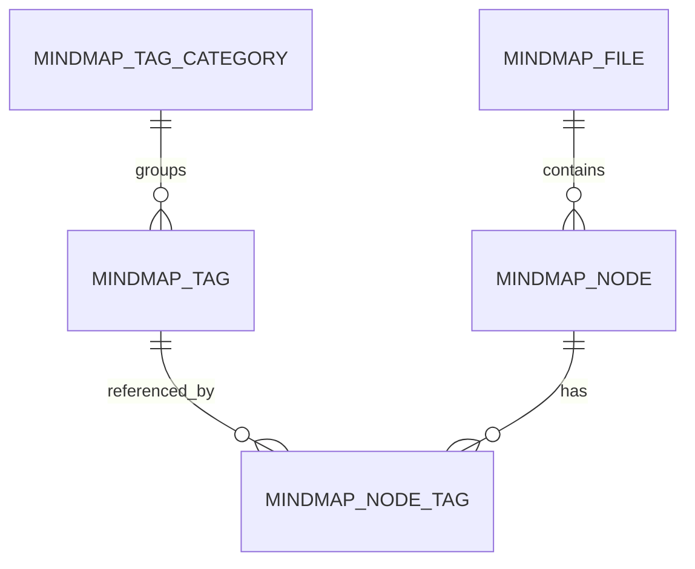

# 脑图统一标签管理功能设计文档

> 文档状态：待评审
> 版本：v2.0
> 日期：2026-08-24
> 适用模块：脑图标签管理、脑图编辑器、节点筛选、全局搜索、实时协作、版本历史、模板、复制与分享
> 决策基线：最终只保留统一标签管理；一个脑图节点可绑定零到多个标签，同一分组下也允许绑定多个标签

## 1. 文档效力

本文档是脑图标签模块的最新专项设计，替代以下旧设计中的“标签字段、字段选项、单选/多选字段”相关内容：

- `docs/superpowers/specs/2026-08-17-mindmap-file-node-tag-product-design.md`

旧文档中的脑图文件、结构化节点、关系、资源、版本与编解码设计继续有效；与本文冲突时，以本文为准。

## 2. 决策摘要

脑图标签模块最终采用单一标签模型：

1. `mindmap_tag` 是标签名称、Key、样式、分组、范围和生命周期的唯一来源。
2. `mindmap_tag_category` 是标签分组的兼容数据表，只负责整理、排序和筛选标签，不承担字段、单选、互斥或校验规则。
3. `mindmap_node_tag` 表示节点和标签的多对多关系。
4. 一个节点可以不绑定标签，也可以绑定任意多个不同标签。
5. 同一分组中的多个标签可以同时绑定到同一个节点，例如 P0、P1、P2 可以同时存在。
6. 同一节点不能重复绑定同一个 `tag_id`。
7. 节点只保存标签引用和局部布局信息，不保存名称、颜色等标签定义副本。
8. 删除 `mindmap_tag_field`、`mindmap_tag_field_option` 及全部标签字段接口、页面和运行时逻辑。
9. 删除节点标签关系和文档载荷中的 `fieldId/field_id`、`optionId/option_id`。
10. 历史字段的 `select_mode=single` 不迁移为任何互斥规则；字段选项全部转换为普通标签。

最终关系如下：



## 3. 背景与现状

### 3.1 当前系统同时存在两套概念

当前实现同时包含：

- 统一标签：`mindmap_tag`。
- 标签分组：`mindmap_tag_category`（数据库与接口字段继续沿用 category 命名）。
- 标签字段：`mindmap_tag_field`。
- 字段选项：`mindmap_tag_field_option`。
- 节点标签关系：`mindmap_node_tag`，同时保存 `tag_id`、`field_id`、`option_id`。

字段选项虽然已经关联统一标签，但标签管理页、节点标签选择器、文档解析、迁移、搜索和替换仍需处理两套身份，导致：

- 用户不清楚应该维护标签还是标签字段。
- 同一个显示名称可能存在多个标签 Key。
- 节点绑定同时携带三种 ID，校验和替换逻辑复杂。
- 字段定义或选项变化容易触发不必要的文档变化和协作冲突。
- 筛选和搜索需要同时兼容标签、字段和选项，容易产生结果不一致。
- 删除字段时必须处理选项、标签和节点绑定的复合影响。

### 3.2 当前页面

`/mindmap/tags` 当前上半部分是“统一标签治理”，下半部分是“标签字段”工作区。统一标签列表中还存在“字段”筛选和“字段”列。

节点编辑器的标签弹窗同时展示字段选项建议和普通标签建议，并将 `tagId/fieldId/optionId` 一并写入节点状态。

### 3.3 目标问题

本次改造不是简单隐藏标签字段页面，而是从产品、数据、接口和运行时中彻底移除标签字段概念，确保系统只存在一种标签身份。

## 4. 产品目标与非目标

### 4.1 产品目标

1. 用户只需要理解和管理“标签”。
2. 节点能够稳定绑定多个标签，不受分组和历史字段规则限制。
3. 标签改名或修改样式后，在所有当前文件和在线编辑器中统一生效。
4. 标签筛选只按 `tag_id` 计算，结果和连线显示正确。
5. 标签新增、修改、停用、替换和归档具备完整影响预览与权限校验。
6. 历史字段和字段选项无损迁移到统一标签，不丢失节点绑定。
7. 标签定义变化不写入整棵脑图，降低实时协作冲突。
8. 迁移可灰度、可验证、可回滚，旧表不与新功能同批物理删除。

### 4.2 非目标

本期不包含：

- 标签分组的单选、互斥、必填或数量限制。
- 使用标签模拟优先级、状态机或审批字段校验。
- 新增独立的字段管理、选项管理或规则管理页面。
- 重做脑图编辑器整体视觉风格。
- 修改文件、文件夹、分享和协作者的主体权限模型。
- 让恢复历史版本回滚全局标签定义。

## 5. 术语与硬性规则

| 术语 | 定义 |
|---|---|
| 标签 | 可被多个节点引用的主数据，名称和样式只有一个来源 |
| 标签分组 | 标签的可选归类，仅用于整理、筛选和排序；兼容字段名为 `categoryId` |
| 节点标签绑定 | 节点使用某个标签的关系，记录顺序和局部位置 |
| 标签定义 | 标签名称、Key、样式、说明、分组、范围和状态 |
| 标签快照 | 历史版本保存时冻结的标签名称和样式，仅用于历史预览 |
| 标签替换 | 将源标签的全部节点绑定原子地迁移到目标标签 |
| 解绑归档 | 删除所有当前绑定后，将标签状态改为归档，不物理删除标签审计记录 |

必须遵守以下规则：

- 一个节点可以绑定零到多个标签。
- 同一分组下允许同时绑定多个标签。
- 分组不包含 `selectMode`，不提供单选或互斥开关。
- 同一节点和同一标签只能存在一条有效绑定。
- 标签名称允许重复；在同一所有者范围内，标签 Key 必须唯一。
- 系统内部、接口、Yjs 和数据库均以 `tagId` 识别标签，不能以名称识别。
- 标签定义不得复制到当前节点数据中作为主数据。
- 标签定义保存新增绑定使用的默认位置和对齐；节点实际顺序、位置和对齐属于绑定局部信息，不随默认值变化。

## 6. 用户角色与权限

### 6.1 角色能力

| 角色 | 查看标签 | 绑定标签 | 创建标签 | 修改标签 | 归档标签 |
|---|---:|---:|---:|---:|---:|
| 系统管理员 | 全局及自己的私有标签 | 有文件编辑权时允许 | 全局或私有 | 全局或自己的私有 | 全局或自己的私有 |
| 脑图所有者 | 全局、自己的私有、文件已引用标签 | 允许 | 私有 | 自己的私有 | 自己的私有 |
| 可编辑协作者 | 全局、自己的私有、文件已引用标签 | 允许 | 有 `mindmap:tag:add` 时创建私有标签 | 自己的私有 | 自己的私有 |
| 只读协作者 | 文件已引用标签 | 不允许 | 不允许 | 不允许 | 不允许 |
| 分享访问者 | 文件已引用标签 | 不允许 | 不允许 | 不允许 | 不允许 |

### 6.2 权限原则

- 修改节点标签绑定要求文件编辑权限，不要求标签定义编辑权限。
- 修改标签定义要求 `mindmap:tag:edit`，且用户必须是私有标签所有者；全局标签仅管理员可修改。
- 私有标签的“私有”限制发现和管理，不影响已有绑定的渲染。任何有权查看文件的人都能解析文件已绑定的标签。
- 可编辑协作者不能把其他用户的私有标签新增绑定到更多节点，但可以查看文件中已存在的绑定。
- 停用或归档标签不会让历史绑定变成无法识别的空白标签。

沿用权限标识：

- `mindmap:tag:query`
- `mindmap:tag:add`
- `mindmap:tag:edit`
- `mindmap:tag:remove`

## 7. 领域模型与数据设计

### 7.1 标签分组 `mindmap_tag_category`

产品界面统一使用“分组”术语。为兼容现有数据库、SQL 迁移和 API 调用方，表名、路径及字段继续使用 `category/categoryId/category_id`，不再新增一套 group 表或字段。

保留字段：

| 字段 | 说明 |
|---|---|
| `id` | 分组 ID |
| `name` | 分组名称 |
| `owner_id` | `0` 表示全局，否则为私有分组所有者 |
| `sort_order` | 分组展示顺序 |
| `created_by/created_time` | 审计信息 |

约束：

- 同一 `owner_id` 下分组名称唯一。
- 分组仅用于整理标签。
- 分组下仍存在标签时拒绝删除。
- 删除分组不会隐式删除或归档标签。
- 分组不增加 `select_mode`、必填、互斥或数量限制字段。

### 7.2 标签 `mindmap_tag`

保留现有核心字段：

| 字段 | 说明 |
|---|---|
| `id` | 数据库主键 |
| `uuid` | 跨环境和导入导出的稳定标识 |
| `tag_key` | 所有者范围内唯一的业务 Key |
| `name` | 标签显示名称 |
| `category_id` | 可为空的分组引用（兼容字段名） |
| `owner_id` | `0` 为全局，否则为私有标签 |
| `style` | `{fill,color,fontSize,radius,paddingX,placement,align}`，位置和对齐只作为新增绑定默认值 |
| `description` | 标签说明 |
| `status` | `0` 启用、`1` 停用、`2` 归档 |
| `definition_revision` | 标签定义修订号 |
| `usage_node_count` | 使用节点数缓存 |
| `usage_file_count` | 使用文件数缓存 |
| 审计字段 | 创建人、修改人和时间 |

不新增以下字段：

- `field_id`
- `option_id`
- `select_mode`
- `exclusive_group`
- `max_selection`

### 7.3 节点标签关系 `mindmap_node_tag`

最终字段：

| 字段 | 说明 |
|---|---|
| `id` | 关系主键 |
| `file_id` | 冗余文件 ID，用于使用量和权限查询 |
| `node_id` | 节点 ID |
| `tag_id` | 统一标签 ID |
| `sort_order` | 标签在当前节点中的展示顺序 |
| `placement` | `left/right/top/bottom`，允许为空并使用默认值 |
| `align` | 当前节点的标签对齐方式，允许为空 |
| `created_by/created_time` | 绑定审计信息 |

删除字段：

- `field_id`
- `option_id`

数据库约束与索引：

```text
UNIQUE(node_id, tag_id)
INDEX(tag_id, file_id)
INDEX(node_id, sort_order)
FOREIGN KEY(tag_id) REFERENCES mindmap_tag(id) ON DELETE RESTRICT
```

`file_id` 必须与 `node_id` 所属文件一致，由服务端写入边界校验，不能信任客户端直接提供的文件归属。

### 7.4 前端和文档载荷

当前文档状态中每个节点的标签只允许包含：

```json
{
  "tagId": 101,
  "sortOrder": 0,
  "placement": "right",
  "align": "center"
}
```

展示时由标签定义缓存解析成组件需要的对象：

```json
{
  "tagId": 101,
  "text": "前置步骤",
  "style": {
    "fill": "#D6E4FF",
    "color": "#1D39C4",
    "fontSize": 12,
    "radius": 3,
    "paddingX": 8
  },
  "placement": "right",
  "align": "center"
}
```

其中 `text/style` 是运行时派生结果，不得作为当前数据的标签定义来源回写数据库或 Yjs。

## 8. 标签生命周期

### 8.1 启用

- 在标签管理列表和节点选择器中可见。
- 允许新增绑定。
- 允许修改定义、查看影响、替换和归档。

### 8.2 停用

- 已有节点继续正常展示。
- 默认不出现在节点标签新增建议中。
- 标签管理页可通过状态筛选查看。
- 不允许新增绑定，但允许解绑和替换。
- 可重新启用。

### 8.3 归档

- 已有绑定原则上应在归档前解除；“解绑并归档”是标准入口。
- 默认列表和选择器不展示。
- 审计与迁移记录仍可查询。
- 不允许新增绑定和普通编辑。
- 本期不提供物理删除入口。

### 8.4 替换引用

标签替换必须在单个数据库事务中完成：

1. 锁定源标签和目标标签。
2. 校验目标标签启用、可见且不是源标签。
3. 统计受影响文件和节点。
4. 把源标签绑定迁移为目标标签。
5. 当节点已绑定目标标签时合并重复关系，不产生唯一键冲突。
6. 合并时优先保留节点已有目标绑定的 `sort_order/placement/align`；没有目标绑定时沿用源绑定。
7. 重算源和目标标签使用量。
8. 递增相关文件内容修订并发布变更事件。

## 9. 标签管理页面设计

路由保持 `/mindmap/tags`。

### 9.1 页面结构

最终页面只保留一个主卡片：

```text
标签管理
├─ 左侧：分组管理
│  ├─ 全部标签
│  ├─ 具体分组及标签数量
│  ├─ 未分组
│  └─ 管理分组
└─ 右侧：当前分组标签管理
   ├─ 当前分组名称 / 新建标签 / 刷新
   ├─ 筛选：关键词 / 范围 / 状态 / 查询 / 重置
   ├─ 批量操作栏
   ├─ 标签表格
   └─ 分页
```

必须删除：

- “全部字段”筛选。
- 标签表格中的“字段”列。
- 页面下方完整“标签字段”工作区。
- 新建字段、编辑字段、删除字段和选项管理弹窗。
- 单选、多选、字段基础样式等文案。

### 9.2 筛选区

| 控件 | 行为 |
|---|---|
| 关键词 | 匹配标签名称、Key 和说明；清空立即恢复 |
| 范围 | 全部、我的标签、全局标签 |
| 状态 | 全部、启用、停用、归档 |
| 查询 | 提交当前条件并回到第一页 |
| 重置 | 保留左侧当前分组，重置右侧其他条件并重新加载 |

分组由左侧导航控制。“未分组”使用 `categoryId=0` 查询约定，由服务端转换为 `category_id IS NULL`，不能在前端对当前分页结果二次过滤。筛选条件写入页面状态，不需要写入脑图文档。

### 9.3 表格列

| 列 | 内容 |
|---|---|
| 选择 | 仅允许选择当前用户可管理的标签 |
| 标签 | 样式预览、名称和说明 |
| Key | 稳定业务 Key |
| 分组 | 分组名称，未分组显示“未分组” |
| 范围 | 全局或私有 |
| 状态 | 启用、停用或归档 |
| 使用节点 | 当前真实使用节点数 |
| 使用文件 | 当前真实使用文件数 |
| 最近修改 | 时间、修改人和定义修订号 |
| 操作 | 影响、编辑、停用、替换引用、解绑并归档 |

### 9.4 新建和编辑标签

字段：

- 名称：必填，1–200 字符。
- Key：必填，允许英文、数字、下划线和约定分隔符；创建后普通用户不可修改。
- 范围：管理员可选全局或私有，普通用户固定私有。
- 分组：可为空。
- 状态：编辑时可在启用和停用之间切换。
- 说明：可选，最多 500 字符。
- 样式：背景色、文字色、字号、圆角、横向内边距、默认位置、默认对齐。
- 位置与对齐联动：上下位置只允许左/中/右对齐，左右位置只允许上/中/下对齐。
- 修改默认位置或对齐不批量覆盖既有节点的局部布局；重新添加标签时使用最新默认值。
- 预览：即时展示当前标签效果。

保存已有标签前必须加载最新影响量并展示：

```text
保存后将更新 18 个脑图中的 246 个节点。
在线编辑器会自动刷新标签定义，不会修改节点内容。
```

### 9.5 分组管理

- 支持新建、修改名称和排序、删除空分组。
- 显示分组范围和标签数量。
- 分组删除前重新检查真实标签数量。
- 分组仅影响管理页和选择器分组，不修改节点绑定。
- 标签移动分组后，节点无需保存或重绘布局，仅更新选择器和标签管理展示。

### 9.6 批量操作

本期批量操作只提供“批量解绑并归档”。

- 仅统计当前用户可管理的已选标签。
- 二次确认展示标签数、节点数和文件数。
- 单批次限制沿用现有 `MAX_MINDMAP_TAG_BATCH_SIZE`。
- 任一标签权限变化或影响量变化时整体失败，不允许静默部分成功。

## 10. 节点标签选择器设计

### 10.1 打开方式

- 用户选中一个或多个可编辑节点后，通过工具栏或节点菜单打开标签选择器。
- 打开时捕获当前 MindMap 实例、目标节点集合和文件修订号。
- 切换文件、实例、只读状态或关闭弹窗后，迟到请求不得写入旧节点或新文件。

### 10.2 信息结构

```text
添加标签
├─ 搜索框
├─ 已选择
├─ 最近使用
├─ 左侧：有匹配标签的分组与标签数量
├─ 右侧：当前分组的可选标签
├─ 未分组作为普通分组展示
└─ 有权限时：创建“搜索词”标签
```

不再展示：

- 标签字段列表。
- 字段选项列表。
- 单选或多选标识。
- 字段默认样式或字段说明。

### 10.3 多标签交互

- 所有标签均使用复选交互。
- 分组使用左侧导航、右侧标签的主从布局；切换分组不清除已选标签。
- 搜索时只保留存在命中标签的分组；当前分组不再命中时自动切换至首个有效分组。
- 选择一个标签不会自动移除任何其他标签。
- 同一分组中的标签可以连续选择。
- 再次点击已选择标签表示取消选择。
- 对多节点批量编辑时，标签状态分为“全部节点已选、部分节点已选、全部未选”。
- 点击“部分节点已选”的标签后，默认补齐到全部目标节点；再次点击则从全部目标节点移除。
- 已停用或归档标签只在目标节点已经绑定时显示，不允许新增绑定。
- 同一标签不会在同一节点产生重复关系。

### 10.4 创建标签

当搜索无完全匹配结果且用户具有新增权限时，列表末尾显示：

```text
创建标签“接口异常”
```

创建成功后直接选中新标签。提交失败时保留搜索词和当前已选状态，不关闭弹窗。

### 10.5 保存与无感刷新

- 一次确认产生一个节点标签变更事务。
- 只更新实际发生变化的节点，不覆盖整棵树。
- 前端对目标节点的标签数组做不可变更新，并发送最小粒度变更。
- 保存成功后局部重绘受影响节点及相关布局，不重建整个 MindMap 实例。
- 当前选区、缩放比例、画布中心和未受影响节点位置保持不变。
- 保存失败时恢复提交前状态，并给出可重试提示。

## 11. 节点标签展示与布局

### 11.1 展示来源

- 标签名称和视觉样式来自当前标签定义缓存。
- `placement/align/sortOrder` 来自节点标签绑定；首次绑定时从标签定义的默认位置和对齐初始化。
- 标签定义缺失时显示可识别的降级标签，例如“标签已失效 #101”，同时上报数据完整性异常。

### 11.2 排序

- 同一节点的标签按 `sort_order ASC, relation_id ASC` 稳定排序。
- 取消某标签后，其余标签保持相对顺序。
- 新增标签默认追加到相同位置分组的末尾。
- 如果组件支持拖拽排序，只更新该节点受影响关系的 `sort_order`。

### 11.3 标签定义实时变化

修改标签名称或样式后：

1. 后端提交标签定义事务并递增 `definition_revision`。
2. 发布 `tag_definition_changed` 事件。
3. 在线编辑器仅更新标签定义缓存。
4. 只重绘正在使用该标签的可见节点。
5. 不写入 Yjs 节点正文，不产生新的脑图内容冲突。

## 12. 节点筛选设计

### 12.1 筛选条件

标签筛选提供以下操作符：

| 操作符 | 语义 |
|---|---|
| 包含任一 | 节点至少绑定一个所选标签 |
| 包含全部 | 节点同时绑定全部所选标签 |
| 不包含 | 节点不绑定任一所选标签 |
| 无标签 | 节点没有任何标签绑定 |

多个筛选条件默认使用“且”连接。后续如需“或”组合，应使用通用筛选组能力，不重新引入标签字段。

### 12.2 可见节点集合

为保证树结构可渲染：

```text
精确结果集 = 满足筛选条件的节点
上下文集合 = 精确结果节点的祖先节点
最终可见集合 = 根节点 + 精确结果集 + 上下文集合
```

- 精确结果使用正常样式或匹配高亮。
- 仅用于保持路径的祖先节点以弱化样式显示，并标记为“路径上下文”，不计入结果数量。
- 不相关的兄弟节点和后代全部隐藏。
- 如果根节点本身不匹配，仍作为画布容器显示，但不计入结果。

### 12.3 连线及附属元素

筛选后必须同步处理所有视觉关系：

- 父子结构线：仅当父子节点都在最终可见集合时显示。
- 关联线：仅当起点和终点都可见时显示，否则隐藏整条线及文字。
- 概要：仅当其覆盖范围仍有可见成员且概要锚点可正确计算时显示，否则隐藏。
- 外框：仅当外框成员均满足当前可见性规则时重新计算；没有有效成员时隐藏。
- 节点附件、图标和标签随所属节点隐藏，不得残留在画布上。
- 清除筛选时恢复原节点、连线、概要和外框状态。

### 12.4 最小粒度刷新

- 筛选只更新可见性集合和受影响布局分支。
- 同一轮条件变化合并为一次渲染任务。
- 不重新请求和替换整份脑图数据。
- 不销毁 MindMap 实例。
- 保持缩放比例和视口中心；当前节点被隐藏时清除其激活状态，并将焦点移回筛选输入。
- 关联线、概要和外框的显隐与节点变更在同一帧提交，避免出现多余连线短暂闪烁。

## 13. 搜索与筛选的关系

- 搜索用于定位节点，不改变整棵树的可见性。
- 筛选用于改变可见节点集合。
- 搜索命中隐藏节点时，界面提示“该节点被当前筛选隐藏”，提供“清除筛选并定位”。
- 搜索请求和筛选请求都必须绑定当前文件、MindMap 实例和请求编号，拒绝迟到结果。
- 标签搜索只使用 `tagId`；名称仅用于用户输入匹配，不能作为绑定或筛选身份。

## 14. 实时协作、一致性与缓存

### 14.1 主数据边界

| 数据 | 主数据来源 | 是否进入 Yjs 正文 |
|---|---|---:|
| 节点绑定的标签 ID | 节点标签关系/Yjs 当前状态 | 是 |
| 标签顺序、位置、对齐 | 节点标签关系/Yjs 当前状态 | 是 |
| 标签名称、视觉样式和布局默认值 | `mindmap_tag` | 否 |
| 标签分组和状态 | `mindmap_tag` / category | 否 |

### 14.2 协作事件

- 节点绑定变化继续作为脑图内容变化参与协作。
- 标签定义变化通过独立事件通道传播，不修改脑图内容 revision。
- 事件至少包含 `tagId`、`definitionRevision`、变更类型和时间。
- 客户端只接受比本地缓存更新的 `definitionRevision`。
- 多次相同事件必须幂等。

### 14.3 本地缓存

- 本地草稿只保存节点的 `tagId` 和局部布局，不保存标签定义为可写主数据。
- 打开脑图时从云端加载当前标签定义，不能使用旧标签字段缓存作为主数据。
- 退出编辑器成功保存云端数据后，清理该脑图正文缓存；下次进入优先读取云端。
- 标签定义可以短期缓存，但必须使用修订号校验，并在定义变更事件后立即失效。

### 14.4 冲突处理

- 不因标签改名、改色或移动分组弹出脑图内容冲突。
- 同一节点的不同标签增删可按集合合并。
- 同一标签在同一节点的并发新增通过唯一约束和幂等 mutation 收敛为一条绑定。
- 一个客户端删除绑定、另一个客户端修改该绑定顺序时，以服务端 revision 和变更顺序决定最终状态，不恢复已删除绑定。

## 15. 历史版本、模板、复制与分享

### 15.1 历史版本

- 当前文件始终解析最新标签定义。
- 历史版本预览使用版本创建时的标签快照，保证画面可复现。
- 恢复历史版本只恢复节点和标签绑定，不回滚全局标签定义。
- 历史载荷中的 `fieldId/optionId` 在预览适配层兼容读取，但新版本不再写入。

### 15.2 模板

- 模板保存标签稳定 UUID 或可移植引用，不保存字段和选项。
- 从模板创建文件时，全局标签直接复用。
- 私有标签按现有可移植规则解析；无法复用时在新所有者范围内创建等价私有标签，并建立一次性映射。

### 15.3 文件复制

- 复制节点标签关系，不复制全局标签定义。
- 同一所有者下的私有标签继续引用原标签。
- 跨所有者复制私有标签时，克隆为目标所有者私有标签，避免目标用户引用不可发现的私有主数据。
- 复制流程不生成字段或字段选项。

### 15.4 分享

- 分享访问者可以解析当前文件已绑定标签，包括文件所有者的私有标签。
- 分享响应只暴露渲染所需定义，不暴露不相关私有标签列表。
- 分享访问者不能修改标签定义或节点绑定。

## 16. 目标接口设计

为降低改造范围，统一标签接口保持现有 `/mindmap/tag` 前缀。

### 16.1 保留接口

| 方法 | 路径 | 用途 |
|---|---|---|
| GET | `/mindmap/tag/categories` | 分组列表 |
| POST | `/mindmap/tag/category` | 新建分组 |
| PUT | `/mindmap/tag/category` | 修改分组 |
| DELETE | `/mindmap/tag/category/{id}` | 删除空分组 |
| GET | `/mindmap/tag/list` | 标签分页列表 |
| GET | `/mindmap/tag/{id}` | 标签详情 |
| POST | `/mindmap/tag` | 新建标签 |
| PUT | `/mindmap/tag` | 修改标签 |
| GET | `/mindmap/tag/suggestions` | 节点选择器建议 |
| GET | `/mindmap/tag/{id}/impact` | 影响范围 |
| GET | `/mindmap/tag/{id}/usages` | 使用明细 |
| POST | `/mindmap/tag/{id}/disable` | 停用标签 |
| POST | `/mindmap/tag/{id}/replace` | 替换引用 |
| DELETE | `/mindmap/tag/{ids}?unbind=true` | 解绑并归档 |

### 16.2 调整接口

- `/mindmap/tag/list` 删除 `fieldId` 查询参数。
- 标签列表和详情响应删除字段上下文。
- 节点保存接口标签项只接受 `tagId/sortOrder/placement/align`。
- 建议接口只返回统一标签并显式包含兼容字段 `categoryId`；前端根据分组列表排序展示，不再按字段分组。
- 标签替换不再执行字段兼容性校验，只校验状态、权限、作用域和目标有效性。

节点标签写入示例：

```json
{
  "nodeUid": "node-123",
  "tags": [
    {"tagId": 12, "sortOrder": 0, "placement": "right", "align": "center"},
    {"tagId": 18, "sortOrder": 1, "placement": "right", "align": "center"}
  ]
}
```

### 16.3 下线接口

以下接口在兼容期结束后全部删除：

```text
GET    /mindmap/tag-field/list
GET    /mindmap/tag-field/{fieldId}
GET    /mindmap/tag-field/{fieldId}/impact
POST   /mindmap/tag-field
PUT    /mindmap/tag-field
DELETE /mindmap/tag-field/{fieldId}
POST   /mindmap/tag-field/option
PUT    /mindmap/tag-field/option
DELETE /mindmap/tag-field/option/{optionId}
PUT    /mindmap/tag-field/option/sort/{fieldId}
GET    /mindmap/tag-field/suggestions
```

### 16.4 兼容期协议

- 第一阶段仍接受旧载荷中的 `fieldId/optionId`，只用它们解析 `tagId`，服务端输出弃用日志。
- 新前端只发送 `tagId`。
- 当所有活跃客户端完成升级后，服务端进入严格模式：出现 `fieldId/optionId` 返回明确的协议过期错误。
- 不允许长期静默忽略无法解析的旧选项，否则会造成标签丢失。

## 17. 数据迁移设计

### 17.1 迁移原则

- 先迁移、验证和灰度，再删除旧表和字段。
- 所有操作幂等，可重复执行。
- 不按名称自动合并标签。
- 每个旧字段、选项和绑定都要进入迁移报告。
- 迁移期间不破坏正在编辑文件的协作状态。

### 17.2 迁移清单

迁移前统计：

- 字段总数及按所有者分布。
- 字段选项总数。
- `option.tag_id` 为空的选项。
- 节点绑定中 `tag_id` 为空或无效的数据。
- `field_id/option_id/tag_id` 不一致的数据。
- 同名不同 Key 标签候选。
- 同一节点因合并后可能产生的重复标签关系。
- 使用字段选项的文件数、节点数及在线编辑文件。

### 17.3 字段到分组的迁移

- 每个旧字段可以转换为同所有者范围内的标签分组，用于保留原有分组体验。
- 如果同所有者下已经存在同名分组，生成复用候选，不自动覆盖。
- 字段描述不自动覆盖分组名称或其他标签说明，可写入迁移审计记录。
- `select_mode` 直接废弃，不迁移任何单选或多选规则。

### 17.4 选项到标签的迁移

对于每个字段选项：

1. `tag_id` 有效时复用对应统一标签。
2. `tag_id` 为空或失效时创建统一标签。
3. 新标签名称取选项名称。
4. 新标签 Key 使用确定性规则生成，并检查所有者范围唯一性。
5. 标签 `fill/color` 来自选项。
6. `fontSize/radius/paddingX` 在标签缺少值时从字段基础样式补齐。
7. 标签没有分组时可关联迁移后的字段分组；已有明确分组时不覆盖。
8. 字段的 `placement/align` 同时写入标签布局默认值，并迁移到已有节点绑定的局部信息，保证历史布局不跳动。

### 17.5 重复标签处理

同名标签只作为人工审查候选，不能自动合并。例如：

```text
P1 / field_testcase1_p1
P1 / testcase_priority_p1
```

选择规范：

1. 优先保留语义稳定、面向业务的 Key。
2. 比较所有者、分组、说明、样式和实际使用场景。
3. 管理员在迁移预览中确认源标签和目标标签映射。
4. 使用现有“替换引用”事务合并节点关系。
5. 原标签解绑后归档，不立即物理删除。

### 17.6 节点关系迁移

对每条 `mindmap_node_tag`：

1. 校验 `tag_id` 有效。
2. 若只有 `option_id`，通过选项映射补齐 `tag_id`。
3. 补齐缺失的 `placement/align`。
4. 清除 `field_id/option_id`。
5. 根据 `(node_id, tag_id)` 合并重复关系。
6. 稳定重排当前节点的 `sort_order`。
7. 重算标签使用节点数和文件数。

### 17.7 Yjs、快照和本地草稿迁移

- 当前物化文档在加载和保存边界统一规范为 `tagId` 协议。
- 对不在线编辑的文件生成新的规范化完整状态并压缩旧增量。
- 对在线文件使用 revision 比较，禁止迁移任务覆盖更高版本协作状态。
- 历史版本保留原始快照，但预览适配器能够把旧 `optionId` 解析成标签快照。
- 本地旧草稿恢复时先解析 `optionId → tagId`；无法解析时停止自动覆盖云端并展示可恢复提示。

### 17.8 迁移不变量

迁移完成必须满足：

```text
迁移前有效节点绑定数
= 迁移后有效节点绑定数
  + 因同节点同标签去重而合并的关系数
```

并满足：

- 不存在无效 `tag_id`。
- 不存在重复 `(node_id, tag_id)`。
- 标签使用量缓存与实时聚合一致。
- 每个字段选项都有明确的目标标签或人工阻塞原因。
- 当前文档不再输出 `fieldId/optionId`。

## 18. 灰度发布与回滚

### Phase 0：审计与预览

- 增加迁移扫描和只读报告。
- 确认重复标签映射。
- 不修改用户数据。

### Phase 1：后端兼容

- 服务端读取新旧载荷。
- 新写入只使用 `tagId`。
- 标签替换和使用量统计改为仅依赖 `tag_id`。
- 保留旧表、旧列和旧接口。

### Phase 2：前端切换

- 标签管理页移除字段 UI。
- 节点选择器只使用统一标签。
- 筛选和搜索只按 `tagId`。
- 使用功能开关控制新旧入口。

### Phase 3：数据迁移

- 执行字段、选项、节点关系和当前文档迁移。
- 运行全量不变量校验和影子比对。
- 保留迁移日志、旧表和回滚映射。

### Phase 4：严格模式

- 拒绝新请求中的 `fieldId/optionId`。
- 旧字段接口返回明确的弃用响应。
- 观察至少一个稳定发布周期。

### Phase 5：物理清理

- 删除字段前端代码和 API 封装。
- 删除字段 Controller、Service、DAO、VO 和实体。
- 删除 `mindmap_node_tag.field_id/option_id` 外键、索引和列。
- 删除 `mindmap_tag_field_option` 和 `mindmap_tag_field` 表。
- 删除 schema verifier 中对应检查。
- 删除只用于字段协议的测试和迁移兼容代码。

### 回滚

- Phase 1–3 可通过功能开关恢复旧前端入口。
- 迁移日志保存每条 `field/option/sourceTag → targetTag` 映射。
- 旧表和旧列在稳定期内保持只读，不立即删除。
- 已合并标签可根据迁移日志重建旧绑定，但回滚前必须阻止新的标签写入，避免双向映射歧义。
- Phase 5 物理清理执行后不再支持快速回滚，需要数据库备份恢复，因此必须单独审批。

## 19. 异常状态与用户反馈

| 场景 | 页面行为 |
|---|---|
| 标签列表加载失败 | 保留筛选条件，展示错误和“重新加载” |
| 分组加载失败 | 标签列表仍可用，分组显示可能不完整并提供重试 |
| 标签保存时 revision 已变化 | 阻止覆盖，加载最新定义并提示重新确认 |
| 标签已被停用 | 选择器不允许新增，已有绑定保持展示 |
| 标签已被归档 | 已打开弹窗刷新状态，禁止继续提交 |
| 批量操作权限变化 | 整体失败并刷新可操作项 |
| 绑定请求部分节点失效 | 整体失败，不产生部分成功 |
| 标签定义缺失 | 展示失效标签占位并上报完整性告警 |
| 筛选无结果 | 保留根节点容器，展示“无符合条件的节点”和清除筛选入口 |
| 协作连接断开 | 本地操作进入现有草稿保护流程，不以旧字段缓存覆盖云端 |

## 20. 性能、可访问性与可观测性

### 20.1 性能

- 标签建议接口限制返回数量，关键词请求防抖并取消旧请求。
- 标签列表使用分页，不一次加载全部使用明细。
- 使用量使用缓存展示，但危险操作前必须实时聚合复核。
- 标签定义事件按 `tagId` 定位受影响的可见节点，不全图扫描和重建。
- 筛选结果使用集合计算，并一次性提交节点和连线可见性。
- 5,000 节点、15,000 标签绑定场景下，选择、筛选和定义刷新必须保持可交互。

### 20.2 可访问性

- 标签选择器使用组合框和多选列表语义。
- 支持上下键、Home/End、Enter/Space 选择和 Esc 关闭。
- 不能只通过颜色表达标签状态；必须同时展示名称和选中标识。
- 危险操作确认框说明标签名称、节点数和文件数。
- 所有图标按钮提供可访问名称和可见 Tooltip。
- 聚焦顺序与视觉顺序一致，焦点样式符合当前 Element Plus 规范。

### 20.3 可观测性

至少记录：

- 标签新增、修改、停用、替换和归档审计日志。
- 标签定义事件发布、接收、丢弃旧 revision 和失败次数。
- 旧 `fieldId/optionId` 协议命中次数。
- 迁移成功、跳过、合并和失败数量。
- 标签使用量缓存与实时聚合不一致数量。
- 无效标签引用和标签定义缺失数量。
- 节点筛选耗时、可见节点数和关系隐藏数量。

## 21. 测试设计

### 21.1 单元测试

- 一个节点绑定多个不同标签。
- 同一分组下绑定多个标签。
- 同一节点重复绑定同一标签时幂等。
- 标签排序、移除和重新添加。
- 启用、停用和归档状态校验。
- 标签替换时重复关系合并。
- 标签使用量重算。
- 旧 `optionId` 到 `tagId` 的兼容解析。
- 字段迁移为分组但不迁移 `select_mode`。
- 筛选“包含任一、包含全部、不包含、无标签”。
- 可见节点、祖先上下文和各种关系显隐计算。

### 21.2 后端集成测试

- 标签 CRUD、分组 CRUD、影响和使用明细。
- 私有与全局标签权限。
- 共享文件中私有标签的只读解析。
- 多节点批量绑定的事务原子性。
- 并发重复绑定的唯一约束收敛。
- 标签替换、解绑归档和使用量一致性。
- 兼容期接受旧载荷，严格期拒绝旧载荷。
- 迁移脚本幂等执行。
- 迁移前后绑定不变量。

### 21.3 前端组件测试

- 标签管理页不再渲染字段筛选、字段列和字段工作区。
- 页面不再请求 `/mindmap/tag-field/*`。
- 节点选择器全部使用统一标签建议。
- 多节点编辑的全选、半选和未选状态。
- 同分组标签连续选择不会互相替换。
- 切换 MindMap 实例后拒绝旧请求结果。
- 标签定义事件只局部刷新使用节点。
- 筛选减少节点时同步隐藏多余连线。
- 清除筛选恢复节点、连线、概要和外框。
- 搜索命中隐藏节点时提供清除筛选入口。

### 21.4 端到端测试

1. 创建三个同分组标签，并在一个节点全部绑定成功。
2. 刷新和重新进入编辑器后，三个标签仍存在且顺序一致。
3. 修改其中一个标签名称和样式，两个在线客户端均无冲突地局部刷新。
4. 按“包含全部”筛选，仅展示同时具有三个标签的节点及祖先路径。
5. 验证隐藏节点的结构线、关联线、概要和外框没有残留。
6. 替换其中一个标签，使用节点数和文件数正确迁移。
7. 解绑并归档后，节点不再显示该标签，审计信息仍可查询。
8. 退出编辑器、清理本地正文缓存并重新进入，数据直接来自云端。

## 22. 验收标准

### 22.1 产品验收

- 用户可在一个节点添加多个标签。
- 用户可在同一节点添加多个同分组标签。
- 产品界面不存在标签字段、字段选项、单选和多选字段概念。
- 标签管理、节点选择、搜索和筛选使用同一套标签数据。

### 22.2 数据验收

- 当前节点标签关系只依赖 `tag_id`。
- 新文档载荷不包含 `fieldId/optionId`。
- 不存在重复 `(node_id, tag_id)`。
- 迁移前后有效标签绑定总量满足迁移不变量。
- 标签使用量缓存与真实聚合一致。

### 22.3 协作验收

- 标签定义变化不增加脑图内容 revision，不触发正文冲突。
- 两个客户端同时添加不同标签可以合并。
- 两个客户端同时添加同一标签最终只有一条绑定。
- 首次加载和使用云端版本后，不因旧标签缓存再次弹出冲突。

### 22.4 筛选验收

- 筛选条件计算符合操作符定义。
- 只展示匹配节点、必要祖先路径和根容器。
- 隐藏节点不存在残留结构线、关联线、概要、外框、标签或附件。
- 条件变化只进行最小粒度刷新，不闪烁、不重载页面、不改变视口。

### 22.5 清理验收

- 前端不存在标签字段页面逻辑和接口调用。
- 后端不存在标签字段 Controller、Service、DAO 和运行时查询。
- 数据库不存在标签字段表及节点关系中的字段、选项列。
- 文档、测试和注释不再把标签字段描述为当前能力。

## 23. 建议开发拆分

### 变更一：统一协议与兼容读取

- 前后端节点标签协议改为 `tagId`。
- 服务端保留旧载荷解析和监控。
- 完成多标签和并发幂等测试。

### 变更二：标签管理页收敛

- 删除字段筛选、字段列和字段工作区。
- 清理字段 API 调用。
- 保留并完善标签生命周期能力。

### 变更三：节点选择器和筛选

- 统一标签多选器。
- 多节点批量选择。
- 标签筛选、最小刷新和关系显隐。

### 变更四：数据迁移与影子校验

- 字段和选项映射报告。
- 标签去重确认。
- 节点关系、Yjs 当前状态和本地草稿兼容迁移。
- 使用量和绑定不变量校验。

### 变更五：严格模式与物理清理

- 拒绝旧协议。
- 删除字段接口、服务、实体、表和列。
- 更新 schema verifier、文档和回归测试。

每个变更独立评审和上线，禁止把前端切换、数据迁移和物理删表放在同一个不可回滚发布中。

## 24. 最终状态定义

当本方案全部完成后，脑图标签模块对用户和系统都只有一种模型：

```text
标签管理标签定义
节点通过 tagId 绑定零到多个标签
分组只负责整理标签
筛选只按标签集合计算
名称和样式通过统一定义全局传播
```

标签字段、字段选项、单选模式和多选模式不再属于产品能力、接口协议、运行时状态或数据库模型。
